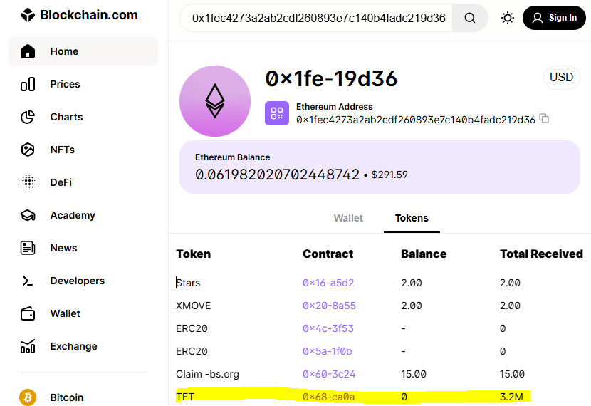
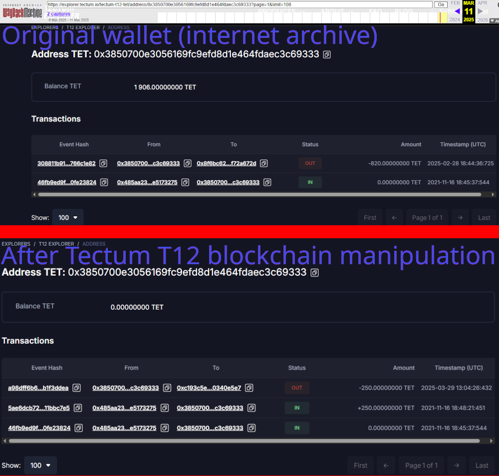
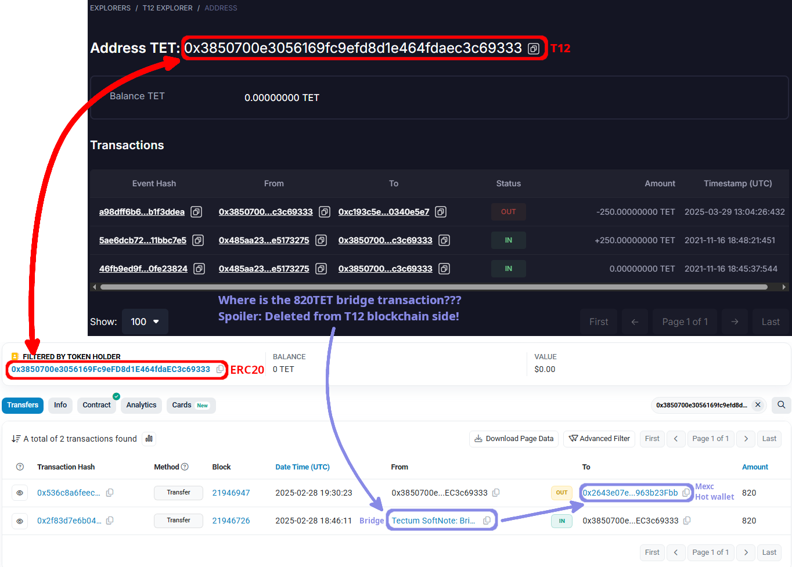
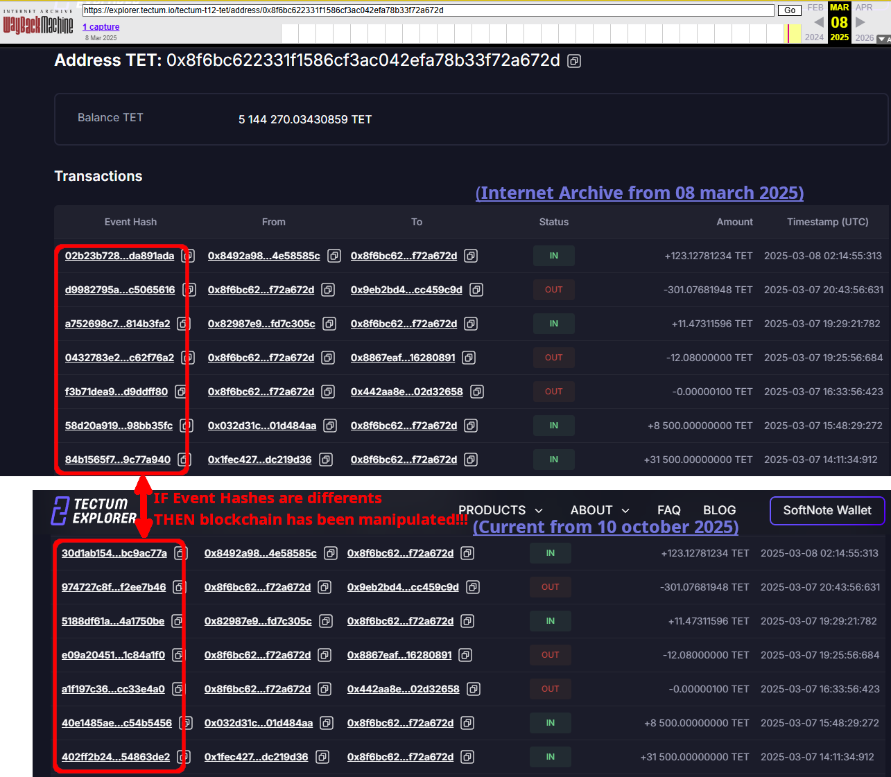

# TECTUM CHECKING PROJECT
A project to check/analyze issues on Tectum blockchain (TET T12 and TET ERC20).

## Why this project?
Because in blockchain, you do not prove things with words.\
But, you prove it with the Trust of code.\
So people won't able to say this is based on BS.

It will analyze blockchain to show some hidden truth of this project.

Then, you will decide by yourself if this blockchain can be trusted or not.

## In short ...

For now, analysis shows:

- [Total amount of TET in excess in T12](https://github.com/OnyxH2O/TET_Check_Project/blob/main/README.md#total-amount-of-tet-in-excess-in-t12):
   - Before 2025/03/14, T12 blockchain had 2.2M TET in excess over the 10Million TET max supply mainly through many "shady" wallets under tectum team ownership (proof: csv file, check below)
   - Since 2025/03/14, this have been fixed in shady way by deleting/modifying many transactions especially in "shady" wallets (proof: wallet archive in waybackmachine, check below)
  
  This shows how dangerous is a centralised blockhain like T12 in the hand of Tectum Team who can modify/delete any transaction as they want.
         
- [TET BRIDGE ANALYZER](https://github.com/OnyxH2O/TET_Check_Project/blob/main/README.md#tet-bridge-analyzer) will show you:
   -  There is many transactions in ERC20 Bridge which does not match any tx in T12 Bridge (missing transaction in T12, double sent, etc...) (proof: csv file, check below)
   -  All Team wallets bridge overall around 5.3M TET from T12 to ERC20 in order to mainly sent TET to Exchanges  (proof: csv file, check below)
  
  This shows T12 blockchain have some inconsistencies against ERC20 bridge tx (probably due to modification/deletion of transactions)\
  and, about the 5.3M TET tectum team bridge to ERC20 (removing all TET sent back to the bridge), well ... it seems this is more than what has been allocated to the team up to Tectum tokenomic plan.

- TCT - New cash cow
   - After almost sending all team's TET to "Bridge -> Exchanges" (currently around 5.3M TET)
   - We currently found 8,310,502 TET (of the 10M TET max supply) which are in ERC20 side
   - So how to move back some TET to T12 AND how to get more TET to sell ... here come TCT!!!
   - To buy TCT (with 10% discount), You need to bridge back your TET to T12 and buy from soft wallet
   - So great! Team get some TET back and bridge it back to ERC20 in order to sent it to Exchange!
   - Proof:  

     
- Speedtest - TPS
   - T12 3.0 :
      - https://www.youtube.com/watch?v=RZNxpaESVKY
      - Live vdo of 3.5M tps on YT cannot be trusted, it is just a live fancy webapp doing fancy graphical stuff and faking transactions.
      - They never let me (or anybody else) to access the testnode in order to check if transactions were real.
      - There is no API for user to do their own speedtest
        
   - T12 4.0 :
      - Source: Tectum T12 4.0 blockchain explorer 
      - 17820 tx of 0.00000001
      - Start from 2025-03-17 07:49:16:900 to 2025-03-17 08:50:51:261
      - So it's around 5 tps here! LoL (17820 /60 /60 = 4.95)

   - T12 4.1 :
      - Source: Tectum T12 4.1 blockchain explorer 
      - 34757 tx of 0.00000001 TEC
      - Start from : 2025-03-09 21:30:23 at Block 1000
      - End at     : 2025-03-09 21:40:23 at block 35757 
      - So it's around 58 tps here! LoL (34757 /10 /60 = 57.93)

## TET BRIDGE ANALYZER
- Source Code: https://github.com/OnyxH2O/TET_Check_Project/blob/main/code_source/tet_bridge_analyzer.ipy
- Run on 2025-10-04 in google collab

#### Discussion:
The result below shows that ERC20 bridge sent 36,745 more TET than T12 bridge received.\
because of bridge inconsistencies between ERC20 bridge and T12 bridge probably due to transactions deletion/modification in T12.\
(check "Total amount of TET in excess in T12" in result)

Proof: Csv file: https://github.com/OnyxH2O/TET_Check_Project/blob/main/result_files/tet_bridge_analyzer/tet_inconsistent_transactions.csv

And what interresting is the top wallets by ERC20 bridge Net (= TET received from ERC20 bridge - TET Sent to ERC20 bridge):
- 3,123,413 TET for 0x1fec...9d36 (an unofficial team wallet)
- 866,550 TET for 0xd1e9...43fe3 ("Tokenomics Marketing Ecosystem and VCs" wallet)
- 866,216 TET for 0x032d...84aa ("Expense & Payroll Account" wallet)
- 462,728 TET for 0x1a8d...6c05 ("Tokenomics Development" wallet)
- ... (check result below)

Proof:
- Csv file: https://github.com/OnyxH2O/TET_Check_Project/blob/main/result_files/tet_bridge_analyzer/tet_wallet_bridge_balances.csv
- url: https://www.blockchain.com/explorer/addresses/eth/0x1fec4273a2ab2cdf260893e7c140b4fadc219d36



Tectum have much more official and unofficial wallets \
but just with theses 4 wallets, it already reached more than 5.3 Million TET which has been sent to exchanges.

Reminder from Tectum tokenomic of the 10 Million TET MAX supply:
- 500k in seed sale
- 1.5M in private sale
- 1M in public sale
- 2M for Staking/Node
- 250k for advisor
- Total = 5.25M
So Removing all that from 10M, it should remain around 4.75M for all the team wallets.

Weiird, weiiiird... it smells pretty fishy here.

#### Results:
```
🌉 BRIDGE ADDRESS BALANCE ANALYSIS:
├─ Bridge Address: 0x8f6bc622331f1586cf3ac042efa78b33f72a672d
├─ ERC20 Net Balance: -8189511.77774356 TET
├─ T12 Net Balance: 8152765.97419940 TET
└─ Combined Diff Net Balance: -36745.80354416 TET

💡 BRIDGE BALANCE EXPLANATION:
   The diff_net_balance represents the difference between what the T12
   bridge received and what the ERC20 bridge sent to wallets, calculated
   from 2023-01-01 onwards, after removing all rollback transactions.
   A positive value indicates more TET received on T12 than sent from ERC20.
   A negative value indicates more TET sent from ERC20 than received on T12.
------------------------------------------------------------

🏆 TOP 10 WALLETS BY ERC20 NET BALANCE (excluding bridge):
 1. 0x1fec4273a2ab2cdf260893e7c140b4fadc219d36
    ├─ ERC20 Net: 3123413.00000000 TET
    ├─ T12 Net:   -3137214.00000000 TET
    └─ Diff Net:  -13801.00000000 TET
 2. 0xd1e976025829fa492799e14c68419972e1743fe3
    ├─ ERC20 Net: 866550.00000000 TET
    ├─ T12 Net:   -1049224.06815880 TET
    └─ Diff Net:  -182674.06815880 TET
 3. 0x032d31cb46f7fe34017fc8e60839393e01d484aa
    ├─ ERC20 Net: 866216.91793500 TET
    ├─ T12 Net:   -862216.91793500 TET
    └─ Diff Net:    4000.00000000 TET
 4. 0x1a8d4fe88ccf87d7a21abdb282da764bb52a6c05
    ├─ ERC20 Net: 462728.41968388 TET
    ├─ T12 Net:   -462728.41968388 TET
    └─ Diff Net:       0.00000000 TET
 5. 0x371565d1078848d127a40d061fe6e43b2e9d8db4
    ├─ ERC20 Net: 206000.00000000 TET
    ├─ T12 Net:        0.00000000 TET
    └─ Diff Net:  206000.00000000 TET
 6. 0xc193c5e4b70160a90795225e5720dbae0340e5e7
    ├─ ERC20 Net: 178509.52365882 TET
    ├─ T12 Net:   -228169.52365882 TET
    └─ Diff Net:  -49660.00000000 TET
 7. 0x50deb045a6897593831b6eeb7d581fd4d3457929
    ├─ ERC20 Net: 164500.00000000 TET
    ├─ T12 Net:   -164590.90000000 TET
    └─ Diff Net:     -90.90000000 TET
 8. 0x1712970f9e033deccbf97adacef230bdacfb64e7
    ├─ ERC20 Net:  91690.09619748 TET
    ├─ T12 Net:   -113446.09619746 TET
    └─ Diff Net:  -21755.99999998 TET
 9. 0x5c2b5e55b664acffb59f9e71dad2a8c79807f1c6
    ├─ ERC20 Net:  89500.00000000 TET
    ├─ T12 Net:   -189500.00000000 TET
    └─ Diff Net:  -100000.00000000 TET
10. 0xa7aa8d0dba60e8cab5b8c2733d3eb7d8b24cc465
    ├─ ERC20 Net:  69036.14248514 TET
    ├─ T12 Net:   -68036.14248514 TET
    └─ Diff Net:    1000.00000000 TET
```

- Csv file: https://github.com/OnyxH2O/TET_Check_Project/blob/main/result_files/tet_bridge_analyzer/tet_wallet_bridge_balances.csv
- Csv file: https://github.com/OnyxH2O/TET_Check_Project/blob/main/result_files/tet_bridge_analyzer/tet_inconsistent_transactions.csv

## Total amount of TET in excess in T12
- Source Code: https://github.com/OnyxH2O/TET_Check_Project/blob/main/code_source/AnalyzeAllTetTx.py
- Run on 2025-03-09 in google collab
 
Here, we will check the following in Tectum T12 blockchain:
- Total amount of TET coin
- Shady wallets where balance is different from the sum of transactions TET amount
 
#### Results:
- Total wallets analyzed: 57260
- Total TET coins: 12227344.00
- Csv file: https://github.com/OnyxH2O/TET_Check_Project/blob/main/result_files/AnalyzeAllTetTx/tet_wallets_20250903_1200.csv


#### Discussion:

We can find over 2,227,344 more TET than the 10M Max supply on the Tectum T12 blockchain 3.0.\
Big part of this excess is coming from "Shady wallets" which all are under Tectum team ownership (1.836 Million TET).

Update 2025/03/14:
After reaching the team on this issue, Tectum has kinda "fixed" this issue on 2025/03/14 by modifying T12 blockchain 3.0.
T12 blockchain 3.0 is a centralised blockchain, so tectum team can modify T12 blockchain as they pleased (by modifying transactions then replay the modified chain of transaction).


## Result of Shady wallets

#### Discussion:

Sum of shady wallet balance difference: 1835632.6991604 TET

It means we found 1,835,632 TET from 846 wallets where balance does not match sum of transactions.

Update:
As said before, Tectum team has kinda "fixed" this issue by modifying T12 blockchain 3.0.\
They can modify TET T12 transactions but not TET ERC20 transactions.\
Therefore we can now found some inconsistent bridge transactions which is recorded in ERC20 but no more in T12.

Transactions have been modified by modifying / adding / deleting in theses shady wallets.

How can I prove theses wallets transactions have been modified? Well thanks to some wallet archive in waybackmachine:
- Check wallet in waybackmachine (ie [0x3850...9333](https://web.archive.org/web/20250311154236/https://explorer.tectum.io/tectum-t12-tet/address/0x3850700e3056169fc9efd8d1e464fdaec3c69333?page=1&limit=100))
- Compare this wallet with tectum explorer (ie [0x3850...9333](https://explorer.tectum.io/tectum-t12-tet/address/0x3850700e3056169fc9efd8d1e464fdaec3c69333?page=1&limit=100))
- If the wallet have interacted with bridge, check wallet address in ERC20 (ie [0x3850...9333](https://etherscan.io/token/0x68a47fe1cf42eba4a030a10cd4d6a1031ca3ca0a?a=0x3850700e3056169fc9efd8d1e464fdaec3c69333))

Blockchain manipulation proof 1:


Blockchain manipulation proof 2:


Blockchain manipulation proof 3:


#### Results:

Csv file: https://github.com/OnyxH2O/TET_Check_Project/blob/main/result_files/AnalyzeAllTetTx/shady_wallets_filtered.csv

|wallet	|	nb_tx	|	tx_balance	|	wallet_balance	|	balance_diff	|	blockchain_link |
| ------	|	------	|	------	|	------	|	------	|	------ |
|0x8a1e8d665048feeac2d480ae82440f9d2443941f	|	3	|	-240	|	2506	|	2746	|	https://explorer.tectum.io/tectum-t12-tet/address/0x8a1e8d665048feeac2d480ae82440f9d2443941f?page=1&limit=100|
|0x8144f84d7045802095825b504e20b76f4a4604ab	|	19	|	-248.23838816	|	2482.76161184	|	2731	|	https://explorer.tectum.io/tectum-t12-tet/address/0x8144f84d7045802095825b504e20b76f4a4604ab?page=1&limit=100|
|0x3850700e3056169fc9efd8d1e464fdaec3c69333	|	2	|	-820	|	1906	|	2726	|	https://explorer.tectum.io/tectum-t12-tet/address/0x3850700e3056169fc9efd8d1e464fdaec3c69333?page=1&limit=100|
|0xe3f10015c040f8e4607d19230c1419371a1fe7c9	|	2	|	-977	|	1747	|	2724	|	https://explorer.tectum.io/tectum-t12-tet/address/0xe3f10015c040f8e4607d19230c1419371a1fe7c9?page=1&limit=100|
|0x870efd56b4862625c99ec21c8752a9df1a936135	|	2	|	-810	|	1912	|	2722	|	https://explorer.tectum.io/tectum-t12-tet/address/0x870efd56b4862625c99ec21c8752a9df1a936135?page=1&limit=100|
|0x47681e8c7376f0974c8872ea26afaac1bc665c57	|	2	|	-950	|	1737	|	2687	|	https://explorer.tectum.io/tectum-t12-tet/address/0x47681e8c7376f0974c8872ea26afaac1bc665c57?page=1&limit=100|
|0x4b4dc120671e934070c00501ac87e376564ad168	|	2	|	-900	|	1775	|	2675	|	https://explorer.tectum.io/tectum-t12-tet/address/0x4b4dc120671e934070c00501ac87e376564ad168?page=1&limit=100|
|0x218ae105e19713fec6e36a16ebe6bf38498663c5	|	2	|	-249	|	2422	|	2671	|	https://explorer.tectum.io/tectum-t12-tet/address/0x218ae105e19713fec6e36a16ebe6bf38498663c5?page=1&limit=100|
|0x823a1dc24c70505fc7c630e7f9d014382d098520	|	2	|	-250	|	2395	|	2645	|	https://explorer.tectum.io/tectum-t12-tet/address/0x823a1dc24c70505fc7c630e7f9d014382d098520?page=1&limit=100|
|0x49e5d8770985595ff17dd2e33b42faf00f734114	|	2	|	-1000	|	1618	|	2618	|	https://explorer.tectum.io/tectum-t12-tet/address/0x49e5d8770985595ff17dd2e33b42faf00f734114?page=1&limit=100|
|0xa36c8278d295d0a40607c7f260e61dfb2e660d71	|	3	|	2500	|	5059	|	2559	|	https://explorer.tectum.io/tectum-t12-tet/address/0xa36c8278d295d0a40607c7f260e61dfb2e660d71?page=1&limit=100|
|0x52142db79922e38b69052b84ac29ec74ac2b51ea	|	7	|	-250	|	2304	|	2554	|	https://explorer.tectum.io/tectum-t12-tet/address/0x52142db79922e38b69052b84ac29ec74ac2b51ea?page=1&limit=100|
|0x5ed613bd086c4b0739b9e3579cfe476dcfe3d73e	|	2	|	-249	|	2294	|	2543	|	https://explorer.tectum.io/tectum-t12-tet/address/0x5ed613bd086c4b0739b9e3579cfe476dcfe3d73e?page=1&limit=100|
|0x0a94cf8ce14af91f2db5fe14e6d39c1921f25efd	|	2	|	250	|	2750	|	2500	|	https://explorer.tectum.io/tectum-t12-tet/address/0x0a94cf8ce14af91f2db5fe14e6d39c1921f25efd?page=1&limit=100|
|0x536282a992484c236361a28d4aeb5a2d6ce3e89a	|	2	|	250	|	2750	|	2500	|	https://explorer.tectum.io/tectum-t12-tet/address/0x536282a992484c236361a28d4aeb5a2d6ce3e89a?page=1&limit=100|
|0xaf31869a940f02199831a9e3e96088d37eeb6cea	|	2	|	250	|	2750	|	2500	|	https://explorer.tectum.io/tectum-t12-tet/address/0xaf31869a940f02199831a9e3e96088d37eeb6cea?page=1&limit=100|
|0x795a920d3e93ade1f4033e66eaec4bd41f861628	|	2	|	250	|	2749	|	2499	|	https://explorer.tectum.io/tectum-t12-tet/address/0x795a920d3e93ade1f4033e66eaec4bd41f861628?page=1&limit=100|
|0x3a76e21e25728a933337eb52a9098a61234620e1	|	2	|	250	|	2748	|	2498	|	https://explorer.tectum.io/tectum-t12-tet/address/0x3a76e21e25728a933337eb52a9098a61234620e1?page=1&limit=100|
|0x85b88bb87fe4d32abf8495932832c55304ba3cee	|	3	|	-1211	|	1287	|	2498	|	https://explorer.tectum.io/tectum-t12-tet/address/0x85b88bb87fe4d32abf8495932832c55304ba3cee?page=1&limit=100|
|0xbe9a3ef96c1d8d5ec454df00d90292f2d689ad08	|	2	|	250	|	2748	|	2498	|	https://explorer.tectum.io/tectum-t12-tet/address/0xbe9a3ef96c1d8d5ec454df00d90292f2d689ad08?page=1&limit=100|
|0x218304face65c170e1b0fc78bd354ada90361cec	|	2	|	250	|	2748	|	2498	|	https://explorer.tectum.io/tectum-t12-tet/address/0x218304face65c170e1b0fc78bd354ada90361cec?page=1&limit=100|
|0xcd2564b2669b6c5290a35774ac86d9ddfd5957cc	|	2	|	250	|	2747	|	2497	|	https://explorer.tectum.io/tectum-t12-tet/address/0xcd2564b2669b6c5290a35774ac86d9ddfd5957cc?page=1&limit=100|
|0x8579d30993243f64a6274048c2c7ba4b3377de19	|	2	|	250	|	2747	|	2497	|	https://explorer.tectum.io/tectum-t12-tet/address/0x8579d30993243f64a6274048c2c7ba4b3377de19?page=1&limit=100|
|0x0a1fc7c435e1167857f22442f7f331ccd852fc4e	|	2	|	250	|	2747	|	2497	|	https://explorer.tectum.io/tectum-t12-tet/address/0x0a1fc7c435e1167857f22442f7f331ccd852fc4e?page=1&limit=100|
|0x76c0a29159dc9e1753646ed19eded119a8ee1e0a	|	2	|	250	|	2747	|	2497	|	https://explorer.tectum.io/tectum-t12-tet/address/0x76c0a29159dc9e1753646ed19eded119a8ee1e0a?page=1&limit=100|
|0x3f896272aa4f9b06a3f6e23c916d2763d8d29961	|	2	|	250	|	2747	|	2497	|	https://explorer.tectum.io/tectum-t12-tet/address/0x3f896272aa4f9b06a3f6e23c916d2763d8d29961?page=1&limit=100|
|0x242bbf8bcd22783f6ec46816ca18fd7e19b181c1	|	2	|	250	|	2746	|	2496	|	https://explorer.tectum.io/tectum-t12-tet/address/0x242bbf8bcd22783f6ec46816ca18fd7e19b181c1?page=1&limit=100|
|0xb2ce96f6ecfdb5906559858e563a67256e118966	|	2	|	250	|	2746	|	2496	|	https://explorer.tectum.io/tectum-t12-tet/address/0xb2ce96f6ecfdb5906559858e563a67256e118966?page=1&limit=100|
|0xca4f392ba89a159e062c019e1b809a45968d01c9	|	2	|	250	|	2746	|	2496	|	https://explorer.tectum.io/tectum-t12-tet/address/0xca4f392ba89a159e062c019e1b809a45968d01c9?page=1&limit=100|
|0xfe4ce9d9a3d0c41abd1c03048acaf8e6a0d74688	|	2	|	250	|	2745	|	2495	|	https://explorer.tectum.io/tectum-t12-tet/address/0xfe4ce9d9a3d0c41abd1c03048acaf8e6a0d74688?page=1&limit=100|
|0x369d8a0733d0eb4460671df12608b7486fc207e0	|	2	|	250	|	2745	|	2495	|	https://explorer.tectum.io/tectum-t12-tet/address/0x369d8a0733d0eb4460671df12608b7486fc207e0?page=1&limit=100|
|0xb90674e83fbd96764aaaa98fab4540aecc1b250d	|	2	|	250	|	2745	|	2495	|	https://explorer.tectum.io/tectum-t12-tet/address/0xb90674e83fbd96764aaaa98fab4540aecc1b250d?page=1&limit=100|
|0xcad4c50767ca9960385f14fa9a8265f68919ce95	|	2	|	250	|	2745	|	2495	|	https://explorer.tectum.io/tectum-t12-tet/address/0xcad4c50767ca9960385f14fa9a8265f68919ce95?page=1&limit=100|
|0x63c47d303e7eb3744db66747eeaaa71fd0c3a0bf	|	2	|	250	|	2744	|	2494	|	https://explorer.tectum.io/tectum-t12-tet/address/0x63c47d303e7eb3744db66747eeaaa71fd0c3a0bf?page=1&limit=100|
|0x1182797d8c83e512322e722d8d743ecd31a30e39	|	2	|	250	|	2744	|	2494	|	https://explorer.tectum.io/tectum-t12-tet/address/0x1182797d8c83e512322e722d8d743ecd31a30e39?page=1&limit=100|
|0x9abed90789777a386650d7fe2f26670c8b027707	|	2	|	250	|	2743	|	2493	|	https://explorer.tectum.io/tectum-t12-tet/address/0x9abed90789777a386650d7fe2f26670c8b027707?page=1&limit=100|
|0xa1b4bc84f28f96f4b2bc0f451168dcdeef4274b8	|	2	|	250	|	2742	|	2492	|	https://explorer.tectum.io/tectum-t12-tet/address/0xa1b4bc84f28f96f4b2bc0f451168dcdeef4274b8?page=1&limit=100|
|0xd86fc68d688fab50c95ef44e10ffc589f32f7377	|	2	|	250	|	2742	|	2492	|	https://explorer.tectum.io/tectum-t12-tet/address/0xd86fc68d688fab50c95ef44e10ffc589f32f7377?page=1&limit=100|
|0xb5946b1d5ec383229fecf801be09dc4f48bc8cf6	|	2	|	250	|	2742	|	2492	|	https://explorer.tectum.io/tectum-t12-tet/address/0xb5946b1d5ec383229fecf801be09dc4f48bc8cf6?page=1&limit=100|
|0x980c25bd596889e5d2202f9f31725210487e58d0	|	2	|	250	|	2740	|	2490	|	https://explorer.tectum.io/tectum-t12-tet/address/0x980c25bd596889e5d2202f9f31725210487e58d0?page=1&limit=100|
|0x8fc14898dde73794a314b329ba71fa185377b9fb	|	2	|	250	|	2738	|	2488	|	https://explorer.tectum.io/tectum-t12-tet/address/0x8fc14898dde73794a314b329ba71fa185377b9fb?page=1&limit=100|
|0x829ac7ffd3bf514f8bea587c14443b515f04a4b8	|	2	|	250	|	2738	|	2488	|	https://explorer.tectum.io/tectum-t12-tet/address/0x829ac7ffd3bf514f8bea587c14443b515f04a4b8?page=1&limit=100|
|0xa5d30f2743013bb56acbf7b64c8a17a2945ba005	|	2	|	250	|	2738	|	2488	|	https://explorer.tectum.io/tectum-t12-tet/address/0xa5d30f2743013bb56acbf7b64c8a17a2945ba005?page=1&limit=100|
|0x5476af1ebe5603efd1e2829e31c6b3f923f9c318	|	2	|	250	|	2737	|	2487	|	https://explorer.tectum.io/tectum-t12-tet/address/0x5476af1ebe5603efd1e2829e31c6b3f923f9c318?page=1&limit=100|
|0x5b2a6edd7c45ef8c9a03f6a48d817b3675e482c2	|	2	|	250	|	2736	|	2486	|	https://explorer.tectum.io/tectum-t12-tet/address/0x5b2a6edd7c45ef8c9a03f6a48d817b3675e482c2?page=1&limit=100|
|0x67760bfdc27a9126f9925df85dee43afc20f8750	|	2	|	250	|	2734	|	2484	|	https://explorer.tectum.io/tectum-t12-tet/address/0x67760bfdc27a9126f9925df85dee43afc20f8750?page=1&limit=100|
|0xea990ce58a55560babf8f8d2ebcfaf76334c5148	|	2	|	250	|	2734	|	2484	|	https://explorer.tectum.io/tectum-t12-tet/address/0xea990ce58a55560babf8f8d2ebcfaf76334c5148?page=1&limit=100|
|0x9b61ad6631f04041ae8b710cdbc35207c2e35db5	|	2	|	250	|	2733	|	2483	|	https://explorer.tectum.io/tectum-t12-tet/address/0x9b61ad6631f04041ae8b710cdbc35207c2e35db5?page=1&limit=100|
|0x0a7b0cbd306ec0d1243153e14747ebc04f5ec969	|	2	|	250	|	2733	|	2483	|	https://explorer.tectum.io/tectum-t12-tet/address/0x0a7b0cbd306ec0d1243153e14747ebc04f5ec969?page=1&limit=100|
|0xfe3977f1d1672d6ad4b243a49f670f39df089825	|	2	|	250	|	2733	|	2483	|	https://explorer.tectum.io/tectum-t12-tet/address/0xfe3977f1d1672d6ad4b243a49f670f39df089825?page=1&limit=100|
|0x8470d56dad15d46e35d43f7ab28c8b54e138dc9b	|	2	|	250	|	2733	|	2483	|	https://explorer.tectum.io/tectum-t12-tet/address/0x8470d56dad15d46e35d43f7ab28c8b54e138dc9b?page=1&limit=100|
|0xf48fd0887b0ea3544333f7850a91df8da263567e	|	2	|	250	|	2733	|	2483	|	https://explorer.tectum.io/tectum-t12-tet/address/0xf48fd0887b0ea3544333f7850a91df8da263567e?page=1&limit=100|
|0x78fe22d699ac592a9465fe0b718ecbe349ee548c	|	2	|	250	|	2730	|	2480	|	https://explorer.tectum.io/tectum-t12-tet/address/0x78fe22d699ac592a9465fe0b718ecbe349ee548c?page=1&limit=100|
|0xd4b714346adc0abadbcc23d5c221e39f8206c906	|	2	|	250	|	2729	|	2479	|	https://explorer.tectum.io/tectum-t12-tet/address/0xd4b714346adc0abadbcc23d5c221e39f8206c906?page=1&limit=100|
|0x065353db3c4746ac17d8dfa6ddfeb0dd50b5e747	|	2	|	250	|	2729	|	2479	|	https://explorer.tectum.io/tectum-t12-tet/address/0x065353db3c4746ac17d8dfa6ddfeb0dd50b5e747?page=1&limit=100|
|0x2676b3fdef8e24f5535274c6dc1ad108b6ee0a5c	|	2	|	250	|	2728	|	2478	|	https://explorer.tectum.io/tectum-t12-tet/address/0x2676b3fdef8e24f5535274c6dc1ad108b6ee0a5c?page=1&limit=100|
|0x01a3d492f097d2dba66cbb461db7e1706ea523db	|	42	|	-2478	|	0	|	2478	|	https://explorer.tectum.io/tectum-t12-tet/address/0x01a3d492f097d2dba66cbb461db7e1706ea523db?page=1&limit=100|
|0x9f5a5b05c377b9c65d96f0d528fb1d99a1b84d08	|	2	|	250	|	2728	|	2478	|	https://explorer.tectum.io/tectum-t12-tet/address/0x9f5a5b05c377b9c65d96f0d528fb1d99a1b84d08?page=1&limit=100|
|0x3d3c85fe1109b7ac125ecc72d69ff18ca8b8ea15	|	2	|	250	|	2727	|	2477	|	https://explorer.tectum.io/tectum-t12-tet/address/0x3d3c85fe1109b7ac125ecc72d69ff18ca8b8ea15?page=1&limit=100|
|0x7fdb0c124c4b99d8f9567a9225cc7a2b35af8390	|	2	|	250	|	2727	|	2477	|	https://explorer.tectum.io/tectum-t12-tet/address/0x7fdb0c124c4b99d8f9567a9225cc7a2b35af8390?page=1&limit=100|
|0x26a8a064f22bd46d4964f5c94613b294301c9c6e	|	2	|	250	|	2725	|	2475	|	https://explorer.tectum.io/tectum-t12-tet/address/0x26a8a064f22bd46d4964f5c94613b294301c9c6e?page=1&limit=100|
|0x17e72d41d42b60d4a641f470835c6fe7502d31f7	|	2	|	250	|	2725	|	2475	|	https://explorer.tectum.io/tectum-t12-tet/address/0x17e72d41d42b60d4a641f470835c6fe7502d31f7?page=1&limit=100|
|0xfb88fad34e9c92ecfd181af5aadb70f38e32d533	|	2	|	250	|	2725	|	2475	|	https://explorer.tectum.io/tectum-t12-tet/address/0xfb88fad34e9c92ecfd181af5aadb70f38e32d533?page=1&limit=100|
|0x54c25ec056c953e8e835b0930ed35ed74a39381b	|	2	|	250	|	2724	|	2474	|	https://explorer.tectum.io/tectum-t12-tet/address/0x54c25ec056c953e8e835b0930ed35ed74a39381b?page=1&limit=100|
|0xfcca40c4697b43e749e606ebea728e70eb477dc5	|	2	|	250	|	2722	|	2472	|	https://explorer.tectum.io/tectum-t12-tet/address/0xfcca40c4697b43e749e606ebea728e70eb477dc5?page=1&limit=100|
|0x62c2de7466dc3e8bd3e208dde873894c9d2c7da5	|	2	|	250	|	2722	|	2472	|	https://explorer.tectum.io/tectum-t12-tet/address/0x62c2de7466dc3e8bd3e208dde873894c9d2c7da5?page=1&limit=100|
|0x4972a4f15680e3bfff19a32e6ccb7ef7eadd288b	|	2	|	250	|	2722	|	2472	|	https://explorer.tectum.io/tectum-t12-tet/address/0x4972a4f15680e3bfff19a32e6ccb7ef7eadd288b?page=1&limit=100|
|0x52bb780356c07d116dc9fe402bd62f11bca4829b	|	2	|	250	|	2722	|	2472	|	https://explorer.tectum.io/tectum-t12-tet/address/0x52bb780356c07d116dc9fe402bd62f11bca4829b?page=1&limit=100|
|0xc17fac2b4d5f663ea4de6d37f11b70bff8013ce1	|	2	|	250	|	2721	|	2471	|	https://explorer.tectum.io/tectum-t12-tet/address/0xc17fac2b4d5f663ea4de6d37f11b70bff8013ce1?page=1&limit=100|
|0xf14c49226ece105134477b5cee416faf16e1c837	|	2	|	250	|	2721	|	2471	|	https://explorer.tectum.io/tectum-t12-tet/address/0xf14c49226ece105134477b5cee416faf16e1c837?page=1&limit=100|
|0x179fa68d317ed49498d7a911d886d99190ee47c1	|	2	|	250	|	2721	|	2471	|	https://explorer.tectum.io/tectum-t12-tet/address/0x179fa68d317ed49498d7a911d886d99190ee47c1?page=1&limit=100|
|0xe57029e0d01c1d9a01737415902982c1b1c4bd04	|	2	|	250	|	2721	|	2471	|	https://explorer.tectum.io/tectum-t12-tet/address/0xe57029e0d01c1d9a01737415902982c1b1c4bd04?page=1&limit=100|
|0x01926a55a472bd8e8a5e27a077ce3d5cb4babbfb	|	2	|	250	|	2721	|	2471	|	https://explorer.tectum.io/tectum-t12-tet/address/0x01926a55a472bd8e8a5e27a077ce3d5cb4babbfb?page=1&limit=100|
|0xa66a3aaac849333cc734a483aee1be61c66d9d21	|	2	|	250	|	2720	|	2470	|	https://explorer.tectum.io/tectum-t12-tet/address/0xa66a3aaac849333cc734a483aee1be61c66d9d21?page=1&limit=100|
|0xee94335f54a11773b50e64d80e3b82ac97171573	|	2	|	250	|	2719	|	2469	|	https://explorer.tectum.io/tectum-t12-tet/address/0xee94335f54a11773b50e64d80e3b82ac97171573?page=1&limit=100|
|0x5b23c0b77de10d265871e2e50f205e640f3675a9	|	2	|	250	|	2715	|	2465	|	https://explorer.tectum.io/tectum-t12-tet/address/0x5b23c0b77de10d265871e2e50f205e640f3675a9?page=1&limit=100|
|0x12a6ebfd7a89a628ecb03ec1b2b55f5b169cfc39	|	2	|	250	|	2714	|	2464	|	https://explorer.tectum.io/tectum-t12-tet/address/0x12a6ebfd7a89a628ecb03ec1b2b55f5b169cfc39?page=1&limit=100|
|0x2be388ab9f6b7a341c69f1f712117df4fe66f658	|	2	|	250	|	2714	|	2464	|	https://explorer.tectum.io/tectum-t12-tet/address/0x2be388ab9f6b7a341c69f1f712117df4fe66f658?page=1&limit=100|
|0x7a766aed956214921f154d0decba66006e6688ca	|	2	|	250	|	2713	|	2463	|	https://explorer.tectum.io/tectum-t12-tet/address/0x7a766aed956214921f154d0decba66006e6688ca?page=1&limit=100|
|0xefcfb8ed12e1f091dfcacbf9fac810bf2b551f61	|	2	|	250	|	2713	|	2463	|	https://explorer.tectum.io/tectum-t12-tet/address/0xefcfb8ed12e1f091dfcacbf9fac810bf2b551f61?page=1&limit=100|
|0xc9a20fa2a83c226a154a710a5f2d1ec42b46cc38	|	2	|	250	|	2713	|	2463	|	https://explorer.tectum.io/tectum-t12-tet/address/0xc9a20fa2a83c226a154a710a5f2d1ec42b46cc38?page=1&limit=100|
|0xd8d8241c935d67188cb8c6b17e5e88687ac90a07	|	2	|	250	|	2713	|	2463	|	https://explorer.tectum.io/tectum-t12-tet/address/0xd8d8241c935d67188cb8c6b17e5e88687ac90a07?page=1&limit=100|
|0x6be2e3e27860d82d509022baeedd372696e34792	|	2	|	250	|	2712	|	2462	|	https://explorer.tectum.io/tectum-t12-tet/address/0x6be2e3e27860d82d509022baeedd372696e34792?page=1&limit=100|
|0xb5593181052649e93939a674691d5a9a4b1e2ab6	|	2	|	250	|	2712	|	2462	|	https://explorer.tectum.io/tectum-t12-tet/address/0xb5593181052649e93939a674691d5a9a4b1e2ab6?page=1&limit=100|
|0xcb8d3b31513251dc5ee51e8cb99a20ab66a61789	|	2	|	250	|	2712	|	2462	|	https://explorer.tectum.io/tectum-t12-tet/address/0xcb8d3b31513251dc5ee51e8cb99a20ab66a61789?page=1&limit=100|
|0x3816d22d4a635d2c403249752852ba6d12dab1ff	|	2	|	-240	|	2222	|	2462	|	https://explorer.tectum.io/tectum-t12-tet/address/0x3816d22d4a635d2c403249752852ba6d12dab1ff?page=1&limit=100|
|0x946ecc56c1bf22c5db98eeb11f7c0d40d0fa332d	|	4	|	-240	|	2221	|	2461	|	https://explorer.tectum.io/tectum-t12-tet/address/0x946ecc56c1bf22c5db98eeb11f7c0d40d0fa332d?page=1&limit=100|
|0x47c47501ff7221e89a3e8af1384b594fff2e8420	|	2	|	250	|	2711	|	2461	|	https://explorer.tectum.io/tectum-t12-tet/address/0x47c47501ff7221e89a3e8af1384b594fff2e8420?page=1&limit=100|
|0x04c2207870fae2f3c5b0f5a00de6f50bc5a1f4cb	|	2	|	250	|	2710	|	2460	|	https://explorer.tectum.io/tectum-t12-tet/address/0x04c2207870fae2f3c5b0f5a00de6f50bc5a1f4cb?page=1&limit=100|
|0x98a85ffe1251f8adc35ad0df8bca07abe101ffd2	|	2	|	250	|	2709	|	2459	|	https://explorer.tectum.io/tectum-t12-tet/address/0x98a85ffe1251f8adc35ad0df8bca07abe101ffd2?page=1&limit=100|
|0x87ef7ce3cd8a02ead1fe62117c5ef990258f4b65	|	2	|	250	|	2709	|	2459	|	https://explorer.tectum.io/tectum-t12-tet/address/0x87ef7ce3cd8a02ead1fe62117c5ef990258f4b65?page=1&limit=100|
|0xa567e4524eab327eb46e7d7f0b4037e9e44f21a2	|	2	|	250	|	2707	|	2457	|	https://explorer.tectum.io/tectum-t12-tet/address/0xa567e4524eab327eb46e7d7f0b4037e9e44f21a2?page=1&limit=100|
|0xb56ddcc28c38fdcc07e3914855185afde5f8f79b	|	2	|	250	|	2706	|	2456	|	https://explorer.tectum.io/tectum-t12-tet/address/0xb56ddcc28c38fdcc07e3914855185afde5f8f79b?page=1&limit=100|
|0xf2b5052ea3374a86bfb54b1a946a23d5d74a7d0f	|	2	|	250	|	2705	|	2455	|	https://explorer.tectum.io/tectum-t12-tet/address/0xf2b5052ea3374a86bfb54b1a946a23d5d74a7d0f?page=1&limit=100|
|0x0a2d15c69fc0ae625385c20bfcd03983d378b050	|	2	|	250	|	2704	|	2454	|	https://explorer.tectum.io/tectum-t12-tet/address/0x0a2d15c69fc0ae625385c20bfcd03983d378b050?page=1&limit=100|
|0x33d8d13d16bafc9e47059ea01775ccafd153ccb4	|	2	|	250	|	2704	|	2454	|	https://explorer.tectum.io/tectum-t12-tet/address/0x33d8d13d16bafc9e47059ea01775ccafd153ccb4?page=1&limit=100|
|0xc8c6af248dc80bb894d4933a9c800d0d91dc753d	|	2	|	250	|	2704	|	2454	|	https://explorer.tectum.io/tectum-t12-tet/address/0xc8c6af248dc80bb894d4933a9c800d0d91dc753d?page=1&limit=100|
|0x61956ad57312a3ca177ee9d2dab216df4d650486	|	2	|	250	|	2704	|	2454	|	https://explorer.tectum.io/tectum-t12-tet/address/0x61956ad57312a3ca177ee9d2dab216df4d650486?page=1&limit=100|
|0x9f2824282742412407c12e50e9b88d4b60cf19b6	|	2	|	250	|	2703	|	2453	|	https://explorer.tectum.io/tectum-t12-tet/address/0x9f2824282742412407c12e50e9b88d4b60cf19b6?page=1&limit=100|
|0x8c7d0f7b974e26fa5621e4ea76a229558410b3a9	|	2	|	250	|	2703	|	2453	|	https://explorer.tectum.io/tectum-t12-tet/address/0x8c7d0f7b974e26fa5621e4ea76a229558410b3a9?page=1&limit=100|
|0xe1d077db3c1ab7732014483998c6b2905d18e1ff	|	2	|	250	|	2702	|	2452	|	https://explorer.tectum.io/tectum-t12-tet/address/0xe1d077db3c1ab7732014483998c6b2905d18e1ff?page=1&limit=100|
|0x9706731bedb7ebeca56af512ff98918b15aceaec	|	2	|	250	|	2702	|	2452	|	https://explorer.tectum.io/tectum-t12-tet/address/0x9706731bedb7ebeca56af512ff98918b15aceaec?page=1&limit=100|
|0xac29dc8655358d880e1561588f2b0e6463d86a0a	|	2	|	250	|	2701	|	2451	|	https://explorer.tectum.io/tectum-t12-tet/address/0xac29dc8655358d880e1561588f2b0e6463d86a0a?page=1&limit=100|
|0x97effe5b09ae838932f5ce758d410d0786033a89	|	2	|	250	|	2700	|	2450	|	https://explorer.tectum.io/tectum-t12-tet/address/0x97effe5b09ae838932f5ce758d410d0786033a89?page=1&limit=100|
|0x58908c2ca38f71b213b310acb9b1452ac2a8f79f	|	2	|	250	|	2698	|	2448	|	https://explorer.tectum.io/tectum-t12-tet/address/0x58908c2ca38f71b213b310acb9b1452ac2a8f79f?page=1&limit=100|
|0x9f436a17d77091f369690ccb29eab48b0c0b4001	|	2	|	-1050	|	1398	|	2448	|	https://explorer.tectum.io/tectum-t12-tet/address/0x9f436a17d77091f369690ccb29eab48b0c0b4001?page=1&limit=100|
|0x0c241b8c698854a093ba3a645e38c778490bc775	|	2	|	250	|	2697	|	2447	|	https://explorer.tectum.io/tectum-t12-tet/address/0x0c241b8c698854a093ba3a645e38c778490bc775?page=1&limit=100|
|0x4412de80b5bcd58027289b2054da7dd67115b195	|	2	|	250	|	2697	|	2447	|	https://explorer.tectum.io/tectum-t12-tet/address/0x4412de80b5bcd58027289b2054da7dd67115b195?page=1&limit=100|
|0xc1dbe7ac5cf016a751e72ec639a4f57fcd769493	|	2	|	250	|	2697	|	2447	|	https://explorer.tectum.io/tectum-t12-tet/address/0xc1dbe7ac5cf016a751e72ec639a4f57fcd769493?page=1&limit=100|
|0x9ae2d79522ba8cf260045ecd3eea93c0e0d932b3	|	2	|	250	|	2697	|	2447	|	https://explorer.tectum.io/tectum-t12-tet/address/0x9ae2d79522ba8cf260045ecd3eea93c0e0d932b3?page=1&limit=100|
|0xdc84721d7dfd27bd3a3c0739f7249e5284a3a4fb	|	2	|	250	|	2697	|	2447	|	https://explorer.tectum.io/tectum-t12-tet/address/0xdc84721d7dfd27bd3a3c0739f7249e5284a3a4fb?page=1&limit=100|
|0x1f46889c71e9aa17b365fcf0983a7b33f26ffdec	|	2	|	250	|	2697	|	2447	|	https://explorer.tectum.io/tectum-t12-tet/address/0x1f46889c71e9aa17b365fcf0983a7b33f26ffdec?page=1&limit=100|
|0x065d81a69c7a38ee500ce1a51a3980d04f768d01	|	4	|	-250	|	2197	|	2447	|	https://explorer.tectum.io/tectum-t12-tet/address/0x065d81a69c7a38ee500ce1a51a3980d04f768d01?page=1&limit=100|
|0x6bb0144007733f2785dd599072557a28530744c8	|	2	|	250	|	2695	|	2445	|	https://explorer.tectum.io/tectum-t12-tet/address/0x6bb0144007733f2785dd599072557a28530744c8?page=1&limit=100|
|0x4b2aad39f618c994f7704cce5b8514d22429103d	|	2	|	250	|	2695	|	2445	|	https://explorer.tectum.io/tectum-t12-tet/address/0x4b2aad39f618c994f7704cce5b8514d22429103d?page=1&limit=100|
|0xb8d79e74a315adfe123eda1c91206b586580ba02	|	2	|	250	|	2694	|	2444	|	https://explorer.tectum.io/tectum-t12-tet/address/0xb8d79e74a315adfe123eda1c91206b586580ba02?page=1&limit=100|
|0xe6bcb4e1baa5a52d4f7de36ea74bef312d39ad8c	|	2	|	250	|	2694	|	2444	|	https://explorer.tectum.io/tectum-t12-tet/address/0xe6bcb4e1baa5a52d4f7de36ea74bef312d39ad8c?page=1&limit=100|
|0xaf2aa3639d43f918f17d201979d10ebc394aa525	|	2	|	250	|	2694	|	2444	|	https://explorer.tectum.io/tectum-t12-tet/address/0xaf2aa3639d43f918f17d201979d10ebc394aa525?page=1&limit=100|
|0x8353ab4a4d99706e29e46a2bf50286f3cfd09801	|	2	|	250	|	2691	|	2441	|	https://explorer.tectum.io/tectum-t12-tet/address/0x8353ab4a4d99706e29e46a2bf50286f3cfd09801?page=1&limit=100|
|0x85c291daff341070396149ff9bbb5a9abb87b6bb	|	2	|	250	|	2690	|	2440	|	https://explorer.tectum.io/tectum-t12-tet/address/0x85c291daff341070396149ff9bbb5a9abb87b6bb?page=1&limit=100|
|0x52fd23f9927936e33c396174498b7fdb9846fbd3	|	2	|	250	|	2690	|	2440	|	https://explorer.tectum.io/tectum-t12-tet/address/0x52fd23f9927936e33c396174498b7fdb9846fbd3?page=1&limit=100|
|0x94230e41a473902cd0aa3ad5c30e62fff4641305	|	2	|	250	|	2688	|	2438	|	https://explorer.tectum.io/tectum-t12-tet/address/0x94230e41a473902cd0aa3ad5c30e62fff4641305?page=1&limit=100|
|0x705408c7f1db7c3fdd604482c278f3f4f56cb8cb	|	2	|	250	|	2687	|	2437	|	https://explorer.tectum.io/tectum-t12-tet/address/0x705408c7f1db7c3fdd604482c278f3f4f56cb8cb?page=1&limit=100|
|0xdf715fa4edca97d6af50a1375ddfbe86a1c8a4a4	|	2	|	250	|	2687	|	2437	|	https://explorer.tectum.io/tectum-t12-tet/address/0xdf715fa4edca97d6af50a1375ddfbe86a1c8a4a4?page=1&limit=100|
|0x40761ca2ae1d64526cdb0099b070ad40a2aeaa12	|	2	|	250	|	2686	|	2436	|	https://explorer.tectum.io/tectum-t12-tet/address/0x40761ca2ae1d64526cdb0099b070ad40a2aeaa12?page=1&limit=100|
|0x20941a47cb383c9259a2121fc8fa12b554e973ff	|	2	|	250	|	2685	|	2435	|	https://explorer.tectum.io/tectum-t12-tet/address/0x20941a47cb383c9259a2121fc8fa12b554e973ff?page=1&limit=100|
|0xb86982fb8f98b47416f0370066b12b927ddf33c0	|	2	|	250	|	2685	|	2435	|	https://explorer.tectum.io/tectum-t12-tet/address/0xb86982fb8f98b47416f0370066b12b927ddf33c0?page=1&limit=100|
|0x5761f98f821539d132c4996c3cef27261ad20554	|	2	|	250	|	2685	|	2435	|	https://explorer.tectum.io/tectum-t12-tet/address/0x5761f98f821539d132c4996c3cef27261ad20554?page=1&limit=100|
|0x81c81e04a42b7417e664091b28be8c816ed52a7d	|	2	|	250	|	2684	|	2434	|	https://explorer.tectum.io/tectum-t12-tet/address/0x81c81e04a42b7417e664091b28be8c816ed52a7d?page=1&limit=100|
|0x0cfcba926107172a8a62e2323b91462e260a8bfa	|	2	|	250	|	2684	|	2434	|	https://explorer.tectum.io/tectum-t12-tet/address/0x0cfcba926107172a8a62e2323b91462e260a8bfa?page=1&limit=100|
|0x5c8a430f8d78330915f9bfd174ce507a483af619	|	2	|	250	|	2683	|	2433	|	https://explorer.tectum.io/tectum-t12-tet/address/0x5c8a430f8d78330915f9bfd174ce507a483af619?page=1&limit=100|
|0x96a670cc9a7b98b9bb0b0c3b4f6290833516ade6	|	2	|	250	|	2683	|	2433	|	https://explorer.tectum.io/tectum-t12-tet/address/0x96a670cc9a7b98b9bb0b0c3b4f6290833516ade6?page=1&limit=100|
|0xc34b3fc39400f8edd9515d643791b5f250b3429d	|	2	|	250	|	2683	|	2433	|	https://explorer.tectum.io/tectum-t12-tet/address/0xc34b3fc39400f8edd9515d643791b5f250b3429d?page=1&limit=100|
|0xaeebd10dd0b21d8dfc07bc51e5703890a6632611	|	2	|	250	|	2682	|	2432	|	https://explorer.tectum.io/tectum-t12-tet/address/0xaeebd10dd0b21d8dfc07bc51e5703890a6632611?page=1&limit=100|
|0xa8c0d8fba9aadd6ff44bafb89750eb23ba3bacc5	|	2	|	250	|	2680	|	2430	|	https://explorer.tectum.io/tectum-t12-tet/address/0xa8c0d8fba9aadd6ff44bafb89750eb23ba3bacc5?page=1&limit=100|
|0x28427e6c59795606adbc5166e2d3414beab2dcda	|	2	|	250	|	2679	|	2429	|	https://explorer.tectum.io/tectum-t12-tet/address/0x28427e6c59795606adbc5166e2d3414beab2dcda?page=1&limit=100|
|0xd74fbb4e63d26cab5708817bcd5a46b127a1c5fc	|	2	|	-250	|	2178	|	2428	|	https://explorer.tectum.io/tectum-t12-tet/address/0xd74fbb4e63d26cab5708817bcd5a46b127a1c5fc?page=1&limit=100|
|0x0c4bac3bc441b9cb7196cd218a764e361e3f7a24	|	2	|	250	|	2677	|	2427	|	https://explorer.tectum.io/tectum-t12-tet/address/0x0c4bac3bc441b9cb7196cd218a764e361e3f7a24?page=1&limit=100|
|0x7d31f4db3a3288d52b2833060350c8e3c05eb1e0	|	2	|	250	|	2677	|	2427	|	https://explorer.tectum.io/tectum-t12-tet/address/0x7d31f4db3a3288d52b2833060350c8e3c05eb1e0?page=1&limit=100|
|0x5990a86701bfbd339049b64989ed58cb0cbeab18	|	2	|	250	|	2677	|	2427	|	https://explorer.tectum.io/tectum-t12-tet/address/0x5990a86701bfbd339049b64989ed58cb0cbeab18?page=1&limit=100|
|0xd7217d39bc6354c7b99fc957fc9c0193d3dae367	|	2	|	-250	|	2177	|	2427	|	https://explorer.tectum.io/tectum-t12-tet/address/0xd7217d39bc6354c7b99fc957fc9c0193d3dae367?page=1&limit=100|
|0x00f5d60dc7de3a51be4153f48e4368bb228bd200	|	2	|	250	|	2676	|	2426	|	https://explorer.tectum.io/tectum-t12-tet/address/0x00f5d60dc7de3a51be4153f48e4368bb228bd200?page=1&limit=100|
|0xf2c977d26da75355ca3ddedeb8c8fa2e2bfdaff8	|	2	|	250	|	2675	|	2425	|	https://explorer.tectum.io/tectum-t12-tet/address/0xf2c977d26da75355ca3ddedeb8c8fa2e2bfdaff8?page=1&limit=100|
|0xe4879230439e6bc8de1da7e6d0bc53fe94721183	|	2	|	250	|	2675	|	2425	|	https://explorer.tectum.io/tectum-t12-tet/address/0xe4879230439e6bc8de1da7e6d0bc53fe94721183?page=1&limit=100|
|0xa0058fd475357658dce063bb0401f7ed6afb7486	|	2	|	250	|	2675	|	2425	|	https://explorer.tectum.io/tectum-t12-tet/address/0xa0058fd475357658dce063bb0401f7ed6afb7486?page=1&limit=100|
|0x934404358882a746fbbb5bcf0390051d43dfa48f	|	2	|	250	|	2674	|	2424	|	https://explorer.tectum.io/tectum-t12-tet/address/0x934404358882a746fbbb5bcf0390051d43dfa48f?page=1&limit=100|
|0xf935bdb87a5d1082ebc2592ab18eacbf2d04dc0f	|	2	|	250	|	2674	|	2424	|	https://explorer.tectum.io/tectum-t12-tet/address/0xf935bdb87a5d1082ebc2592ab18eacbf2d04dc0f?page=1&limit=100|
|0xdbc2b99356c5b815ddb7e0a2498524010b0778f7	|	2	|	250	|	2674	|	2424	|	https://explorer.tectum.io/tectum-t12-tet/address/0xdbc2b99356c5b815ddb7e0a2498524010b0778f7?page=1&limit=100|
|0xa3bfa2cbcef5834d6182bbab8d16d88a445f0208	|	2	|	250	|	2672	|	2422	|	https://explorer.tectum.io/tectum-t12-tet/address/0xa3bfa2cbcef5834d6182bbab8d16d88a445f0208?page=1&limit=100|
|0x3168d8d213238367238f83ce33527818dda066b9	|	2	|	250	|	2671	|	2421	|	https://explorer.tectum.io/tectum-t12-tet/address/0x3168d8d213238367238f83ce33527818dda066b9?page=1&limit=100|
|0x0eac6d70113a4c5f22cbd19cb7c36072261be038	|	2	|	250	|	2671	|	2421	|	https://explorer.tectum.io/tectum-t12-tet/address/0x0eac6d70113a4c5f22cbd19cb7c36072261be038?page=1&limit=100|
|0x13f1249935a201ac62de7438caa1c051ff045776	|	2	|	250	|	2671	|	2421	|	https://explorer.tectum.io/tectum-t12-tet/address/0x13f1249935a201ac62de7438caa1c051ff045776?page=1&limit=100|
|0xa60308d8042909b44dec8d8fc858571ed1a40d99	|	2	|	250	|	2668	|	2418	|	https://explorer.tectum.io/tectum-t12-tet/address/0xa60308d8042909b44dec8d8fc858571ed1a40d99?page=1&limit=100|
|0x46b372df6500155aea6b29e2f2f92e1d98d79a27	|	2	|	250	|	2666	|	2416	|	https://explorer.tectum.io/tectum-t12-tet/address/0x46b372df6500155aea6b29e2f2f92e1d98d79a27?page=1&limit=100|
|0x5d12a691de089b240c83a7145c22eba25d6e67a3	|	2	|	250	|	2665	|	2415	|	https://explorer.tectum.io/tectum-t12-tet/address/0x5d12a691de089b240c83a7145c22eba25d6e67a3?page=1&limit=100|
|0xa63690cf99b5aa66b3668c00a632171672e0dd49	|	2	|	250	|	2664	|	2414	|	https://explorer.tectum.io/tectum-t12-tet/address/0xa63690cf99b5aa66b3668c00a632171672e0dd49?page=1&limit=100|
|0x6e7cd6fa01efb98de7c5266c3b0cbc77e9643b24	|	2	|	250	|	2664	|	2414	|	https://explorer.tectum.io/tectum-t12-tet/address/0x6e7cd6fa01efb98de7c5266c3b0cbc77e9643b24?page=1&limit=100|
|0x984b016b47d17c0e4e7b84cdca26cd33f8675972	|	2	|	250	|	2664	|	2414	|	https://explorer.tectum.io/tectum-t12-tet/address/0x984b016b47d17c0e4e7b84cdca26cd33f8675972?page=1&limit=100|
|0x77676bca4654f15c0523e7baa8dea4dbb3330b3f	|	2	|	250	|	2664	|	2414	|	https://explorer.tectum.io/tectum-t12-tet/address/0x77676bca4654f15c0523e7baa8dea4dbb3330b3f?page=1&limit=100|
|0x20bd64397324744b0193e5a9abe3bb074919ba0a	|	2	|	250	|	2662	|	2412	|	https://explorer.tectum.io/tectum-t12-tet/address/0x20bd64397324744b0193e5a9abe3bb074919ba0a?page=1&limit=100|
|0xe31c86c84b808e26e65dac1b2ac668b9972e1b40	|	2	|	250	|	2662	|	2412	|	https://explorer.tectum.io/tectum-t12-tet/address/0xe31c86c84b808e26e65dac1b2ac668b9972e1b40?page=1&limit=100|
|0x940342f591d87630e11ecf80534fd0f27aa25690	|	2	|	250	|	2661	|	2411	|	https://explorer.tectum.io/tectum-t12-tet/address/0x940342f591d87630e11ecf80534fd0f27aa25690?page=1&limit=100|
|0x3b640061235d7b85b9795156b015194320943150	|	2	|	250	|	2661	|	2411	|	https://explorer.tectum.io/tectum-t12-tet/address/0x3b640061235d7b85b9795156b015194320943150?page=1&limit=100|
|0xbc0c7eef7410cf184f0879b04500fe21502d178b	|	2	|	250	|	2661	|	2411	|	https://explorer.tectum.io/tectum-t12-tet/address/0xbc0c7eef7410cf184f0879b04500fe21502d178b?page=1&limit=100|
|0x4bd57ea5a048e18496711264b423693b42eb0743	|	2	|	250	|	2660	|	2410	|	https://explorer.tectum.io/tectum-t12-tet/address/0x4bd57ea5a048e18496711264b423693b42eb0743?page=1&limit=100|
|0x2282cad08f1d9f61dd16bf2fc19c2d960be543e2	|	2	|	250	|	2660	|	2410	|	https://explorer.tectum.io/tectum-t12-tet/address/0x2282cad08f1d9f61dd16bf2fc19c2d960be543e2?page=1&limit=100|
|0x0609d3d9a2c3242bd94d1c4b75df8d643e420c36	|	2	|	250	|	2659	|	2409	|	https://explorer.tectum.io/tectum-t12-tet/address/0x0609d3d9a2c3242bd94d1c4b75df8d643e420c36?page=1&limit=100|
|0x21437274276a64de73112f7ae6b6fd8ad90b7e7a	|	2	|	250	|	2659	|	2409	|	https://explorer.tectum.io/tectum-t12-tet/address/0x21437274276a64de73112f7ae6b6fd8ad90b7e7a?page=1&limit=100|
|0x4c5315d5cc2840deabd98a07e9191648fa966ec2	|	2	|	250	|	2658	|	2408	|	https://explorer.tectum.io/tectum-t12-tet/address/0x4c5315d5cc2840deabd98a07e9191648fa966ec2?page=1&limit=100|
|0x48282b9f420f3367cf834e737bd2bae09d472459	|	2	|	250	|	2657	|	2407	|	https://explorer.tectum.io/tectum-t12-tet/address/0x48282b9f420f3367cf834e737bd2bae09d472459?page=1&limit=100|
|0xefa878d4ca8a55011085d8d708170e35deea5f65	|	2	|	250	|	2656	|	2406	|	https://explorer.tectum.io/tectum-t12-tet/address/0xefa878d4ca8a55011085d8d708170e35deea5f65?page=1&limit=100|
|0x208bfbe12139801dcd78e665ce7f6c6f8dd4a2a2	|	2	|	250	|	2655	|	2405	|	https://explorer.tectum.io/tectum-t12-tet/address/0x208bfbe12139801dcd78e665ce7f6c6f8dd4a2a2?page=1&limit=100|
|0xed66475cd0c7178b2b4496bb12521052e746e14c	|	2	|	250	|	2653	|	2403	|	https://explorer.tectum.io/tectum-t12-tet/address/0xed66475cd0c7178b2b4496bb12521052e746e14c?page=1&limit=100|
|0x2406714bd3c3804ee1e84294ba5deb313716ee84	|	2	|	250	|	2653	|	2403	|	https://explorer.tectum.io/tectum-t12-tet/address/0x2406714bd3c3804ee1e84294ba5deb313716ee84?page=1&limit=100|
|0x84804c3857480ebb120335e2a2e53c1f9a03c463	|	2	|	250	|	2653	|	2403	|	https://explorer.tectum.io/tectum-t12-tet/address/0x84804c3857480ebb120335e2a2e53c1f9a03c463?page=1&limit=100|
|0x1b61c5923b2647a93c8876627308714a8cc73a78	|	2	|	250	|	2653	|	2403	|	https://explorer.tectum.io/tectum-t12-tet/address/0x1b61c5923b2647a93c8876627308714a8cc73a78?page=1&limit=100|
|0x9cf2e9c04411a49d7e63dacda989e4aa3b568a70	|	2	|	250	|	2653	|	2403	|	https://explorer.tectum.io/tectum-t12-tet/address/0x9cf2e9c04411a49d7e63dacda989e4aa3b568a70?page=1&limit=100|
|0xa7b9696a576dbc769b6f550fa73c987be11aae11	|	2	|	250	|	2651	|	2401	|	https://explorer.tectum.io/tectum-t12-tet/address/0xa7b9696a576dbc769b6f550fa73c987be11aae11?page=1&limit=100|
|0x580d7ba10335d87434129ac22069cc80f02a1a68	|	2	|	250	|	2651	|	2401	|	https://explorer.tectum.io/tectum-t12-tet/address/0x580d7ba10335d87434129ac22069cc80f02a1a68?page=1&limit=100|
|0x7dba91d140ea3ee47679bf9e2e197aa221a08938	|	2	|	250	|	2651	|	2401	|	https://explorer.tectum.io/tectum-t12-tet/address/0x7dba91d140ea3ee47679bf9e2e197aa221a08938?page=1&limit=100|
|0x2e23bd5106b2cf460ac15c6af7c9b5088e4198a7	|	2	|	250	|	2651	|	2401	|	https://explorer.tectum.io/tectum-t12-tet/address/0x2e23bd5106b2cf460ac15c6af7c9b5088e4198a7?page=1&limit=100|
|0xe7beb533873710172ab980b93e565efa7f7a5312	|	2	|	250	|	2649	|	2399	|	https://explorer.tectum.io/tectum-t12-tet/address/0xe7beb533873710172ab980b93e565efa7f7a5312?page=1&limit=100|
|0x7c835893b1158eab2fc3e8f81550803bc7e32e0a	|	2	|	250	|	2648	|	2398	|	https://explorer.tectum.io/tectum-t12-tet/address/0x7c835893b1158eab2fc3e8f81550803bc7e32e0a?page=1&limit=100|
|0xd04208f20e00114a36f7c5485a22127983564c5d	|	2	|	250	|	2646	|	2396	|	https://explorer.tectum.io/tectum-t12-tet/address/0xd04208f20e00114a36f7c5485a22127983564c5d?page=1&limit=100|
|0xf56435fa279e5b0954ece370048f628c207464ce	|	2	|	250	|	2646	|	2396	|	https://explorer.tectum.io/tectum-t12-tet/address/0xf56435fa279e5b0954ece370048f628c207464ce?page=1&limit=100|
|0x9c1985b6d3b00aaf3689cf626a1e57f649028185	|	2	|	250	|	2646	|	2396	|	https://explorer.tectum.io/tectum-t12-tet/address/0x9c1985b6d3b00aaf3689cf626a1e57f649028185?page=1&limit=100|
|0x7516759f9483250eea950ab9f10fab0bc460ca93	|	2	|	250	|	2646	|	2396	|	https://explorer.tectum.io/tectum-t12-tet/address/0x7516759f9483250eea950ab9f10fab0bc460ca93?page=1&limit=100|
|0xa79991d217926172f2cd7303f36fda0e19e2b8ac	|	2	|	250	|	2646	|	2396	|	https://explorer.tectum.io/tectum-t12-tet/address/0xa79991d217926172f2cd7303f36fda0e19e2b8ac?page=1&limit=100|
|0x5a674d376df0bff5f7591d6e71f9793529eb9ab1	|	2	|	250	|	2644	|	2394	|	https://explorer.tectum.io/tectum-t12-tet/address/0x5a674d376df0bff5f7591d6e71f9793529eb9ab1?page=1&limit=100|
|0x87b21d85b7f02f1ee1c4f225c347b8e43f47943d	|	2	|	250	|	2643	|	2393	|	https://explorer.tectum.io/tectum-t12-tet/address/0x87b21d85b7f02f1ee1c4f225c347b8e43f47943d?page=1&limit=100|
|0x345e193951d0a2464987fe50c1a7d7f54f62c4ff	|	2	|	250	|	2643	|	2393	|	https://explorer.tectum.io/tectum-t12-tet/address/0x345e193951d0a2464987fe50c1a7d7f54f62c4ff?page=1&limit=100|
|0x720f5a67b9b0fa2b5f701cc09d3955197add799e	|	2	|	250	|	2642	|	2392	|	https://explorer.tectum.io/tectum-t12-tet/address/0x720f5a67b9b0fa2b5f701cc09d3955197add799e?page=1&limit=100|
|0x6abf96a20644706286a7878315fb47b12c51dd6e	|	2	|	250	|	2642	|	2392	|	https://explorer.tectum.io/tectum-t12-tet/address/0x6abf96a20644706286a7878315fb47b12c51dd6e?page=1&limit=100|
|0xe7e3a02a627d48c2e053092c033ce43f2deee318	|	2	|	250	|	2640	|	2390	|	https://explorer.tectum.io/tectum-t12-tet/address/0xe7e3a02a627d48c2e053092c033ce43f2deee318?page=1&limit=100|
|0xe8fc8f5209c035dad9706f23f1262eacfceb08c5	|	2	|	250	|	2640	|	2390	|	https://explorer.tectum.io/tectum-t12-tet/address/0xe8fc8f5209c035dad9706f23f1262eacfceb08c5?page=1&limit=100|
|0x6a4ebb1d619f914b3954b8f65e0fb5d4f3dc987d	|	2	|	250	|	2639	|	2389	|	https://explorer.tectum.io/tectum-t12-tet/address/0x6a4ebb1d619f914b3954b8f65e0fb5d4f3dc987d?page=1&limit=100|
|0x8a2aa1f2fe16ff7cd2b67845dc1ffc7206d2a00c	|	2	|	250	|	2638	|	2388	|	https://explorer.tectum.io/tectum-t12-tet/address/0x8a2aa1f2fe16ff7cd2b67845dc1ffc7206d2a00c?page=1&limit=100|
|0x60a6881ab922ddb0edaacec93634405f2cff4544	|	2	|	250	|	2638	|	2388	|	https://explorer.tectum.io/tectum-t12-tet/address/0x60a6881ab922ddb0edaacec93634405f2cff4544?page=1&limit=100|
|0x9ffd6ddd2752b3a8ac8353cfef3b911d7c15a87c	|	2	|	250	|	2637	|	2387	|	https://explorer.tectum.io/tectum-t12-tet/address/0x9ffd6ddd2752b3a8ac8353cfef3b911d7c15a87c?page=1&limit=100|
|0x1373da80b86e72d9ce68be75131fcead80e216dd	|	2	|	250	|	2636	|	2386	|	https://explorer.tectum.io/tectum-t12-tet/address/0x1373da80b86e72d9ce68be75131fcead80e216dd?page=1&limit=100|
|0x9bee3a299c1d53c19d476a7122b6a81eded5bc2f	|	2	|	250	|	2635	|	2385	|	https://explorer.tectum.io/tectum-t12-tet/address/0x9bee3a299c1d53c19d476a7122b6a81eded5bc2f?page=1&limit=100|
|0x58fc72d54fbb5d2a19df9684ee8a036bdb4f209c	|	2	|	250	|	2635	|	2385	|	https://explorer.tectum.io/tectum-t12-tet/address/0x58fc72d54fbb5d2a19df9684ee8a036bdb4f209c?page=1&limit=100|
|0x085b46423e84e23014cbbd5ca2244586192f72fa	|	2	|	250	|	2635	|	2385	|	https://explorer.tectum.io/tectum-t12-tet/address/0x085b46423e84e23014cbbd5ca2244586192f72fa?page=1&limit=100|
|0xbf027cbad997f6a038d208d353caf43b68c96e32	|	2	|	250	|	2634	|	2384	|	https://explorer.tectum.io/tectum-t12-tet/address/0xbf027cbad997f6a038d208d353caf43b68c96e32?page=1&limit=100|
|0x9948dacc9babc8346fa5ea602f9218950a8d4262	|	2	|	250	|	2634	|	2384	|	https://explorer.tectum.io/tectum-t12-tet/address/0x9948dacc9babc8346fa5ea602f9218950a8d4262?page=1&limit=100|
|0x47bca8875afc3a5c90ec3358c53e74869308acf6	|	2	|	250	|	2634	|	2384	|	https://explorer.tectum.io/tectum-t12-tet/address/0x47bca8875afc3a5c90ec3358c53e74869308acf6?page=1&limit=100|
|0x19d0e1bce3e1eb534e0d3d8f0a9b7666807868b9	|	2	|	250	|	2634	|	2384	|	https://explorer.tectum.io/tectum-t12-tet/address/0x19d0e1bce3e1eb534e0d3d8f0a9b7666807868b9?page=1&limit=100|
|0xd39fb255261693e25740064f27f0d9ec194ff143	|	2	|	250	|	2633	|	2383	|	https://explorer.tectum.io/tectum-t12-tet/address/0xd39fb255261693e25740064f27f0d9ec194ff143?page=1&limit=100|
|0xaebb3e2ebbf55fbf126458cee62df94f055e028f	|	2	|	250	|	2633	|	2383	|	https://explorer.tectum.io/tectum-t12-tet/address/0xaebb3e2ebbf55fbf126458cee62df94f055e028f?page=1&limit=100|
|0x0cf4f09c09a470fecaf3b671b4153d8148c81faa	|	2	|	250	|	2633	|	2383	|	https://explorer.tectum.io/tectum-t12-tet/address/0x0cf4f09c09a470fecaf3b671b4153d8148c81faa?page=1&limit=100|
|0x45ccbdfc752369c4ef7eaa35aab098ca28123978	|	2	|	250	|	2632	|	2382	|	https://explorer.tectum.io/tectum-t12-tet/address/0x45ccbdfc752369c4ef7eaa35aab098ca28123978?page=1&limit=100|
|0x38dbc43c3dc82a291cd38f8916138b35ba56540a	|	2	|	250	|	2631	|	2381	|	https://explorer.tectum.io/tectum-t12-tet/address/0x38dbc43c3dc82a291cd38f8916138b35ba56540a?page=1&limit=100|
|0x61ff9bad358c06d038dd8c9a519bd8e8df27a180	|	2	|	250	|	2631	|	2381	|	https://explorer.tectum.io/tectum-t12-tet/address/0x61ff9bad358c06d038dd8c9a519bd8e8df27a180?page=1&limit=100|
|0x64bcd06ab8e6784b3205e14f99ff4dc2b54e290f	|	2	|	250	|	2631	|	2381	|	https://explorer.tectum.io/tectum-t12-tet/address/0x64bcd06ab8e6784b3205e14f99ff4dc2b54e290f?page=1&limit=100|
|0x0d43f98ddf28b8e54c70b67b987df20d1dc9c8ad	|	2	|	250	|	2630	|	2380	|	https://explorer.tectum.io/tectum-t12-tet/address/0x0d43f98ddf28b8e54c70b67b987df20d1dc9c8ad?page=1&limit=100|
|0x881331e270bbc0002ba93471eed6dd0fd47259e6	|	2	|	250	|	2630	|	2380	|	https://explorer.tectum.io/tectum-t12-tet/address/0x881331e270bbc0002ba93471eed6dd0fd47259e6?page=1&limit=100|
|0x6f35852bd5ed676cdaf5f3841f8fe08e473e4132	|	2	|	250	|	2629	|	2379	|	https://explorer.tectum.io/tectum-t12-tet/address/0x6f35852bd5ed676cdaf5f3841f8fe08e473e4132?page=1&limit=100|
|0xc1211786bda9c48cf5253c141e369a517e56d280	|	2	|	250	|	2629	|	2379	|	https://explorer.tectum.io/tectum-t12-tet/address/0xc1211786bda9c48cf5253c141e369a517e56d280?page=1&limit=100|
|0xbb4a4175fa9fd4786c6450ac9e2b13b837738df0	|	2	|	250	|	2628	|	2378	|	https://explorer.tectum.io/tectum-t12-tet/address/0xbb4a4175fa9fd4786c6450ac9e2b13b837738df0?page=1&limit=100|
|0xc91a213026877358dbbc6a7678482c15956be4d0	|	2	|	250	|	2628	|	2378	|	https://explorer.tectum.io/tectum-t12-tet/address/0xc91a213026877358dbbc6a7678482c15956be4d0?page=1&limit=100|
|0x120de45c1db66c3c23ffa55d3977315ff9c26b2e	|	2	|	250	|	2628	|	2378	|	https://explorer.tectum.io/tectum-t12-tet/address/0x120de45c1db66c3c23ffa55d3977315ff9c26b2e?page=1&limit=100|
|0x931d4a37f492535c79732bc4b89efc1cf0261489	|	2	|	250	|	2628	|	2378	|	https://explorer.tectum.io/tectum-t12-tet/address/0x931d4a37f492535c79732bc4b89efc1cf0261489?page=1&limit=100|
|0x1399c236c0aa8ba361aea53e657dc7dd6f52bd01	|	2	|	250	|	2624	|	2374	|	https://explorer.tectum.io/tectum-t12-tet/address/0x1399c236c0aa8ba361aea53e657dc7dd6f52bd01?page=1&limit=100|
|0x23906ecbf52a9c63741077862b56712dbf1b7e5c	|	2	|	250	|	2624	|	2374	|	https://explorer.tectum.io/tectum-t12-tet/address/0x23906ecbf52a9c63741077862b56712dbf1b7e5c?page=1&limit=100|
|0x45aecf32ea745bfa185190e75ce1315e91d0d98d	|	2	|	250	|	2623	|	2373	|	https://explorer.tectum.io/tectum-t12-tet/address/0x45aecf32ea745bfa185190e75ce1315e91d0d98d?page=1&limit=100|
|0x48085d8f1e34ee7dda1acd87c2690fcc4cae7f42	|	2	|	250	|	2623	|	2373	|	https://explorer.tectum.io/tectum-t12-tet/address/0x48085d8f1e34ee7dda1acd87c2690fcc4cae7f42?page=1&limit=100|
|0x963e06cf1119414132f73000e7590acb8b71f2a9	|	2	|	250	|	2621	|	2371	|	https://explorer.tectum.io/tectum-t12-tet/address/0x963e06cf1119414132f73000e7590acb8b71f2a9?page=1&limit=100|
|0x384d78f4c03f1104754ef0f52351885d27c511d8	|	2	|	250	|	2621	|	2371	|	https://explorer.tectum.io/tectum-t12-tet/address/0x384d78f4c03f1104754ef0f52351885d27c511d8?page=1&limit=100|
|0x254439961b58926df716ac99dace270b01766071	|	2	|	250	|	2620	|	2370	|	https://explorer.tectum.io/tectum-t12-tet/address/0x254439961b58926df716ac99dace270b01766071?page=1&limit=100|
|0x62e6e1b3e45293cd19f89474af18fd1f03d3aaec	|	2	|	250	|	2619	|	2369	|	https://explorer.tectum.io/tectum-t12-tet/address/0x62e6e1b3e45293cd19f89474af18fd1f03d3aaec?page=1&limit=100|
|0x13ff78ba5eadf5de794e47526cf4cd5d286541b3	|	2	|	250	|	2619	|	2369	|	https://explorer.tectum.io/tectum-t12-tet/address/0x13ff78ba5eadf5de794e47526cf4cd5d286541b3?page=1&limit=100|
|0xae94721974dc145b6ec47b57dbb3821b4220add3	|	4	|	-240	|	2128	|	2368	|	https://explorer.tectum.io/tectum-t12-tet/address/0xae94721974dc145b6ec47b57dbb3821b4220add3?page=1&limit=100|
|0x215edf7db97beb24ffbd9626cdadb4f2e3f377fc	|	2	|	250	|	2618	|	2368	|	https://explorer.tectum.io/tectum-t12-tet/address/0x215edf7db97beb24ffbd9626cdadb4f2e3f377fc?page=1&limit=100|
|0xbd963f96a280129a49aefd870d5f655a7b1a9e60	|	2	|	250	|	2618	|	2368	|	https://explorer.tectum.io/tectum-t12-tet/address/0xbd963f96a280129a49aefd870d5f655a7b1a9e60?page=1&limit=100|
|0x9425740f16c4595f3dad5b4b87485985c5af77fd	|	2	|	250	|	2618	|	2368	|	https://explorer.tectum.io/tectum-t12-tet/address/0x9425740f16c4595f3dad5b4b87485985c5af77fd?page=1&limit=100|
|0x754fabfacbcdfaa7b02d97940d5c24b2a2322aad	|	2	|	250	|	2617	|	2367	|	https://explorer.tectum.io/tectum-t12-tet/address/0x754fabfacbcdfaa7b02d97940d5c24b2a2322aad?page=1&limit=100|
|0x917cf81a07181b6f68c0010490707a70836dad8e	|	2	|	250	|	2615	|	2365	|	https://explorer.tectum.io/tectum-t12-tet/address/0x917cf81a07181b6f68c0010490707a70836dad8e?page=1&limit=100|
|0xda9515d0d79c95c1e0d000307c560b9c0c9238b3	|	2	|	250	|	2615	|	2365	|	https://explorer.tectum.io/tectum-t12-tet/address/0xda9515d0d79c95c1e0d000307c560b9c0c9238b3?page=1&limit=100|
|0xb05d3c9874c4e248650b671545c04aee80298d74	|	2	|	250	|	2614	|	2364	|	https://explorer.tectum.io/tectum-t12-tet/address/0xb05d3c9874c4e248650b671545c04aee80298d74?page=1&limit=100|
|0x799de9cd8808c14d91672e11839531005322d69e	|	2	|	250	|	2614	|	2364	|	https://explorer.tectum.io/tectum-t12-tet/address/0x799de9cd8808c14d91672e11839531005322d69e?page=1&limit=100|
|0xf021bba60984430565cb4f8d81220c4610e7902b	|	2	|	250	|	2613	|	2363	|	https://explorer.tectum.io/tectum-t12-tet/address/0xf021bba60984430565cb4f8d81220c4610e7902b?page=1&limit=100|
|0xadceaea80a985954ce836957bb7ba8948f78b4e1	|	2	|	250	|	2612	|	2362	|	https://explorer.tectum.io/tectum-t12-tet/address/0xadceaea80a985954ce836957bb7ba8948f78b4e1?page=1&limit=100|
|0x74524766652bd528d2c7ac7b0478a88cb6809f0b	|	2	|	250	|	2611	|	2361	|	https://explorer.tectum.io/tectum-t12-tet/address/0x74524766652bd528d2c7ac7b0478a88cb6809f0b?page=1&limit=100|
|0xf91884a84e577430e007707579cd9518cbefecad	|	2	|	250	|	2609	|	2359	|	https://explorer.tectum.io/tectum-t12-tet/address/0xf91884a84e577430e007707579cd9518cbefecad?page=1&limit=100|
|0x5319b1d129e6b5346b37eb31ea8173b99b83dc66	|	2	|	250	|	2609	|	2359	|	https://explorer.tectum.io/tectum-t12-tet/address/0x5319b1d129e6b5346b37eb31ea8173b99b83dc66?page=1&limit=100|
|0xf1a1b10785d7b11d9275c35676b0c26ec1cef957	|	2	|	250	|	2609	|	2359	|	https://explorer.tectum.io/tectum-t12-tet/address/0xf1a1b10785d7b11d9275c35676b0c26ec1cef957?page=1&limit=100|
|0xa785de588263511fefd20c5cd508749f8eed3118	|	2	|	250	|	2609	|	2359	|	https://explorer.tectum.io/tectum-t12-tet/address/0xa785de588263511fefd20c5cd508749f8eed3118?page=1&limit=100|
|0x8d9f533dc966b51f3a175d5a6daec19958a8362f	|	2	|	250	|	2609	|	2359	|	https://explorer.tectum.io/tectum-t12-tet/address/0x8d9f533dc966b51f3a175d5a6daec19958a8362f?page=1&limit=100|
|0x88989220453f17103f326bdd365cbffd1f9d3775	|	2	|	250	|	2608	|	2358	|	https://explorer.tectum.io/tectum-t12-tet/address/0x88989220453f17103f326bdd365cbffd1f9d3775?page=1&limit=100|
|0xe64606a52f9ef16896ad1a1394db91210eefb394	|	2	|	250	|	2608	|	2358	|	https://explorer.tectum.io/tectum-t12-tet/address/0xe64606a52f9ef16896ad1a1394db91210eefb394?page=1&limit=100|
|0xec0bd7672e4f23fa2fe59d8e45c7338b83560388	|	2	|	250	|	2608	|	2358	|	https://explorer.tectum.io/tectum-t12-tet/address/0xec0bd7672e4f23fa2fe59d8e45c7338b83560388?page=1&limit=100|
|0x147e16b04131f61cccfd4a33d0cd3dda1601e235	|	2	|	250	|	2608	|	2358	|	https://explorer.tectum.io/tectum-t12-tet/address/0x147e16b04131f61cccfd4a33d0cd3dda1601e235?page=1&limit=100|
|0xbc3a088db0802851160e1a6d2007c592b3e42864	|	2	|	250	|	2606	|	2356	|	https://explorer.tectum.io/tectum-t12-tet/address/0xbc3a088db0802851160e1a6d2007c592b3e42864?page=1&limit=100|
|0x3133feb961d9e906824b7cfaaac5075d81a9f3e4	|	2	|	250	|	2606	|	2356	|	https://explorer.tectum.io/tectum-t12-tet/address/0x3133feb961d9e906824b7cfaaac5075d81a9f3e4?page=1&limit=100|
|0x5060768ac47a910206a9c57b1137eae58e30138d	|	2	|	250	|	2605	|	2355	|	https://explorer.tectum.io/tectum-t12-tet/address/0x5060768ac47a910206a9c57b1137eae58e30138d?page=1&limit=100|
|0xe7a7bf06a4dbd61d16f70bd870a6018ef1b1ca0f	|	2	|	250	|	2605	|	2355	|	https://explorer.tectum.io/tectum-t12-tet/address/0xe7a7bf06a4dbd61d16f70bd870a6018ef1b1ca0f?page=1&limit=100|
|0xa90645bee61b96297a0eb43aba530b1b6d0fac39	|	2	|	250	|	2604	|	2354	|	https://explorer.tectum.io/tectum-t12-tet/address/0xa90645bee61b96297a0eb43aba530b1b6d0fac39?page=1&limit=100|
|0x58b8febe1949d41c8829d5b0f86808e2bd2c72f7	|	2	|	250	|	2603	|	2353	|	https://explorer.tectum.io/tectum-t12-tet/address/0x58b8febe1949d41c8829d5b0f86808e2bd2c72f7?page=1&limit=100|
|0x0e4743ce2f37db7bc07ff95a555b72aed3c49f17	|	2	|	250	|	2603	|	2353	|	https://explorer.tectum.io/tectum-t12-tet/address/0x0e4743ce2f37db7bc07ff95a555b72aed3c49f17?page=1&limit=100|
|0x23daf81ea58657921ba6a68ba62d9267a0ed4bdb	|	2	|	250	|	2602	|	2352	|	https://explorer.tectum.io/tectum-t12-tet/address/0x23daf81ea58657921ba6a68ba62d9267a0ed4bdb?page=1&limit=100|
|0x6c4a816565b64ceb3e9aa7bb19cb7319c4e7c348	|	2	|	250	|	2601	|	2351	|	https://explorer.tectum.io/tectum-t12-tet/address/0x6c4a816565b64ceb3e9aa7bb19cb7319c4e7c348?page=1&limit=100|
|0xdb10da8c42b86f8c9bf697c8e5cfa12a69531f34	|	2	|	250	|	2601	|	2351	|	https://explorer.tectum.io/tectum-t12-tet/address/0xdb10da8c42b86f8c9bf697c8e5cfa12a69531f34?page=1&limit=100|
|0x98abb08c2bcde12c583ab0ee49ccc36078226f38	|	2	|	250	|	2601	|	2351	|	https://explorer.tectum.io/tectum-t12-tet/address/0x98abb08c2bcde12c583ab0ee49ccc36078226f38?page=1&limit=100|
|0xf53442152d6c1c7f19b36746c6d44ca148365757	|	2	|	250	|	2601	|	2351	|	https://explorer.tectum.io/tectum-t12-tet/address/0xf53442152d6c1c7f19b36746c6d44ca148365757?page=1&limit=100|
|0xd065ab7a6d21071b7879c125b7ec5c3ce0446c1f	|	2	|	250	|	2601	|	2351	|	https://explorer.tectum.io/tectum-t12-tet/address/0xd065ab7a6d21071b7879c125b7ec5c3ce0446c1f?page=1&limit=100|
|0x5cab6791e5a032c74d1ba6739ea022d85edcbd61	|	2	|	250	|	2599	|	2349	|	https://explorer.tectum.io/tectum-t12-tet/address/0x5cab6791e5a032c74d1ba6739ea022d85edcbd61?page=1&limit=100|
|0x3360ad8b794a9ddb1454365662f44da848ff29ea	|	2	|	250	|	2599	|	2349	|	https://explorer.tectum.io/tectum-t12-tet/address/0x3360ad8b794a9ddb1454365662f44da848ff29ea?page=1&limit=100|
|0x4c4e8360c4fdc1a66ff777592f5f95d2051fb95e	|	2	|	250	|	2598	|	2348	|	https://explorer.tectum.io/tectum-t12-tet/address/0x4c4e8360c4fdc1a66ff777592f5f95d2051fb95e?page=1&limit=100|
|0xe58340e26c18f3c83c533339c3ff7cacdd576e5c	|	2	|	250	|	2598	|	2348	|	https://explorer.tectum.io/tectum-t12-tet/address/0xe58340e26c18f3c83c533339c3ff7cacdd576e5c?page=1&limit=100|
|0xe3a22ee7d627d727805089d08638bdf03cef08d7	|	2	|	250	|	2598	|	2348	|	https://explorer.tectum.io/tectum-t12-tet/address/0xe3a22ee7d627d727805089d08638bdf03cef08d7?page=1&limit=100|
|0x484d2d5b99d5fe447698b24ff28faadd0c1fed03	|	2	|	250	|	2596	|	2346	|	https://explorer.tectum.io/tectum-t12-tet/address/0x484d2d5b99d5fe447698b24ff28faadd0c1fed03?page=1&limit=100|
|0x67653c323254a254995b6f6fa4b36148ae35677d	|	2	|	250	|	2595	|	2345	|	https://explorer.tectum.io/tectum-t12-tet/address/0x67653c323254a254995b6f6fa4b36148ae35677d?page=1&limit=100|
|0x1d6244833dd9d351b21d5add96abec25e6d4e28b	|	2	|	250	|	2595	|	2345	|	https://explorer.tectum.io/tectum-t12-tet/address/0x1d6244833dd9d351b21d5add96abec25e6d4e28b?page=1&limit=100|
|0x24bb61a89785bdc85cb361e4bbdeed70bba5ef08	|	2	|	250	|	2595	|	2345	|	https://explorer.tectum.io/tectum-t12-tet/address/0x24bb61a89785bdc85cb361e4bbdeed70bba5ef08?page=1&limit=100|
|0xcfc14554bd47a22e12104dd61ea8186f2290ed3a	|	2	|	250	|	2594	|	2344	|	https://explorer.tectum.io/tectum-t12-tet/address/0xcfc14554bd47a22e12104dd61ea8186f2290ed3a?page=1&limit=100|
|0xcec5d5963afb9cd80e36bc1381c474cd19224698	|	2	|	250	|	2593	|	2343	|	https://explorer.tectum.io/tectum-t12-tet/address/0xcec5d5963afb9cd80e36bc1381c474cd19224698?page=1&limit=100|
|0x14588bd0ea696d47798260b53164e56490a67274	|	2	|	250	|	2593	|	2343	|	https://explorer.tectum.io/tectum-t12-tet/address/0x14588bd0ea696d47798260b53164e56490a67274?page=1&limit=100|
|0x144f9e70554621113fd31fa1c41c1d46bed0c6e3	|	2	|	250	|	2591	|	2341	|	https://explorer.tectum.io/tectum-t12-tet/address/0x144f9e70554621113fd31fa1c41c1d46bed0c6e3?page=1&limit=100|
|0x32607ecf99b8d21be5c2d9550340e9c59f6aa209	|	2	|	250	|	2590	|	2340	|	https://explorer.tectum.io/tectum-t12-tet/address/0x32607ecf99b8d21be5c2d9550340e9c59f6aa209?page=1&limit=100|
|0x96d01b67617567cb01c644f5577db9296859a4c0	|	2	|	250	|	2589	|	2339	|	https://explorer.tectum.io/tectum-t12-tet/address/0x96d01b67617567cb01c644f5577db9296859a4c0?page=1&limit=100|
|0x2b755aeeb0694ea5321f204088e7a3fea7aba583	|	2	|	250	|	2589	|	2339	|	https://explorer.tectum.io/tectum-t12-tet/address/0x2b755aeeb0694ea5321f204088e7a3fea7aba583?page=1&limit=100|
|0xa92d85a715a300f886c0f450965bf8df94ad9de7	|	2	|	250	|	2588	|	2338	|	https://explorer.tectum.io/tectum-t12-tet/address/0xa92d85a715a300f886c0f450965bf8df94ad9de7?page=1&limit=100|
|0xb23bc815cdad030a2a9bb926e7cbe604bf9d032e	|	2	|	250	|	2587	|	2337	|	https://explorer.tectum.io/tectum-t12-tet/address/0xb23bc815cdad030a2a9bb926e7cbe604bf9d032e?page=1&limit=100|
|0x3e267565a7ec28fb7febe4bbb4cad151842625c1	|	2	|	250	|	2587	|	2337	|	https://explorer.tectum.io/tectum-t12-tet/address/0x3e267565a7ec28fb7febe4bbb4cad151842625c1?page=1&limit=100|
|0x08b743437f74ac6dcb583fbf8c95353683f491f9	|	2	|	250	|	2586	|	2336	|	https://explorer.tectum.io/tectum-t12-tet/address/0x08b743437f74ac6dcb583fbf8c95353683f491f9?page=1&limit=100|
|0xac02084ae3f3dc501a2de0e58c9005a039b3eb6e	|	2	|	250	|	2586	|	2336	|	https://explorer.tectum.io/tectum-t12-tet/address/0xac02084ae3f3dc501a2de0e58c9005a039b3eb6e?page=1&limit=100|
|0x28166f98d9816ce95bbc32d9cd1647d69ac6f519	|	2	|	250	|	2585	|	2335	|	https://explorer.tectum.io/tectum-t12-tet/address/0x28166f98d9816ce95bbc32d9cd1647d69ac6f519?page=1&limit=100|
|0x8f4321cf94d0e1959118219b150c20cec3c5fa6b	|	2	|	250	|	2585	|	2335	|	https://explorer.tectum.io/tectum-t12-tet/address/0x8f4321cf94d0e1959118219b150c20cec3c5fa6b?page=1&limit=100|
|0x53993a4880615740110442ba1c58b9b54e011a5a	|	2	|	250	|	2584	|	2334	|	https://explorer.tectum.io/tectum-t12-tet/address/0x53993a4880615740110442ba1c58b9b54e011a5a?page=1&limit=100|
|0x6392e4926c6ff35c70e53c3a3122611bc0bbca89	|	2	|	250	|	2584	|	2334	|	https://explorer.tectum.io/tectum-t12-tet/address/0x6392e4926c6ff35c70e53c3a3122611bc0bbca89?page=1&limit=100|
|0x5347cef614ec1fa8bd82ce7497a0fd5102be22d8	|	2	|	250	|	2583	|	2333	|	https://explorer.tectum.io/tectum-t12-tet/address/0x5347cef614ec1fa8bd82ce7497a0fd5102be22d8?page=1&limit=100|
|0x0a63842724adf8446329a6fbba0d0253914138e3	|	2	|	250	|	2583	|	2333	|	https://explorer.tectum.io/tectum-t12-tet/address/0x0a63842724adf8446329a6fbba0d0253914138e3?page=1&limit=100|
|0x758ed8bd44d0f9836a335f590fb486a0a0ec6ab7	|	2	|	250	|	2583	|	2333	|	https://explorer.tectum.io/tectum-t12-tet/address/0x758ed8bd44d0f9836a335f590fb486a0a0ec6ab7?page=1&limit=100|
|0x975675a8607daaec0b0b9cf20bf85fba86a5300e	|	2	|	250	|	2582	|	2332	|	https://explorer.tectum.io/tectum-t12-tet/address/0x975675a8607daaec0b0b9cf20bf85fba86a5300e?page=1&limit=100|
|0x47840bb55906959318632554a532a7ea3d131c7e	|	2	|	250	|	2581	|	2331	|	https://explorer.tectum.io/tectum-t12-tet/address/0x47840bb55906959318632554a532a7ea3d131c7e?page=1&limit=100|
|0xa5e56b441202660bfd4f9a091d69670fba86b748	|	2	|	250	|	2580	|	2330	|	https://explorer.tectum.io/tectum-t12-tet/address/0xa5e56b441202660bfd4f9a091d69670fba86b748?page=1&limit=100|
|0xfda526e4314a66f83036348e8c337ea62d11d6ea	|	2	|	250	|	2580	|	2330	|	https://explorer.tectum.io/tectum-t12-tet/address/0xfda526e4314a66f83036348e8c337ea62d11d6ea?page=1&limit=100|
|0xc66274cbb6cf3fb0fd8b79f6f26ce58fdd69838b	|	2	|	250	|	2580	|	2330	|	https://explorer.tectum.io/tectum-t12-tet/address/0xc66274cbb6cf3fb0fd8b79f6f26ce58fdd69838b?page=1&limit=100|
|0x628ea69e348e9a7e79cdf086306ef562b694b1d9	|	2	|	250	|	2579	|	2329	|	https://explorer.tectum.io/tectum-t12-tet/address/0x628ea69e348e9a7e79cdf086306ef562b694b1d9?page=1&limit=100|
|0x816917fb661d2279d4916706f2ddae4a5decd5c5	|	2	|	250	|	2578	|	2328	|	https://explorer.tectum.io/tectum-t12-tet/address/0x816917fb661d2279d4916706f2ddae4a5decd5c5?page=1&limit=100|
|0x6633c90e543f4dfeaf0d1329a2a03f6c993888ac	|	2	|	250	|	2578	|	2328	|	https://explorer.tectum.io/tectum-t12-tet/address/0x6633c90e543f4dfeaf0d1329a2a03f6c993888ac?page=1&limit=100|
|0x4ef590b0e9e070fa858785b877ed0d1e284871c1	|	2	|	250	|	2578	|	2328	|	https://explorer.tectum.io/tectum-t12-tet/address/0x4ef590b0e9e070fa858785b877ed0d1e284871c1?page=1&limit=100|
|0xb5212822751073c9bf31117b7801713d53e78258	|	2	|	250	|	2578	|	2328	|	https://explorer.tectum.io/tectum-t12-tet/address/0xb5212822751073c9bf31117b7801713d53e78258?page=1&limit=100|
|0xf011de6aca8130a1b44b1d9d75b09145bf72356a	|	2	|	250	|	2578	|	2328	|	https://explorer.tectum.io/tectum-t12-tet/address/0xf011de6aca8130a1b44b1d9d75b09145bf72356a?page=1&limit=100|
|0xde40f247af03310b1898ff6bb63fb5e27c56c630	|	2	|	250	|	2576	|	2326	|	https://explorer.tectum.io/tectum-t12-tet/address/0xde40f247af03310b1898ff6bb63fb5e27c56c630?page=1&limit=100|
|0x0204ab6e84c4467765c73fb17a6f7ac00bd7d7dc	|	2	|	250	|	2575	|	2325	|	https://explorer.tectum.io/tectum-t12-tet/address/0x0204ab6e84c4467765c73fb17a6f7ac00bd7d7dc?page=1&limit=100|
|0xa870c4f2402971a0e3874a79fc6d1cb758207fa4	|	2	|	250	|	2574	|	2324	|	https://explorer.tectum.io/tectum-t12-tet/address/0xa870c4f2402971a0e3874a79fc6d1cb758207fa4?page=1&limit=100|
|0x45a11592ca5b3ca14f72ed977110352ddc7373d9	|	2	|	250	|	2574	|	2324	|	https://explorer.tectum.io/tectum-t12-tet/address/0x45a11592ca5b3ca14f72ed977110352ddc7373d9?page=1&limit=100|
|0x253c631409c8b20af5b8627a9adfd33d3b755c3d	|	2	|	250	|	2573	|	2323	|	https://explorer.tectum.io/tectum-t12-tet/address/0x253c631409c8b20af5b8627a9adfd33d3b755c3d?page=1&limit=100|
|0xdde37d47d16997f2a98b77adc1f32c4bd6693b44	|	2	|	250	|	2571	|	2321	|	https://explorer.tectum.io/tectum-t12-tet/address/0xdde37d47d16997f2a98b77adc1f32c4bd6693b44?page=1&limit=100|
|0x2b3ea038e1eec4b84609fa164ade518a1efe77dc	|	2	|	250	|	2571	|	2321	|	https://explorer.tectum.io/tectum-t12-tet/address/0x2b3ea038e1eec4b84609fa164ade518a1efe77dc?page=1&limit=100|
|0x2c969d4bb271791b030e1af3e1c6598ad5a2de42	|	2	|	250	|	2570	|	2320	|	https://explorer.tectum.io/tectum-t12-tet/address/0x2c969d4bb271791b030e1af3e1c6598ad5a2de42?page=1&limit=100|
|0x0e05a1ef4d993cc3b687975335c66520e368b671	|	2	|	250	|	2569	|	2319	|	https://explorer.tectum.io/tectum-t12-tet/address/0x0e05a1ef4d993cc3b687975335c66520e368b671?page=1&limit=100|
|0xb0ddb393364884dfff935b3400a5178d97498892	|	2	|	250	|	2569	|	2319	|	https://explorer.tectum.io/tectum-t12-tet/address/0xb0ddb393364884dfff935b3400a5178d97498892?page=1&limit=100|
|0xa10f6e1274d9815a80b20c167dc3d4f165101fff	|	2	|	250	|	2568	|	2318	|	https://explorer.tectum.io/tectum-t12-tet/address/0xa10f6e1274d9815a80b20c167dc3d4f165101fff?page=1&limit=100|
|0x0cebc844828350371936498ed52c3eea963ec3a8	|	2	|	250	|	2568	|	2318	|	https://explorer.tectum.io/tectum-t12-tet/address/0x0cebc844828350371936498ed52c3eea963ec3a8?page=1&limit=100|
|0xd136387140c7f770a1b75412467753a3c477e29c	|	2	|	250	|	2566	|	2316	|	https://explorer.tectum.io/tectum-t12-tet/address/0xd136387140c7f770a1b75412467753a3c477e29c?page=1&limit=100|
|0xd1cd285a11dab449f552c5b5aeddf2cecd6e7396	|	2	|	250	|	2565	|	2315	|	https://explorer.tectum.io/tectum-t12-tet/address/0xd1cd285a11dab449f552c5b5aeddf2cecd6e7396?page=1&limit=100|
|0x1eb8d706f1cea4cd7f3f905f202a9645fad8816f	|	2	|	250	|	2565	|	2315	|	https://explorer.tectum.io/tectum-t12-tet/address/0x1eb8d706f1cea4cd7f3f905f202a9645fad8816f?page=1&limit=100|
|0xf6266ed10444c0d027dcfb655669b7f69891ef36	|	2	|	250	|	2565	|	2315	|	https://explorer.tectum.io/tectum-t12-tet/address/0xf6266ed10444c0d027dcfb655669b7f69891ef36?page=1&limit=100|
|0x4ae2296eb16f7a77feefe8b5cb21f0e818a38030	|	2	|	250	|	2565	|	2315	|	https://explorer.tectum.io/tectum-t12-tet/address/0x4ae2296eb16f7a77feefe8b5cb21f0e818a38030?page=1&limit=100|
|0x7a8193f07288b53e09156c401fa734416a1774e9	|	2	|	250	|	2564	|	2314	|	https://explorer.tectum.io/tectum-t12-tet/address/0x7a8193f07288b53e09156c401fa734416a1774e9?page=1&limit=100|
|0xb10e37bc72880539cfd8f9149363a36809dd6443	|	2	|	250	|	2562	|	2312	|	https://explorer.tectum.io/tectum-t12-tet/address/0xb10e37bc72880539cfd8f9149363a36809dd6443?page=1&limit=100|
|0xf9f9e21e9be15af8c50c3d659f4797c3ba398fc1	|	2	|	250	|	2560	|	2310	|	https://explorer.tectum.io/tectum-t12-tet/address/0xf9f9e21e9be15af8c50c3d659f4797c3ba398fc1?page=1&limit=100|
|0xbd3e46494b606d5f0bba1a9c31e3ebeb49c90638	|	2	|	250	|	2560	|	2310	|	https://explorer.tectum.io/tectum-t12-tet/address/0xbd3e46494b606d5f0bba1a9c31e3ebeb49c90638?page=1&limit=100|
|0xd89f5fd563e26aceb2e0bc6fac6778fe0f6d151e	|	2	|	250	|	2559	|	2309	|	https://explorer.tectum.io/tectum-t12-tet/address/0xd89f5fd563e26aceb2e0bc6fac6778fe0f6d151e?page=1&limit=100|
|0x7a0cf1fd02fb49d08601b18cb8575b8578bfde4c	|	2	|	250	|	2558	|	2308	|	https://explorer.tectum.io/tectum-t12-tet/address/0x7a0cf1fd02fb49d08601b18cb8575b8578bfde4c?page=1&limit=100|
|0x8349b4b860a679df5d149bf84b4cb0202947f130	|	2	|	250	|	2558	|	2308	|	https://explorer.tectum.io/tectum-t12-tet/address/0x8349b4b860a679df5d149bf84b4cb0202947f130?page=1&limit=100|
|0x29eef8a2fedbd134d254423da96dd9f78c1cf703	|	2	|	250	|	2556	|	2306	|	https://explorer.tectum.io/tectum-t12-tet/address/0x29eef8a2fedbd134d254423da96dd9f78c1cf703?page=1&limit=100|
|0x794d6c575f30ecf3c4fb5dac796ab328fd20b5d2	|	2	|	-770	|	1536	|	2306	|	https://explorer.tectum.io/tectum-t12-tet/address/0x794d6c575f30ecf3c4fb5dac796ab328fd20b5d2?page=1&limit=100|
|0x0d2900be66e3a8b3f993b423b00cea9473188790	|	2	|	250	|	2555	|	2305	|	https://explorer.tectum.io/tectum-t12-tet/address/0x0d2900be66e3a8b3f993b423b00cea9473188790?page=1&limit=100|
|0x52ea1118c93761f3c1bb413e1e2e3d190cbd8567	|	2	|	250	|	2555	|	2305	|	https://explorer.tectum.io/tectum-t12-tet/address/0x52ea1118c93761f3c1bb413e1e2e3d190cbd8567?page=1&limit=100|
|0xf12a636adee78a1d0a971aed4d06c5a778cfc12c	|	2	|	250	|	2555	|	2305	|	https://explorer.tectum.io/tectum-t12-tet/address/0xf12a636adee78a1d0a971aed4d06c5a778cfc12c?page=1&limit=100|
|0x2ec7cf6b95ce0f65db61bc2e76d458f0d070b864	|	2	|	250	|	2554	|	2304	|	https://explorer.tectum.io/tectum-t12-tet/address/0x2ec7cf6b95ce0f65db61bc2e76d458f0d070b864?page=1&limit=100|
|0xeabcaa06c31de596124f4103ac8af2e2309ea1bc	|	2	|	250	|	2554	|	2304	|	https://explorer.tectum.io/tectum-t12-tet/address/0xeabcaa06c31de596124f4103ac8af2e2309ea1bc?page=1&limit=100|
|0x47645416cb12727937a98d54c687b6d5ecfc8131	|	2	|	250	|	2550	|	2300	|	https://explorer.tectum.io/tectum-t12-tet/address/0x47645416cb12727937a98d54c687b6d5ecfc8131?page=1&limit=100|
|0xc8c749c0bc3a5ae90c32f803574004bd9fbfcb2d	|	2	|	250	|	2550	|	2300	|	https://explorer.tectum.io/tectum-t12-tet/address/0xc8c749c0bc3a5ae90c32f803574004bd9fbfcb2d?page=1&limit=100|
|0x585f3342f5c88c815f51245d617e8cf39e77898d	|	2	|	250	|	2549	|	2299	|	https://explorer.tectum.io/tectum-t12-tet/address/0x585f3342f5c88c815f51245d617e8cf39e77898d?page=1&limit=100|
|0x819fbe2d1162d99b06c1481ed29335b271a89a57	|	2	|	250	|	2549	|	2299	|	https://explorer.tectum.io/tectum-t12-tet/address/0x819fbe2d1162d99b06c1481ed29335b271a89a57?page=1&limit=100|
|0xd2311b0c5bae0a33acd5222b21b139d677ad0872	|	2	|	250	|	2549	|	2299	|	https://explorer.tectum.io/tectum-t12-tet/address/0xd2311b0c5bae0a33acd5222b21b139d677ad0872?page=1&limit=100|
|0x3f81d7cffb9385a3ecc2b73510fd21e148f9440d	|	2	|	250	|	2549	|	2299	|	https://explorer.tectum.io/tectum-t12-tet/address/0x3f81d7cffb9385a3ecc2b73510fd21e148f9440d?page=1&limit=100|
|0xa30e695175aae8d4b9ee39638f79deb226ffbc66	|	2	|	250	|	2548	|	2298	|	https://explorer.tectum.io/tectum-t12-tet/address/0xa30e695175aae8d4b9ee39638f79deb226ffbc66?page=1&limit=100|
|0x55a41751e7a0504507e19fde3cb1313586522faf	|	2	|	250	|	2545	|	2295	|	https://explorer.tectum.io/tectum-t12-tet/address/0x55a41751e7a0504507e19fde3cb1313586522faf?page=1&limit=100|
|0xefc52052503a39a2c3d9ca66a96b3cc219100cce	|	2	|	250	|	2545	|	2295	|	https://explorer.tectum.io/tectum-t12-tet/address/0xefc52052503a39a2c3d9ca66a96b3cc219100cce?page=1&limit=100|
|0xcae4e4a86713c24da9c60ef0024b66046862abfb	|	2	|	250	|	2545	|	2295	|	https://explorer.tectum.io/tectum-t12-tet/address/0xcae4e4a86713c24da9c60ef0024b66046862abfb?page=1&limit=100|
|0x66b73a4ae8035ca61d541d762393333882285d11	|	2	|	250	|	2545	|	2295	|	https://explorer.tectum.io/tectum-t12-tet/address/0x66b73a4ae8035ca61d541d762393333882285d11?page=1&limit=100|
|0x05d3cd44661b0c5efbbb5e8a30e4442a1f9961d8	|	2	|	250	|	2544	|	2294	|	https://explorer.tectum.io/tectum-t12-tet/address/0x05d3cd44661b0c5efbbb5e8a30e4442a1f9961d8?page=1&limit=100|
|0x0ae79522835ad3cf845fe2b6001557d601a44f77	|	2	|	250	|	2543	|	2293	|	https://explorer.tectum.io/tectum-t12-tet/address/0x0ae79522835ad3cf845fe2b6001557d601a44f77?page=1&limit=100|
|0x96df684e1c9624fd0c33321af6e64c839742cd77	|	2	|	250	|	2543	|	2293	|	https://explorer.tectum.io/tectum-t12-tet/address/0x96df684e1c9624fd0c33321af6e64c839742cd77?page=1&limit=100|
|0x139a044e30dc3e15d16787858da629587f49d574	|	2	|	250	|	2542	|	2292	|	https://explorer.tectum.io/tectum-t12-tet/address/0x139a044e30dc3e15d16787858da629587f49d574?page=1&limit=100|
|0xaeebb7431bb8009bcbd7d502b6c2cc0df14480b6	|	2	|	250	|	2542	|	2292	|	https://explorer.tectum.io/tectum-t12-tet/address/0xaeebb7431bb8009bcbd7d502b6c2cc0df14480b6?page=1&limit=100|
|0x72cbe63f8c1587ce6c55d2c463ae889fe81122f3	|	2	|	250	|	2542	|	2292	|	https://explorer.tectum.io/tectum-t12-tet/address/0x72cbe63f8c1587ce6c55d2c463ae889fe81122f3?page=1&limit=100|
|0xf661422ff06996c9cbd1d6ebc09f967157de6844	|	2	|	250	|	2542	|	2292	|	https://explorer.tectum.io/tectum-t12-tet/address/0xf661422ff06996c9cbd1d6ebc09f967157de6844?page=1&limit=100|
|0xacffde0d29a9c86dbea369e6f28ddcde3d6230b7	|	2	|	250	|	2540	|	2290	|	https://explorer.tectum.io/tectum-t12-tet/address/0xacffde0d29a9c86dbea369e6f28ddcde3d6230b7?page=1&limit=100|
|0x2d7fc25548abaff0e8db2f839ec5654bed306ffc	|	2	|	250	|	2540	|	2290	|	https://explorer.tectum.io/tectum-t12-tet/address/0x2d7fc25548abaff0e8db2f839ec5654bed306ffc?page=1&limit=100|
|0xc901f707ee10b200c44482f82fd9d3d778a7c103	|	2	|	250	|	2539	|	2289	|	https://explorer.tectum.io/tectum-t12-tet/address/0xc901f707ee10b200c44482f82fd9d3d778a7c103?page=1&limit=100|
|0xb15db904c09197d9c61ff48e916846a9040ad208	|	2	|	250	|	2539	|	2289	|	https://explorer.tectum.io/tectum-t12-tet/address/0xb15db904c09197d9c61ff48e916846a9040ad208?page=1&limit=100|
|0xf219415df248847d217647039da90f2c9e37d99f	|	2	|	250	|	2538	|	2288	|	https://explorer.tectum.io/tectum-t12-tet/address/0xf219415df248847d217647039da90f2c9e37d99f?page=1&limit=100|
|0x1e5bc944af2b2b8077f8547517f5642d237d6d77	|	2	|	250	|	2537	|	2287	|	https://explorer.tectum.io/tectum-t12-tet/address/0x1e5bc944af2b2b8077f8547517f5642d237d6d77?page=1&limit=100|
|0x547184ffe9c79909f9285e6e9529db0e7c8bcebb	|	2	|	250	|	2537	|	2287	|	https://explorer.tectum.io/tectum-t12-tet/address/0x547184ffe9c79909f9285e6e9529db0e7c8bcebb?page=1&limit=100|
|0xc1bca8528374f53a93bcb8d72f49d4977a5a897b	|	2	|	250	|	2537	|	2287	|	https://explorer.tectum.io/tectum-t12-tet/address/0xc1bca8528374f53a93bcb8d72f49d4977a5a897b?page=1&limit=100|
|0x11f3a818a329424cf0ac694859ed42097cb6a60d	|	2	|	250	|	2536	|	2286	|	https://explorer.tectum.io/tectum-t12-tet/address/0x11f3a818a329424cf0ac694859ed42097cb6a60d?page=1&limit=100|
|0x7ef65938c1e09455eaafac7da5a1522cb6ff05b5	|	2	|	250	|	2535	|	2285	|	https://explorer.tectum.io/tectum-t12-tet/address/0x7ef65938c1e09455eaafac7da5a1522cb6ff05b5?page=1&limit=100|
|0x11bce5f8eaf6859e0fcbc0ea2afdb93bb10c4a82	|	2	|	250	|	2535	|	2285	|	https://explorer.tectum.io/tectum-t12-tet/address/0x11bce5f8eaf6859e0fcbc0ea2afdb93bb10c4a82?page=1&limit=100|
|0x2e4c0465c9eec0b86f840491e95275641b9e01d8	|	2	|	250	|	2534	|	2284	|	https://explorer.tectum.io/tectum-t12-tet/address/0x2e4c0465c9eec0b86f840491e95275641b9e01d8?page=1&limit=100|
|0x2b4864e76ae546bf93d4e6a4dec91f0b5f24b887	|	2	|	250	|	2532	|	2282	|	https://explorer.tectum.io/tectum-t12-tet/address/0x2b4864e76ae546bf93d4e6a4dec91f0b5f24b887?page=1&limit=100|
|0xc854f3bd2805195d9e8a91ebdb9754ac998591c1	|	2	|	250	|	2532	|	2282	|	https://explorer.tectum.io/tectum-t12-tet/address/0xc854f3bd2805195d9e8a91ebdb9754ac998591c1?page=1&limit=100|
|0x062ae628594268aeff8d1eb1082a7ed28ab90b76	|	2	|	250	|	2532	|	2282	|	https://explorer.tectum.io/tectum-t12-tet/address/0x062ae628594268aeff8d1eb1082a7ed28ab90b76?page=1&limit=100|
|0x9ee9167a1b7140db3b2b5a773ab9841e50739c1e	|	2	|	250	|	2530	|	2280	|	https://explorer.tectum.io/tectum-t12-tet/address/0x9ee9167a1b7140db3b2b5a773ab9841e50739c1e?page=1&limit=100|
|0xbaeb3b545a0c0efaea8f9d9bb9516c242f7e9f63	|	2	|	250	|	2530	|	2280	|	https://explorer.tectum.io/tectum-t12-tet/address/0xbaeb3b545a0c0efaea8f9d9bb9516c242f7e9f63?page=1&limit=100|
|0x6362c052e1c1e2a67709e722756f51dc30d4ddcd	|	2	|	250	|	2528	|	2278	|	https://explorer.tectum.io/tectum-t12-tet/address/0x6362c052e1c1e2a67709e722756f51dc30d4ddcd?page=1&limit=100|
|0x4cc4073c37f27d7d066b9bc1e5fe57609e689b1c	|	2	|	250	|	2524	|	2274	|	https://explorer.tectum.io/tectum-t12-tet/address/0x4cc4073c37f27d7d066b9bc1e5fe57609e689b1c?page=1&limit=100|
|0x1ea6ad8684eef35b4bc26c0c4fbddb11019bfe1a	|	2	|	250	|	2524	|	2274	|	https://explorer.tectum.io/tectum-t12-tet/address/0x1ea6ad8684eef35b4bc26c0c4fbddb11019bfe1a?page=1&limit=100|
|0x75fc747f656c69365235ec1739f473e34ecc8dc6	|	2	|	250	|	2524	|	2274	|	https://explorer.tectum.io/tectum-t12-tet/address/0x75fc747f656c69365235ec1739f473e34ecc8dc6?page=1&limit=100|
|0x706e5040b42550e12b834f89256d248c50a357b6	|	2	|	250	|	2523	|	2273	|	https://explorer.tectum.io/tectum-t12-tet/address/0x706e5040b42550e12b834f89256d248c50a357b6?page=1&limit=100|
|0x04c0b4cf0f1dbb1ba26e3b7e177a59f599d570a6	|	2	|	250	|	2523	|	2273	|	https://explorer.tectum.io/tectum-t12-tet/address/0x04c0b4cf0f1dbb1ba26e3b7e177a59f599d570a6?page=1&limit=100|
|0xb773292336f63ed43dd03887ad0120772c724392	|	2	|	250	|	2522	|	2272	|	https://explorer.tectum.io/tectum-t12-tet/address/0xb773292336f63ed43dd03887ad0120772c724392?page=1&limit=100|
|0xd9a9607f59356b6ec9f13ba33f54e22364062428	|	2	|	250	|	2521	|	2271	|	https://explorer.tectum.io/tectum-t12-tet/address/0xd9a9607f59356b6ec9f13ba33f54e22364062428?page=1&limit=100|
|0x41d5502f5e6a43a40fb564c36279da88f8776b02	|	2	|	250	|	2521	|	2271	|	https://explorer.tectum.io/tectum-t12-tet/address/0x41d5502f5e6a43a40fb564c36279da88f8776b02?page=1&limit=100|
|0x7c803dac279f5e1ad5bacf774a1356234accd562	|	2	|	250	|	2520	|	2270	|	https://explorer.tectum.io/tectum-t12-tet/address/0x7c803dac279f5e1ad5bacf774a1356234accd562?page=1&limit=100|
|0x91a370567d01bcf9b3a10286e6032a5efd27e0f3	|	2	|	250	|	2519	|	2269	|	https://explorer.tectum.io/tectum-t12-tet/address/0x91a370567d01bcf9b3a10286e6032a5efd27e0f3?page=1&limit=100|
|0x3f951d585e24627038702afa0d14fcbb4d5f39f1	|	2	|	250	|	2519	|	2269	|	https://explorer.tectum.io/tectum-t12-tet/address/0x3f951d585e24627038702afa0d14fcbb4d5f39f1?page=1&limit=100|
|0x1798ede06579bd97fb8a2ba5cccbb7c1f49f15d4	|	2	|	250	|	2519	|	2269	|	https://explorer.tectum.io/tectum-t12-tet/address/0x1798ede06579bd97fb8a2ba5cccbb7c1f49f15d4?page=1&limit=100|
|0x752d9374299f54c2972ffa338fd99437173b0a45	|	2	|	250	|	2519	|	2269	|	https://explorer.tectum.io/tectum-t12-tet/address/0x752d9374299f54c2972ffa338fd99437173b0a45?page=1&limit=100|
|0xd2b1b6eb79ef6fc9534691d02427fb187f79bf71	|	2	|	250	|	2518	|	2268	|	https://explorer.tectum.io/tectum-t12-tet/address/0xd2b1b6eb79ef6fc9534691d02427fb187f79bf71?page=1&limit=100|
|0x16ff0f5396e05e4d87e5af61f28b135cd78c2fa0	|	2	|	250	|	2518	|	2268	|	https://explorer.tectum.io/tectum-t12-tet/address/0x16ff0f5396e05e4d87e5af61f28b135cd78c2fa0?page=1&limit=100|
|0xc2c03f90a0d1024a74907325643d20c38d33bc8f	|	2	|	250	|	2518	|	2268	|	https://explorer.tectum.io/tectum-t12-tet/address/0xc2c03f90a0d1024a74907325643d20c38d33bc8f?page=1&limit=100|
|0x056851f4ab0c70af33bdaaa95786a360cc553027	|	2	|	250	|	2516	|	2266	|	https://explorer.tectum.io/tectum-t12-tet/address/0x056851f4ab0c70af33bdaaa95786a360cc553027?page=1&limit=100|
|0x5b3911e6b0f55e8b84253137f55c907a8e5034b0	|	2	|	250	|	2516	|	2266	|	https://explorer.tectum.io/tectum-t12-tet/address/0x5b3911e6b0f55e8b84253137f55c907a8e5034b0?page=1&limit=100|
|0x50abd1f63d1fdb2fa96eb5af9074577b9b5b4fbd	|	2	|	250	|	2515	|	2265	|	https://explorer.tectum.io/tectum-t12-tet/address/0x50abd1f63d1fdb2fa96eb5af9074577b9b5b4fbd?page=1&limit=100|
|0x14a4bc969f1e3360c9f40153f3476fd6ef3df51a	|	2	|	250	|	2515	|	2265	|	https://explorer.tectum.io/tectum-t12-tet/address/0x14a4bc969f1e3360c9f40153f3476fd6ef3df51a?page=1&limit=100|
|0x3689e108ccf5fb709083b493de3206fb45e4308a	|	2	|	250	|	2515	|	2265	|	https://explorer.tectum.io/tectum-t12-tet/address/0x3689e108ccf5fb709083b493de3206fb45e4308a?page=1&limit=100|
|0x5c5f7532f0466317737fd402f3b635576b94441b	|	2	|	250	|	2514	|	2264	|	https://explorer.tectum.io/tectum-t12-tet/address/0x5c5f7532f0466317737fd402f3b635576b94441b?page=1&limit=100|
|0x713f46fac498d4b08949f5cfd68e00936481aaa8	|	2	|	250	|	2513	|	2263	|	https://explorer.tectum.io/tectum-t12-tet/address/0x713f46fac498d4b08949f5cfd68e00936481aaa8?page=1&limit=100|
|0xbe03c7c644e21dbd7192fcd84a669c7d6141cdf9	|	2	|	250	|	2512	|	2262	|	https://explorer.tectum.io/tectum-t12-tet/address/0xbe03c7c644e21dbd7192fcd84a669c7d6141cdf9?page=1&limit=100|
|0xb552f8838b0b9ae197137c28ac178a3b2b437686	|	2	|	250	|	2512	|	2262	|	https://explorer.tectum.io/tectum-t12-tet/address/0xb552f8838b0b9ae197137c28ac178a3b2b437686?page=1&limit=100|
|0xd13bc1f336248b3b93e3790a1ff81d8b3cd4e53f	|	2	|	250	|	2511	|	2261	|	https://explorer.tectum.io/tectum-t12-tet/address/0xd13bc1f336248b3b93e3790a1ff81d8b3cd4e53f?page=1&limit=100|
|0xa2bcc3df14597b3c38bd33c54baf582f608720d2	|	2	|	250	|	2507	|	2257	|	https://explorer.tectum.io/tectum-t12-tet/address/0xa2bcc3df14597b3c38bd33c54baf582f608720d2?page=1&limit=100|
|0x309c6f4c06b42e1e7d81a0a3f6e41b97322a70ed	|	2	|	250	|	2507	|	2257	|	https://explorer.tectum.io/tectum-t12-tet/address/0x309c6f4c06b42e1e7d81a0a3f6e41b97322a70ed?page=1&limit=100|
|0x1f10d514995990f2a46990d1c254d7bb0ae5112c	|	2	|	250	|	2506	|	2256	|	https://explorer.tectum.io/tectum-t12-tet/address/0x1f10d514995990f2a46990d1c254d7bb0ae5112c?page=1&limit=100|
|0x600b578f3be5b805c409222328f36cbe5e48cf41	|	2	|	250	|	2506	|	2256	|	https://explorer.tectum.io/tectum-t12-tet/address/0x600b578f3be5b805c409222328f36cbe5e48cf41?page=1&limit=100|
|0x1fb19028265fc8bf68960fb94833d0bb13d57b97	|	2	|	250	|	2505	|	2255	|	https://explorer.tectum.io/tectum-t12-tet/address/0x1fb19028265fc8bf68960fb94833d0bb13d57b97?page=1&limit=100|
|0xc580ed604570afd875388bfa9b9bda5f8c8b6ce2	|	2	|	250	|	2504	|	2254	|	https://explorer.tectum.io/tectum-t12-tet/address/0xc580ed604570afd875388bfa9b9bda5f8c8b6ce2?page=1&limit=100|
|0x19dd56dd8488095760b98f23d31c38f2b47a3a07	|	2	|	250	|	2504	|	2254	|	https://explorer.tectum.io/tectum-t12-tet/address/0x19dd56dd8488095760b98f23d31c38f2b47a3a07?page=1&limit=100|
|0x7aae3b6d6d0e5a768fce7924b4c1c49344136e3d	|	2	|	250	|	2504	|	2254	|	https://explorer.tectum.io/tectum-t12-tet/address/0x7aae3b6d6d0e5a768fce7924b4c1c49344136e3d?page=1&limit=100|
|0x4a0729228d4990f85565936bca023089f0c138f1	|	2	|	250	|	2504	|	2254	|	https://explorer.tectum.io/tectum-t12-tet/address/0x4a0729228d4990f85565936bca023089f0c138f1?page=1&limit=100|
|0x2c3ec43460ab5e6eabf38d23b8460e5963eaedf5	|	2	|	250	|	2503	|	2253	|	https://explorer.tectum.io/tectum-t12-tet/address/0x2c3ec43460ab5e6eabf38d23b8460e5963eaedf5?page=1&limit=100|
|0x03b925dcfefb46b1145752d309dc8e508343c1d3	|	2	|	250	|	2503	|	2253	|	https://explorer.tectum.io/tectum-t12-tet/address/0x03b925dcfefb46b1145752d309dc8e508343c1d3?page=1&limit=100|
|0x285ad23ff9c9ba2761f7f4374721ca8534fab21c	|	2	|	250	|	2502	|	2252	|	https://explorer.tectum.io/tectum-t12-tet/address/0x285ad23ff9c9ba2761f7f4374721ca8534fab21c?page=1&limit=100|
|0x4ad2c19e468e4a2a54f96732d25d717916692b50	|	2	|	250	|	2502	|	2252	|	https://explorer.tectum.io/tectum-t12-tet/address/0x4ad2c19e468e4a2a54f96732d25d717916692b50?page=1&limit=100|
|0x5b6b7ed2894e67a42965bc64a26ba53e34bf8b81	|	2	|	250	|	2502	|	2252	|	https://explorer.tectum.io/tectum-t12-tet/address/0x5b6b7ed2894e67a42965bc64a26ba53e34bf8b81?page=1&limit=100|
|0x31cc3271f55599a73a56413a924855eb0c27c908	|	2	|	250	|	2502	|	2252	|	https://explorer.tectum.io/tectum-t12-tet/address/0x31cc3271f55599a73a56413a924855eb0c27c908?page=1&limit=100|
|0x03b089ac79fc791c58c77eafe23db9cc31da13c7	|	2	|	250	|	2502	|	2252	|	https://explorer.tectum.io/tectum-t12-tet/address/0x03b089ac79fc791c58c77eafe23db9cc31da13c7?page=1&limit=100|
|0x72efc8432b06b194e03f2727f5187bb3663b20be	|	2	|	250	|	2502	|	2252	|	https://explorer.tectum.io/tectum-t12-tet/address/0x72efc8432b06b194e03f2727f5187bb3663b20be?page=1&limit=100|
|0xfba2d65b0f0237376c012f854f1e4c29bd846eb3	|	2	|	250	|	2501	|	2251	|	https://explorer.tectum.io/tectum-t12-tet/address/0xfba2d65b0f0237376c012f854f1e4c29bd846eb3?page=1&limit=100|
|0xcc2cab385e0b913f8a5593d63b9532c8c897f7b5	|	2	|	250	|	2501	|	2251	|	https://explorer.tectum.io/tectum-t12-tet/address/0xcc2cab385e0b913f8a5593d63b9532c8c897f7b5?page=1&limit=100|
|0x1114a192a2e5269fa2b485a47326fc15e67e9bbc	|	2	|	250	|	2501	|	2251	|	https://explorer.tectum.io/tectum-t12-tet/address/0x1114a192a2e5269fa2b485a47326fc15e67e9bbc?page=1&limit=100|
|0x7ebfa0ff8220bfd1394923bc3eadb31eb66cd88c	|	2	|	250	|	2501	|	2251	|	https://explorer.tectum.io/tectum-t12-tet/address/0x7ebfa0ff8220bfd1394923bc3eadb31eb66cd88c?page=1&limit=100|
|0xe2aa384c32754160cdf223a7e022249d03f84c4d	|	2	|	250	|	2500	|	2250	|	https://explorer.tectum.io/tectum-t12-tet/address/0xe2aa384c32754160cdf223a7e022249d03f84c4d?page=1&limit=100|
|0xf3fd8151c4afb35c9f46077663ab100681cdfd80	|	2	|	250	|	2500	|	2250	|	https://explorer.tectum.io/tectum-t12-tet/address/0xf3fd8151c4afb35c9f46077663ab100681cdfd80?page=1&limit=100|
|0x707476d82e67fcb502209c387ed5fdd53eebee02	|	2	|	250	|	2500	|	2250	|	https://explorer.tectum.io/tectum-t12-tet/address/0x707476d82e67fcb502209c387ed5fdd53eebee02?page=1&limit=100|
|0x7b54dd20e6c6b6fb384551d8d2ba2c4879823910	|	2	|	250	|	2498	|	2248	|	https://explorer.tectum.io/tectum-t12-tet/address/0x7b54dd20e6c6b6fb384551d8d2ba2c4879823910?page=1&limit=100|
|0xef183ac9b6719fc6c3ed08362fcdaa349d7921e5	|	2	|	250	|	2498	|	2248	|	https://explorer.tectum.io/tectum-t12-tet/address/0xef183ac9b6719fc6c3ed08362fcdaa349d7921e5?page=1&limit=100|
|0xf8e3c600fb3bb321a3a76177d2570886f9e35e8c	|	2	|	250	|	2498	|	2248	|	https://explorer.tectum.io/tectum-t12-tet/address/0xf8e3c600fb3bb321a3a76177d2570886f9e35e8c?page=1&limit=100|
|0xf594541f32c6515cce6c0e9a09524161cb0aaa12	|	2	|	250	|	2498	|	2248	|	https://explorer.tectum.io/tectum-t12-tet/address/0xf594541f32c6515cce6c0e9a09524161cb0aaa12?page=1&limit=100|
|0x175c0529ef0915e24f7bc54bcc3797c69d772765	|	2	|	250	|	2497	|	2247	|	https://explorer.tectum.io/tectum-t12-tet/address/0x175c0529ef0915e24f7bc54bcc3797c69d772765?page=1&limit=100|
|0xb6448003b2fc7b521b68abc46633a0beb2846cac	|	2	|	250	|	2496	|	2246	|	https://explorer.tectum.io/tectum-t12-tet/address/0xb6448003b2fc7b521b68abc46633a0beb2846cac?page=1&limit=100|
|0x569bd590236836ca25b68e28346234442e2ed164	|	2	|	250	|	2496	|	2246	|	https://explorer.tectum.io/tectum-t12-tet/address/0x569bd590236836ca25b68e28346234442e2ed164?page=1&limit=100|
|0xd44873631c86334a3d5aa37e1c829143a13fe460	|	2	|	250	|	2495	|	2245	|	https://explorer.tectum.io/tectum-t12-tet/address/0xd44873631c86334a3d5aa37e1c829143a13fe460?page=1&limit=100|
|0xcc6eeac030ed76a9d5b5292d727969b5990af183	|	2	|	250	|	2495	|	2245	|	https://explorer.tectum.io/tectum-t12-tet/address/0xcc6eeac030ed76a9d5b5292d727969b5990af183?page=1&limit=100|
|0x841fe7c541ea9e98415b1b179f69e9b7fbbcadac	|	2	|	250	|	2495	|	2245	|	https://explorer.tectum.io/tectum-t12-tet/address/0x841fe7c541ea9e98415b1b179f69e9b7fbbcadac?page=1&limit=100|
|0x1fb01e758cd8a3b204264835384a7432511e1a24	|	2	|	250	|	2494	|	2244	|	https://explorer.tectum.io/tectum-t12-tet/address/0x1fb01e758cd8a3b204264835384a7432511e1a24?page=1&limit=100|
|0x763eaeb431396be815e68db744edc8bece4b2583	|	2	|	250	|	2494	|	2244	|	https://explorer.tectum.io/tectum-t12-tet/address/0x763eaeb431396be815e68db744edc8bece4b2583?page=1&limit=100|
|0xe12bdafa6bd5b09960d5d42b99c3493a726e6cb3	|	2	|	250	|	2493	|	2243	|	https://explorer.tectum.io/tectum-t12-tet/address/0xe12bdafa6bd5b09960d5d42b99c3493a726e6cb3?page=1&limit=100|
|0xdde2b098a38c834791659777ebf6fc60587ebd9d	|	2	|	250	|	2490	|	2240	|	https://explorer.tectum.io/tectum-t12-tet/address/0xdde2b098a38c834791659777ebf6fc60587ebd9d?page=1&limit=100|
|0x3ef81cfe0f249eb5268e43cbf2f759253f5299c9	|	2	|	250	|	2489	|	2239	|	https://explorer.tectum.io/tectum-t12-tet/address/0x3ef81cfe0f249eb5268e43cbf2f759253f5299c9?page=1&limit=100|
|0x1d1818397bff1423a6676d2cb0012fd18e26816f	|	2	|	250	|	2488	|	2238	|	https://explorer.tectum.io/tectum-t12-tet/address/0x1d1818397bff1423a6676d2cb0012fd18e26816f?page=1&limit=100|
|0x45ce415bf4ead27d49e22955d37ff573423d406d	|	2	|	250	|	2488	|	2238	|	https://explorer.tectum.io/tectum-t12-tet/address/0x45ce415bf4ead27d49e22955d37ff573423d406d?page=1&limit=100|
|0x8de14d0f84393288288c509bf8f31e082f60a29e	|	2	|	250	|	2487	|	2237	|	https://explorer.tectum.io/tectum-t12-tet/address/0x8de14d0f84393288288c509bf8f31e082f60a29e?page=1&limit=100|
|0x1f712309265ea03cc87e1dfc05b9005c201be4ae	|	2	|	250	|	2486	|	2236	|	https://explorer.tectum.io/tectum-t12-tet/address/0x1f712309265ea03cc87e1dfc05b9005c201be4ae?page=1&limit=100|
|0x00a2975bf2a3b869a344bb08500423deaf47151d	|	2	|	250	|	2485	|	2235	|	https://explorer.tectum.io/tectum-t12-tet/address/0x00a2975bf2a3b869a344bb08500423deaf47151d?page=1&limit=100|
|0x7209fe127bf6837fd537be35fa975b6772e6d347	|	2	|	250	|	2483	|	2233	|	https://explorer.tectum.io/tectum-t12-tet/address/0x7209fe127bf6837fd537be35fa975b6772e6d347?page=1&limit=100|
|0xf74acbd85da3a13f2c082443bb730358afe24808	|	2	|	250	|	2482	|	2232	|	https://explorer.tectum.io/tectum-t12-tet/address/0xf74acbd85da3a13f2c082443bb730358afe24808?page=1&limit=100|
|0xaac8c7c7b5f5c6d19e4c41fb79639cb5541caccc	|	2	|	250	|	2482	|	2232	|	https://explorer.tectum.io/tectum-t12-tet/address/0xaac8c7c7b5f5c6d19e4c41fb79639cb5541caccc?page=1&limit=100|
|0xe4056f39f26464432ba468c6439b6db8a3b70bf3	|	2	|	250	|	2481	|	2231	|	https://explorer.tectum.io/tectum-t12-tet/address/0xe4056f39f26464432ba468c6439b6db8a3b70bf3?page=1&limit=100|
|0xf99a680d5eaff779b9896e86b7212e11b9141388	|	2	|	250	|	2480	|	2230	|	https://explorer.tectum.io/tectum-t12-tet/address/0xf99a680d5eaff779b9896e86b7212e11b9141388?page=1&limit=100|
|0xbbc80ada0cceffb029a9d377bb2121904ac1515e	|	2	|	250	|	2480	|	2230	|	https://explorer.tectum.io/tectum-t12-tet/address/0xbbc80ada0cceffb029a9d377bb2121904ac1515e?page=1&limit=100|
|0x416c7efd62d9c62127588e2ca590d5f5574cd34f	|	2	|	250	|	2479	|	2229	|	https://explorer.tectum.io/tectum-t12-tet/address/0x416c7efd62d9c62127588e2ca590d5f5574cd34f?page=1&limit=100|
|0x412a5a00a134d1a17ed393fffd9deceae0ab35f4	|	2	|	250	|	2478	|	2228	|	https://explorer.tectum.io/tectum-t12-tet/address/0x412a5a00a134d1a17ed393fffd9deceae0ab35f4?page=1&limit=100|
|0xf1e6e9d89bd35f3e188f72b37553505353527e65	|	2	|	250	|	2478	|	2228	|	https://explorer.tectum.io/tectum-t12-tet/address/0xf1e6e9d89bd35f3e188f72b37553505353527e65?page=1&limit=100|
|0x4f50068964d1b4e0cda01cbc1487cac8724fcc81	|	2	|	250	|	2477	|	2227	|	https://explorer.tectum.io/tectum-t12-tet/address/0x4f50068964d1b4e0cda01cbc1487cac8724fcc81?page=1&limit=100|
|0x440603531b92ea1f0651caa278a1d440191d7d67	|	2	|	250	|	2477	|	2227	|	https://explorer.tectum.io/tectum-t12-tet/address/0x440603531b92ea1f0651caa278a1d440191d7d67?page=1&limit=100|
|0x6cce656b30573b8d4260ef2189323a6955bfdcbf	|	2	|	250	|	2477	|	2227	|	https://explorer.tectum.io/tectum-t12-tet/address/0x6cce656b30573b8d4260ef2189323a6955bfdcbf?page=1&limit=100|
|0x5194576bd96792faabb0d9a705c1a8d99dd47641	|	2	|	250	|	2477	|	2227	|	https://explorer.tectum.io/tectum-t12-tet/address/0x5194576bd96792faabb0d9a705c1a8d99dd47641?page=1&limit=100|
|0x0f04fbc888d0006d3dd6b2e23d4d8101ba1bcd9e	|	2	|	250	|	2476	|	2226	|	https://explorer.tectum.io/tectum-t12-tet/address/0x0f04fbc888d0006d3dd6b2e23d4d8101ba1bcd9e?page=1&limit=100|
|0xd1a8d27827e7004eeb4e337dfb53022e94d06880	|	2	|	250	|	2476	|	2226	|	https://explorer.tectum.io/tectum-t12-tet/address/0xd1a8d27827e7004eeb4e337dfb53022e94d06880?page=1&limit=100|
|0x1ec82b0ac9c211627b9212b7b7417de22e64ebbf	|	2	|	250	|	2475	|	2225	|	https://explorer.tectum.io/tectum-t12-tet/address/0x1ec82b0ac9c211627b9212b7b7417de22e64ebbf?page=1&limit=100|
|0x6424f5990479f12e78cf525be896298896c24e04	|	2	|	250	|	2475	|	2225	|	https://explorer.tectum.io/tectum-t12-tet/address/0x6424f5990479f12e78cf525be896298896c24e04?page=1&limit=100|
|0xa9d383bd2d2f499decc127d2f31663a57280fb3f	|	2	|	250	|	2475	|	2225	|	https://explorer.tectum.io/tectum-t12-tet/address/0xa9d383bd2d2f499decc127d2f31663a57280fb3f?page=1&limit=100|
|0x76f05205f61e367f9e9979ee03142c8b3a60d114	|	2	|	250	|	2475	|	2225	|	https://explorer.tectum.io/tectum-t12-tet/address/0x76f05205f61e367f9e9979ee03142c8b3a60d114?page=1&limit=100|
|0x07ef1f59a469132d1cb80d8da7e31815f46c63da	|	2	|	250	|	2475	|	2225	|	https://explorer.tectum.io/tectum-t12-tet/address/0x07ef1f59a469132d1cb80d8da7e31815f46c63da?page=1&limit=100|
|0x0a07ab9ad67a584874aba5b0d1da84162c5edd64	|	2	|	250	|	2474	|	2224	|	https://explorer.tectum.io/tectum-t12-tet/address/0x0a07ab9ad67a584874aba5b0d1da84162c5edd64?page=1&limit=100|
|0xbc568cda99e952c95a81abe4949cb6359a85e5a1	|	2	|	250	|	2474	|	2224	|	https://explorer.tectum.io/tectum-t12-tet/address/0xbc568cda99e952c95a81abe4949cb6359a85e5a1?page=1&limit=100|
|0x24ab763a6222295532cb4817a3f69911c8f407c1	|	2	|	250	|	2474	|	2224	|	https://explorer.tectum.io/tectum-t12-tet/address/0x24ab763a6222295532cb4817a3f69911c8f407c1?page=1&limit=100|
|0x5258e32b308676f326ddc40dbebb373961e01659	|	2	|	250	|	2474	|	2224	|	https://explorer.tectum.io/tectum-t12-tet/address/0x5258e32b308676f326ddc40dbebb373961e01659?page=1&limit=100|
|0x0a1e535356889466abe2ab685eaf54bf3acd49c0	|	2	|	250	|	2473	|	2223	|	https://explorer.tectum.io/tectum-t12-tet/address/0x0a1e535356889466abe2ab685eaf54bf3acd49c0?page=1&limit=100|
|0xa3c2eea57e43f3435e88f446522faabca34cbde5	|	2	|	250	|	2473	|	2223	|	https://explorer.tectum.io/tectum-t12-tet/address/0xa3c2eea57e43f3435e88f446522faabca34cbde5?page=1&limit=100|
|0x145817afcfd3ba2647b2c4edcc0c4a6a6b7be2c2	|	2	|	250	|	2472	|	2222	|	https://explorer.tectum.io/tectum-t12-tet/address/0x145817afcfd3ba2647b2c4edcc0c4a6a6b7be2c2?page=1&limit=100|
|0x1a6b5704a5f9d14fca19e8d187ef3211fccbab42	|	2	|	250	|	2471	|	2221	|	https://explorer.tectum.io/tectum-t12-tet/address/0x1a6b5704a5f9d14fca19e8d187ef3211fccbab42?page=1&limit=100|
|0x234a2020390e41f53c80792d7693b7a5a6fedfb6	|	2	|	250	|	2470	|	2220	|	https://explorer.tectum.io/tectum-t12-tet/address/0x234a2020390e41f53c80792d7693b7a5a6fedfb6?page=1&limit=100|
|0x49b543bcae614bdcc8b10fd8713ae2352751d16f	|	2	|	250	|	2469	|	2219	|	https://explorer.tectum.io/tectum-t12-tet/address/0x49b543bcae614bdcc8b10fd8713ae2352751d16f?page=1&limit=100|
|0x31ce59e5d0800204c7e338498251b951bd59448c	|	2	|	250	|	2469	|	2219	|	https://explorer.tectum.io/tectum-t12-tet/address/0x31ce59e5d0800204c7e338498251b951bd59448c?page=1&limit=100|
|0xe5a1180e1beb364d59989d440cb592cc7e47a860	|	2	|	250	|	2469	|	2219	|	https://explorer.tectum.io/tectum-t12-tet/address/0xe5a1180e1beb364d59989d440cb592cc7e47a860?page=1&limit=100|
|0x7e73c4797c9f168b781261e20fe65de526bfa381	|	2	|	250	|	2468	|	2218	|	https://explorer.tectum.io/tectum-t12-tet/address/0x7e73c4797c9f168b781261e20fe65de526bfa381?page=1&limit=100|
|0x4e077af96fa7335600ee8274a899c5ec1ee5d47b	|	2	|	250	|	2468	|	2218	|	https://explorer.tectum.io/tectum-t12-tet/address/0x4e077af96fa7335600ee8274a899c5ec1ee5d47b?page=1&limit=100|
|0xdf82b4244ae21929bf6a861c9fffcc1412ce0371	|	2	|	250	|	2468	|	2218	|	https://explorer.tectum.io/tectum-t12-tet/address/0xdf82b4244ae21929bf6a861c9fffcc1412ce0371?page=1&limit=100|
|0x20e969c02c4c8c2f9058a6a75e35410dd7d9e598	|	2	|	250	|	2467	|	2217	|	https://explorer.tectum.io/tectum-t12-tet/address/0x20e969c02c4c8c2f9058a6a75e35410dd7d9e598?page=1&limit=100|
|0x52ee90729ef81127deefc5f28880675bdc7ce86a	|	2	|	250	|	2465	|	2215	|	https://explorer.tectum.io/tectum-t12-tet/address/0x52ee90729ef81127deefc5f28880675bdc7ce86a?page=1&limit=100|
|0x563bacf0223c1941ad45da2890656f90e064308e	|	2	|	250	|	2465	|	2215	|	https://explorer.tectum.io/tectum-t12-tet/address/0x563bacf0223c1941ad45da2890656f90e064308e?page=1&limit=100|
|0x9188a6d9d02413be6a1d139268e57eed7cb451cd	|	2	|	250	|	2464	|	2214	|	https://explorer.tectum.io/tectum-t12-tet/address/0x9188a6d9d02413be6a1d139268e57eed7cb451cd?page=1&limit=100|
|0xd64010c14f97f29fb6804f8c2d762000a1c1987c	|	2	|	250	|	2463	|	2213	|	https://explorer.tectum.io/tectum-t12-tet/address/0xd64010c14f97f29fb6804f8c2d762000a1c1987c?page=1&limit=100|
|0xef7ae58e3e7e4ebc970921dc0e6df1ab1a6a8ed0	|	2	|	250	|	2462	|	2212	|	https://explorer.tectum.io/tectum-t12-tet/address/0xef7ae58e3e7e4ebc970921dc0e6df1ab1a6a8ed0?page=1&limit=100|
|0xbe5dc5479811726d18beafc09b50542667e3b5a6	|	2	|	250	|	2462	|	2212	|	https://explorer.tectum.io/tectum-t12-tet/address/0xbe5dc5479811726d18beafc09b50542667e3b5a6?page=1&limit=100|
|0x0eda9b2009f420bd34cb99c17a3d6f17ffe922d1	|	2	|	250	|	2460	|	2210	|	https://explorer.tectum.io/tectum-t12-tet/address/0x0eda9b2009f420bd34cb99c17a3d6f17ffe922d1?page=1&limit=100|
|0xd096602fef2cb8b54445205241168cf8b74ecb28	|	2	|	250	|	2460	|	2210	|	https://explorer.tectum.io/tectum-t12-tet/address/0xd096602fef2cb8b54445205241168cf8b74ecb28?page=1&limit=100|
|0x4979c408d8b431cd8798d1ad5cc036cf8e3189c9	|	2	|	250	|	2459	|	2209	|	https://explorer.tectum.io/tectum-t12-tet/address/0x4979c408d8b431cd8798d1ad5cc036cf8e3189c9?page=1&limit=100|
|0xefe779927a61fc2d5160398a76e283207d7b0d7b	|	2	|	250	|	2459	|	2209	|	https://explorer.tectum.io/tectum-t12-tet/address/0xefe779927a61fc2d5160398a76e283207d7b0d7b?page=1&limit=100|
|0x37c6e4dd8bf9acc25544301845f53f4140795dc4	|	2	|	250	|	2459	|	2209	|	https://explorer.tectum.io/tectum-t12-tet/address/0x37c6e4dd8bf9acc25544301845f53f4140795dc4?page=1&limit=100|
|0x69434fc4e04c1d4e1a48e936546854b47ae2878b	|	2	|	250	|	2457	|	2207	|	https://explorer.tectum.io/tectum-t12-tet/address/0x69434fc4e04c1d4e1a48e936546854b47ae2878b?page=1&limit=100|
|0x26bfb097ce2f176a6fac63574502e83fd732d05b	|	2	|	250	|	2457	|	2207	|	https://explorer.tectum.io/tectum-t12-tet/address/0x26bfb097ce2f176a6fac63574502e83fd732d05b?page=1&limit=100|
|0x72d1b1a61a067a282872e57bef4acab415e73747	|	2	|	250	|	2457	|	2207	|	https://explorer.tectum.io/tectum-t12-tet/address/0x72d1b1a61a067a282872e57bef4acab415e73747?page=1&limit=100|
|0x31ec4eb5af52b0173898b588101c3b9a4d505700	|	1	|	0	|	2206	|	2206	|	https://explorer.tectum.io/tectum-t12-tet/address/0x31ec4eb5af52b0173898b588101c3b9a4d505700?page=1&limit=100|
|0x8a343550f6de62d7278b7cc727bd87d1aaffe059	|	2	|	250	|	2455	|	2205	|	https://explorer.tectum.io/tectum-t12-tet/address/0x8a343550f6de62d7278b7cc727bd87d1aaffe059?page=1&limit=100|
|0xe2c49ab9500fce4fe79eacae1da2a38fa6b8a6cf	|	2	|	250	|	2455	|	2205	|	https://explorer.tectum.io/tectum-t12-tet/address/0xe2c49ab9500fce4fe79eacae1da2a38fa6b8a6cf?page=1&limit=100|
|0x78f01f6465e816df7d41ed4c3c77902545d3df13	|	2	|	250	|	2454	|	2204	|	https://explorer.tectum.io/tectum-t12-tet/address/0x78f01f6465e816df7d41ed4c3c77902545d3df13?page=1&limit=100|
|0xe9a5bfd875093658ca40c1832bb354c273d24561	|	2	|	250	|	2453	|	2203	|	https://explorer.tectum.io/tectum-t12-tet/address/0xe9a5bfd875093658ca40c1832bb354c273d24561?page=1&limit=100|
|0x03caba4c54a3a052e5a96f8db4416f7e4feae495	|	2	|	250	|	2453	|	2203	|	https://explorer.tectum.io/tectum-t12-tet/address/0x03caba4c54a3a052e5a96f8db4416f7e4feae495?page=1&limit=100|
|0xa37a4e9554efd1c402ff66c62cba85a4a9263b5f	|	2	|	250	|	2453	|	2203	|	https://explorer.tectum.io/tectum-t12-tet/address/0xa37a4e9554efd1c402ff66c62cba85a4a9263b5f?page=1&limit=100|
|0x489e3ffd765aa667ab8557264f0934a8bdc0d68a	|	2	|	250	|	2451	|	2201	|	https://explorer.tectum.io/tectum-t12-tet/address/0x489e3ffd765aa667ab8557264f0934a8bdc0d68a?page=1&limit=100|
|0xaf6617ea26ff9ba97f493482603dae15098cf0ab	|	2	|	250	|	2450	|	2200	|	https://explorer.tectum.io/tectum-t12-tet/address/0xaf6617ea26ff9ba97f493482603dae15098cf0ab?page=1&limit=100|
|0xca42f6ecfd3bcc74a205d08e1eeb7e3e7d4039cf	|	2	|	250	|	2450	|	2200	|	https://explorer.tectum.io/tectum-t12-tet/address/0xca42f6ecfd3bcc74a205d08e1eeb7e3e7d4039cf?page=1&limit=100|
|0x830240d211dd1107770e933cc5deccb3aed4ec0e	|	2	|	250	|	2449	|	2199	|	https://explorer.tectum.io/tectum-t12-tet/address/0x830240d211dd1107770e933cc5deccb3aed4ec0e?page=1&limit=100|
|0x6c8b9f1bd694d5d2eb6a87dd8e02b5bee103e584	|	2	|	250	|	2448	|	2198	|	https://explorer.tectum.io/tectum-t12-tet/address/0x6c8b9f1bd694d5d2eb6a87dd8e02b5bee103e584?page=1&limit=100|
|0x4e5b8f5f67b0dfa61697a05731492f90243e9b8c	|	2	|	250	|	2448	|	2198	|	https://explorer.tectum.io/tectum-t12-tet/address/0x4e5b8f5f67b0dfa61697a05731492f90243e9b8c?page=1&limit=100|
|0x605f677e930986215f2fa21ebb8accc5adb31704	|	2	|	250	|	2448	|	2198	|	https://explorer.tectum.io/tectum-t12-tet/address/0x605f677e930986215f2fa21ebb8accc5adb31704?page=1&limit=100|
|0x4bdf5762f0525e651dff53bd0de25200c0f1d151	|	2	|	250	|	2447	|	2197	|	https://explorer.tectum.io/tectum-t12-tet/address/0x4bdf5762f0525e651dff53bd0de25200c0f1d151?page=1&limit=100|
|0x2710fbeb923863d645cbb7a93243bc6064119c9b	|	2	|	250	|	2446	|	2196	|	https://explorer.tectum.io/tectum-t12-tet/address/0x2710fbeb923863d645cbb7a93243bc6064119c9b?page=1&limit=100|
|0xd13a5be762a89028d796a531a024f6b0612d9bf2	|	2	|	250	|	2445	|	2195	|	https://explorer.tectum.io/tectum-t12-tet/address/0xd13a5be762a89028d796a531a024f6b0612d9bf2?page=1&limit=100|
|0x1cff44e989b504b4c1317593a9eb734dfb370e1b	|	2	|	250	|	2445	|	2195	|	https://explorer.tectum.io/tectum-t12-tet/address/0x1cff44e989b504b4c1317593a9eb734dfb370e1b?page=1&limit=100|
|0x84b3314cf31ea1c48e569d48750f38acb17d6ad3	|	2	|	250	|	2444	|	2194	|	https://explorer.tectum.io/tectum-t12-tet/address/0x84b3314cf31ea1c48e569d48750f38acb17d6ad3?page=1&limit=100|
|0xb8cace732c03ed36a6584cda3cd2887702acf7f4	|	2	|	250	|	2441	|	2191	|	https://explorer.tectum.io/tectum-t12-tet/address/0xb8cace732c03ed36a6584cda3cd2887702acf7f4?page=1&limit=100|
|0xb9b235bc573bf3a95e479c0ab874334eae99e736	|	2	|	250	|	2441	|	2191	|	https://explorer.tectum.io/tectum-t12-tet/address/0xb9b235bc573bf3a95e479c0ab874334eae99e736?page=1&limit=100|
|0x4008ecfdc2b849f24a4a0466e5ddc663eff983f9	|	2	|	250	|	2441	|	2191	|	https://explorer.tectum.io/tectum-t12-tet/address/0x4008ecfdc2b849f24a4a0466e5ddc663eff983f9?page=1&limit=100|
|0xafa661a95c91fd5869037c30e6f7bc97cda039fc	|	2	|	250	|	2440	|	2190	|	https://explorer.tectum.io/tectum-t12-tet/address/0xafa661a95c91fd5869037c30e6f7bc97cda039fc?page=1&limit=100|
|0xe94e47f30c1d9205326ee4fffce9bb8e68443d24	|	2	|	250	|	2439	|	2189	|	https://explorer.tectum.io/tectum-t12-tet/address/0xe94e47f30c1d9205326ee4fffce9bb8e68443d24?page=1&limit=100|
|0x03534e88d8ab9025b70fdb964bdf0221a5c82da5	|	2	|	250	|	2439	|	2189	|	https://explorer.tectum.io/tectum-t12-tet/address/0x03534e88d8ab9025b70fdb964bdf0221a5c82da5?page=1&limit=100|
|0xd873294d61009b06cd64e8618d29a388b28a3fce	|	2	|	250	|	2438	|	2188	|	https://explorer.tectum.io/tectum-t12-tet/address/0xd873294d61009b06cd64e8618d29a388b28a3fce?page=1&limit=100|
|0x0216a76effc7b34ac4126894788520cdd10006a8	|	2	|	250	|	2438	|	2188	|	https://explorer.tectum.io/tectum-t12-tet/address/0x0216a76effc7b34ac4126894788520cdd10006a8?page=1&limit=100|
|0x1d7116a782abe7e204b9c87c94a52dbf3d1964b9	|	2	|	250	|	2438	|	2188	|	https://explorer.tectum.io/tectum-t12-tet/address/0x1d7116a782abe7e204b9c87c94a52dbf3d1964b9?page=1&limit=100|
|0x9f8a0890d1916d71fe16f62bae01018a54d4d9b3	|	2	|	250	|	2437	|	2187	|	https://explorer.tectum.io/tectum-t12-tet/address/0x9f8a0890d1916d71fe16f62bae01018a54d4d9b3?page=1&limit=100|
|0xe60f48c01819cc694fc85d881bcf77f94c216461	|	2	|	250	|	2437	|	2187	|	https://explorer.tectum.io/tectum-t12-tet/address/0xe60f48c01819cc694fc85d881bcf77f94c216461?page=1&limit=100|
|0x0e5934cf2fe993240605d23a05e2af46eda1293f	|	2	|	250	|	2436	|	2186	|	https://explorer.tectum.io/tectum-t12-tet/address/0x0e5934cf2fe993240605d23a05e2af46eda1293f?page=1&limit=100|
|0x1ab24cd2067058e04c4a16b4f75bf2014efa7559	|	2	|	250	|	2436	|	2186	|	https://explorer.tectum.io/tectum-t12-tet/address/0x1ab24cd2067058e04c4a16b4f75bf2014efa7559?page=1&limit=100|
|0xf9fb10f5bd32ab0fc44c4881ed80547b97dd1f05	|	2	|	250	|	2435	|	2185	|	https://explorer.tectum.io/tectum-t12-tet/address/0xf9fb10f5bd32ab0fc44c4881ed80547b97dd1f05?page=1&limit=100|
|0xa9def3b6c008f337104f7575719a1bbbfaf1f85b	|	2	|	250	|	2435	|	2185	|	https://explorer.tectum.io/tectum-t12-tet/address/0xa9def3b6c008f337104f7575719a1bbbfaf1f85b?page=1&limit=100|
|0xf221065f1d42fde6bbf452b4298f7b23f563aa64	|	2	|	250	|	2435	|	2185	|	https://explorer.tectum.io/tectum-t12-tet/address/0xf221065f1d42fde6bbf452b4298f7b23f563aa64?page=1&limit=100|
|0x6d134a0be8d20b5ab06394ced9f9b8661c3ee6dd	|	2	|	250	|	2435	|	2185	|	https://explorer.tectum.io/tectum-t12-tet/address/0x6d134a0be8d20b5ab06394ced9f9b8661c3ee6dd?page=1&limit=100|
|0xe4093f1ddfbc67faabaf62e6591a78f4a2a39f18	|	2	|	250	|	2435	|	2185	|	https://explorer.tectum.io/tectum-t12-tet/address/0xe4093f1ddfbc67faabaf62e6591a78f4a2a39f18?page=1&limit=100|
|0x40e7f3a17252f454695cf28650ccf3c84f1ab27e	|	2	|	250	|	2434	|	2184	|	https://explorer.tectum.io/tectum-t12-tet/address/0x40e7f3a17252f454695cf28650ccf3c84f1ab27e?page=1&limit=100|
|0x4a1399ff27da2f42a69957ade9538a6a14d7e76a	|	2	|	250	|	2433	|	2183	|	https://explorer.tectum.io/tectum-t12-tet/address/0x4a1399ff27da2f42a69957ade9538a6a14d7e76a?page=1&limit=100|
|0x7bb727186c12db715a827ddc94f0c06d5c84ecd5	|	2	|	250	|	2433	|	2183	|	https://explorer.tectum.io/tectum-t12-tet/address/0x7bb727186c12db715a827ddc94f0c06d5c84ecd5?page=1&limit=100|
|0xa412ec0af4e34dd87ebc44c645973dc75408d2ae	|	2	|	250	|	2432	|	2182	|	https://explorer.tectum.io/tectum-t12-tet/address/0xa412ec0af4e34dd87ebc44c645973dc75408d2ae?page=1&limit=100|
|0xb983ec1fc8cac044691d90a3bf3775d40937c15b	|	2	|	250	|	2432	|	2182	|	https://explorer.tectum.io/tectum-t12-tet/address/0xb983ec1fc8cac044691d90a3bf3775d40937c15b?page=1&limit=100|
|0x1efb3f02b2363984d04006cf9fd558c206daa7a7	|	2	|	250	|	2432	|	2182	|	https://explorer.tectum.io/tectum-t12-tet/address/0x1efb3f02b2363984d04006cf9fd558c206daa7a7?page=1&limit=100|
|0x387ac06bffde2e000ad0cebf845b9d86f45df2a8	|	2	|	250	|	2431	|	2181	|	https://explorer.tectum.io/tectum-t12-tet/address/0x387ac06bffde2e000ad0cebf845b9d86f45df2a8?page=1&limit=100|
|0x2f054d431515c845a92666b4877095f6ef9d8074	|	2	|	250	|	2431	|	2181	|	https://explorer.tectum.io/tectum-t12-tet/address/0x2f054d431515c845a92666b4877095f6ef9d8074?page=1&limit=100|
|0x00e8dd22d4f0d652cb27b3717f181d2d0897c344	|	2	|	250	|	2431	|	2181	|	https://explorer.tectum.io/tectum-t12-tet/address/0x00e8dd22d4f0d652cb27b3717f181d2d0897c344?page=1&limit=100|
|0x2173869086c7c589cd648b68f15204eaff995362	|	2	|	250	|	2430	|	2180	|	https://explorer.tectum.io/tectum-t12-tet/address/0x2173869086c7c589cd648b68f15204eaff995362?page=1&limit=100|
|0x2768b64e74141945d78b964fcc601e0a3ab76f77	|	2	|	250	|	2429	|	2179	|	https://explorer.tectum.io/tectum-t12-tet/address/0x2768b64e74141945d78b964fcc601e0a3ab76f77?page=1&limit=100|
|0x474fcd44b92c9398f9d57135945aa43ca79137ea	|	2	|	250	|	2428	|	2178	|	https://explorer.tectum.io/tectum-t12-tet/address/0x474fcd44b92c9398f9d57135945aa43ca79137ea?page=1&limit=100|
|0xeff1dad1bb6f2a9e73299237b0f54bf03c674052	|	2	|	250	|	2428	|	2178	|	https://explorer.tectum.io/tectum-t12-tet/address/0xeff1dad1bb6f2a9e73299237b0f54bf03c674052?page=1&limit=100|
|0x234bfcf1b811e7c8b4b08b54f591eb1a6edbfea0	|	2	|	250	|	2428	|	2178	|	https://explorer.tectum.io/tectum-t12-tet/address/0x234bfcf1b811e7c8b4b08b54f591eb1a6edbfea0?page=1&limit=100|
|0x35f2257eed35fc97086dbd444671871e50193ba5	|	2	|	250	|	2427	|	2177	|	https://explorer.tectum.io/tectum-t12-tet/address/0x35f2257eed35fc97086dbd444671871e50193ba5?page=1&limit=100|
|0x285f6abae7fc6b3fb4dc909bc585d1afe30224d4	|	2	|	250	|	2427	|	2177	|	https://explorer.tectum.io/tectum-t12-tet/address/0x285f6abae7fc6b3fb4dc909bc585d1afe30224d4?page=1&limit=100|
|0x59f49c3922e37cf7fca3242c613fa4b3cce99f29	|	2	|	250	|	2426	|	2176	|	https://explorer.tectum.io/tectum-t12-tet/address/0x59f49c3922e37cf7fca3242c613fa4b3cce99f29?page=1&limit=100|
|0xeaab152422a3841eb56b0d20e5453e0410d30617	|	2	|	250	|	2425	|	2175	|	https://explorer.tectum.io/tectum-t12-tet/address/0xeaab152422a3841eb56b0d20e5453e0410d30617?page=1&limit=100|
|0x376920ae4f28fb9bb90b1d17173f4a46968d6384	|	2	|	250	|	2424	|	2174	|	https://explorer.tectum.io/tectum-t12-tet/address/0x376920ae4f28fb9bb90b1d17173f4a46968d6384?page=1&limit=100|
|0xaafd1eafa2bae7cff366ba8a5c1b503e48419c06	|	2	|	250	|	2424	|	2174	|	https://explorer.tectum.io/tectum-t12-tet/address/0xaafd1eafa2bae7cff366ba8a5c1b503e48419c06?page=1&limit=100|
|0x2fb028b6c02ab20b72d006e15a43a75897647835	|	2	|	250	|	2424	|	2174	|	https://explorer.tectum.io/tectum-t12-tet/address/0x2fb028b6c02ab20b72d006e15a43a75897647835?page=1&limit=100|
|0xc6ed03143cbd690bf3fd942acb749de88b551a4a	|	2	|	250	|	2423	|	2173	|	https://explorer.tectum.io/tectum-t12-tet/address/0xc6ed03143cbd690bf3fd942acb749de88b551a4a?page=1&limit=100|
|0xd54f7eb6c379eb3e3cf8d054eede66f8178ac1d0	|	2	|	250	|	2423	|	2173	|	https://explorer.tectum.io/tectum-t12-tet/address/0xd54f7eb6c379eb3e3cf8d054eede66f8178ac1d0?page=1&limit=100|
|0xdc76ca086406bc186c08ab10fa2cf175bbed045c	|	2	|	250	|	2423	|	2173	|	https://explorer.tectum.io/tectum-t12-tet/address/0xdc76ca086406bc186c08ab10fa2cf175bbed045c?page=1&limit=100|
|0xf96e00659d89c2377e86019b37b31b2dc55da144	|	2	|	250	|	2422	|	2172	|	https://explorer.tectum.io/tectum-t12-tet/address/0xf96e00659d89c2377e86019b37b31b2dc55da144?page=1&limit=100|
|0xf1f1e61861220351e903c3ec0eb3c17858d6f54d	|	2	|	250	|	2421	|	2171	|	https://explorer.tectum.io/tectum-t12-tet/address/0xf1f1e61861220351e903c3ec0eb3c17858d6f54d?page=1&limit=100|
|0x627a54bff523f6c6817373641fa055c16962c205	|	2	|	250	|	2421	|	2171	|	https://explorer.tectum.io/tectum-t12-tet/address/0x627a54bff523f6c6817373641fa055c16962c205?page=1&limit=100|
|0x0bfd17d46c253eb4bf0adf0d6eb4be9024a3606c	|	2	|	250	|	2420	|	2170	|	https://explorer.tectum.io/tectum-t12-tet/address/0x0bfd17d46c253eb4bf0adf0d6eb4be9024a3606c?page=1&limit=100|
|0x35dfe50eb32185e6186f4b720391484366d99e00	|	2	|	250	|	2420	|	2170	|	https://explorer.tectum.io/tectum-t12-tet/address/0x35dfe50eb32185e6186f4b720391484366d99e00?page=1&limit=100|
|0x711013e4eb5b1e8db9c808af8247c2851442e25a	|	2	|	250	|	2419	|	2169	|	https://explorer.tectum.io/tectum-t12-tet/address/0x711013e4eb5b1e8db9c808af8247c2851442e25a?page=1&limit=100|
|0x1050cf215b08a8aa356ff0ea857cf4dc70eca071	|	2	|	250	|	2418	|	2168	|	https://explorer.tectum.io/tectum-t12-tet/address/0x1050cf215b08a8aa356ff0ea857cf4dc70eca071?page=1&limit=100|
|0x573633e626170917f889222cbdc68c9cfa70cb97	|	2	|	250	|	2417	|	2167	|	https://explorer.tectum.io/tectum-t12-tet/address/0x573633e626170917f889222cbdc68c9cfa70cb97?page=1&limit=100|
|0xcee6a6489730b9b94978d66b52b30bb3ddc3a52f	|	2	|	250	|	2417	|	2167	|	https://explorer.tectum.io/tectum-t12-tet/address/0xcee6a6489730b9b94978d66b52b30bb3ddc3a52f?page=1&limit=100|
|0x8ee84037551ce34d8100f89c95046e595a30bf8a	|	2	|	250	|	2416	|	2166	|	https://explorer.tectum.io/tectum-t12-tet/address/0x8ee84037551ce34d8100f89c95046e595a30bf8a?page=1&limit=100|
|0x5f428d5949a5efb7c0ce2793cd192d4ffecbacf1	|	2	|	250	|	2416	|	2166	|	https://explorer.tectum.io/tectum-t12-tet/address/0x5f428d5949a5efb7c0ce2793cd192d4ffecbacf1?page=1&limit=100|
|0x44858161fca2520e224f1ba85d8cb06740601a04	|	2	|	250	|	2415	|	2165	|	https://explorer.tectum.io/tectum-t12-tet/address/0x44858161fca2520e224f1ba85d8cb06740601a04?page=1&limit=100|
|0x35f13e23a6873030070bdd81abe3bff930a61662	|	2	|	250	|	2414	|	2164	|	https://explorer.tectum.io/tectum-t12-tet/address/0x35f13e23a6873030070bdd81abe3bff930a61662?page=1&limit=100|
|0xcde8a31166fb8432df62b721b9a4bf2f37ec9292	|	2	|	250	|	2414	|	2164	|	https://explorer.tectum.io/tectum-t12-tet/address/0xcde8a31166fb8432df62b721b9a4bf2f37ec9292?page=1&limit=100|
|0xe0f355734020d6594f90d8fa31e0d83b9d2415be	|	2	|	250	|	2413	|	2163	|	https://explorer.tectum.io/tectum-t12-tet/address/0xe0f355734020d6594f90d8fa31e0d83b9d2415be?page=1&limit=100|
|0x7ffb62a720541328a60040ea66e2a13f6602b653	|	2	|	250	|	2413	|	2163	|	https://explorer.tectum.io/tectum-t12-tet/address/0x7ffb62a720541328a60040ea66e2a13f6602b653?page=1&limit=100|
|0xb81c87834a5bb149e59cae42acb08ddb52e68a94	|	2	|	250	|	2412	|	2162	|	https://explorer.tectum.io/tectum-t12-tet/address/0xb81c87834a5bb149e59cae42acb08ddb52e68a94?page=1&limit=100|
|0xa864391a411e043aaa24b1022ef7dd075e0ea321	|	2	|	250	|	2412	|	2162	|	https://explorer.tectum.io/tectum-t12-tet/address/0xa864391a411e043aaa24b1022ef7dd075e0ea321?page=1&limit=100|
|0x36f2ef97adbc58235e6cef6b87aef3cb36f583bc	|	2	|	250	|	2411	|	2161	|	https://explorer.tectum.io/tectum-t12-tet/address/0x36f2ef97adbc58235e6cef6b87aef3cb36f583bc?page=1&limit=100|
|0x96aac0598776d74ccd00c64466c03bd85749d8f3	|	2	|	250	|	2410	|	2160	|	https://explorer.tectum.io/tectum-t12-tet/address/0x96aac0598776d74ccd00c64466c03bd85749d8f3?page=1&limit=100|
|0xe5d1471eb3ba4fe6b2b6b93874f7b3e90b4bb7d3	|	2	|	250	|	2410	|	2160	|	https://explorer.tectum.io/tectum-t12-tet/address/0xe5d1471eb3ba4fe6b2b6b93874f7b3e90b4bb7d3?page=1&limit=100|
|0xf7c082cbdec0cb5cd5898aca474fe7da16fd4155	|	2	|	250	|	2409	|	2159	|	https://explorer.tectum.io/tectum-t12-tet/address/0xf7c082cbdec0cb5cd5898aca474fe7da16fd4155?page=1&limit=100|
|0xff33ebe27d8ec9af7f10f4602a9ce6965c577da4	|	2	|	250	|	2409	|	2159	|	https://explorer.tectum.io/tectum-t12-tet/address/0xff33ebe27d8ec9af7f10f4602a9ce6965c577da4?page=1&limit=100|
|0x7606c3fdc2a7e0b5baa2341c90339021ae5b326d	|	2	|	250	|	2409	|	2159	|	https://explorer.tectum.io/tectum-t12-tet/address/0x7606c3fdc2a7e0b5baa2341c90339021ae5b326d?page=1&limit=100|
|0x42fe0891abc6858895a6328146bc25eaff017a8a	|	2	|	250	|	2408	|	2158	|	https://explorer.tectum.io/tectum-t12-tet/address/0x42fe0891abc6858895a6328146bc25eaff017a8a?page=1&limit=100|
|0x8715396100e4c517f9a0c5bf56119877ca45c96b	|	2	|	250	|	2408	|	2158	|	https://explorer.tectum.io/tectum-t12-tet/address/0x8715396100e4c517f9a0c5bf56119877ca45c96b?page=1&limit=100|
|0x84358031442cf76ca5f424581ea10e877e2113d4	|	2	|	250	|	2408	|	2158	|	https://explorer.tectum.io/tectum-t12-tet/address/0x84358031442cf76ca5f424581ea10e877e2113d4?page=1&limit=100|
|0x1345aa7f250827749f252e0216abee11177da470	|	2	|	250	|	2407	|	2157	|	https://explorer.tectum.io/tectum-t12-tet/address/0x1345aa7f250827749f252e0216abee11177da470?page=1&limit=100|
|0x9227eeed9c6022e7d22aeaeb1c51926a80ce5fd1	|	2	|	250	|	2407	|	2157	|	https://explorer.tectum.io/tectum-t12-tet/address/0x9227eeed9c6022e7d22aeaeb1c51926a80ce5fd1?page=1&limit=100|
|0xfa077d8977901e5ffec55fa4b938fa16b92e63ff	|	2	|	250	|	2407	|	2157	|	https://explorer.tectum.io/tectum-t12-tet/address/0xfa077d8977901e5ffec55fa4b938fa16b92e63ff?page=1&limit=100|
|0x6b9e5a59b90897230251b9533b89345cf0eecf49	|	2	|	250	|	2406	|	2156	|	https://explorer.tectum.io/tectum-t12-tet/address/0x6b9e5a59b90897230251b9533b89345cf0eecf49?page=1&limit=100|
|0x5e74e9b0ef78231d62ad110a5a0b7750de500b7c	|	2	|	250	|	2405	|	2155	|	https://explorer.tectum.io/tectum-t12-tet/address/0x5e74e9b0ef78231d62ad110a5a0b7750de500b7c?page=1&limit=100|
|0xfda9f6fc728a1ca5c585083589592c0e027aeeb3	|	2	|	250	|	2405	|	2155	|	https://explorer.tectum.io/tectum-t12-tet/address/0xfda9f6fc728a1ca5c585083589592c0e027aeeb3?page=1&limit=100|
|0x151fa1f292cdf80324085fcf5aac1ad5cab63c45	|	2	|	250	|	2404	|	2154	|	https://explorer.tectum.io/tectum-t12-tet/address/0x151fa1f292cdf80324085fcf5aac1ad5cab63c45?page=1&limit=100|
|0x6337286e17ebc6efee6c19f2c0f5e9f714f9d2f7	|	2	|	250	|	2404	|	2154	|	https://explorer.tectum.io/tectum-t12-tet/address/0x6337286e17ebc6efee6c19f2c0f5e9f714f9d2f7?page=1&limit=100|
|0xa0cad0b4a9d66f0547dfc73fe3ce74266444e82c	|	2	|	250	|	2402	|	2152	|	https://explorer.tectum.io/tectum-t12-tet/address/0xa0cad0b4a9d66f0547dfc73fe3ce74266444e82c?page=1&limit=100|
|0xba7bfde40b7fe4a769ed2308a2159836c3ed05b4	|	2	|	250	|	2402	|	2152	|	https://explorer.tectum.io/tectum-t12-tet/address/0xba7bfde40b7fe4a769ed2308a2159836c3ed05b4?page=1&limit=100|
|0xa9dadefbd480cfae6749602289fe33f8e89456cb	|	2	|	250	|	2398	|	2148	|	https://explorer.tectum.io/tectum-t12-tet/address/0xa9dadefbd480cfae6749602289fe33f8e89456cb?page=1&limit=100|
|0x4792c3a753558ac84f1291359299e0ae1910e8da	|	2	|	250	|	2398	|	2148	|	https://explorer.tectum.io/tectum-t12-tet/address/0x4792c3a753558ac84f1291359299e0ae1910e8da?page=1&limit=100|
|0xeb396220477dbc18ef94213c5ada2b3a578685d5	|	2	|	250	|	2396	|	2146	|	https://explorer.tectum.io/tectum-t12-tet/address/0xeb396220477dbc18ef94213c5ada2b3a578685d5?page=1&limit=100|
|0x0030bccd15751fbbacc3cd03aad9e12687fcad6a	|	2	|	250	|	2395	|	2145	|	https://explorer.tectum.io/tectum-t12-tet/address/0x0030bccd15751fbbacc3cd03aad9e12687fcad6a?page=1&limit=100|
|0xed2ea321e1e034e6b5181127a858957ceed20d79	|	2	|	250	|	2395	|	2145	|	https://explorer.tectum.io/tectum-t12-tet/address/0xed2ea321e1e034e6b5181127a858957ceed20d79?page=1&limit=100|
|0x58989a79aa94a140a16b29aa78c6ce6408f4b4ff	|	2	|	250	|	2395	|	2145	|	https://explorer.tectum.io/tectum-t12-tet/address/0x58989a79aa94a140a16b29aa78c6ce6408f4b4ff?page=1&limit=100|
|0x32d131a74ab6d79339cdb858d79901aec484abd8	|	2	|	250	|	2395	|	2145	|	https://explorer.tectum.io/tectum-t12-tet/address/0x32d131a74ab6d79339cdb858d79901aec484abd8?page=1&limit=100|
|0x2281656b32a0739d3a726c4e118992ac0f1c182d	|	2	|	250	|	2394	|	2144	|	https://explorer.tectum.io/tectum-t12-tet/address/0x2281656b32a0739d3a726c4e118992ac0f1c182d?page=1&limit=100|
|0x0edef01c37fe839f5351ce2e822401793bac7443	|	2	|	250	|	2393	|	2143	|	https://explorer.tectum.io/tectum-t12-tet/address/0x0edef01c37fe839f5351ce2e822401793bac7443?page=1&limit=100|
|0x225febeb740b3ab44023828d5904cc2da5c7752c	|	2	|	250	|	2393	|	2143	|	https://explorer.tectum.io/tectum-t12-tet/address/0x225febeb740b3ab44023828d5904cc2da5c7752c?page=1&limit=100|
|0x6e8fa04575adc506abadc4c762cb619cb6647a27	|	2	|	250	|	2392	|	2142	|	https://explorer.tectum.io/tectum-t12-tet/address/0x6e8fa04575adc506abadc4c762cb619cb6647a27?page=1&limit=100|
|0xc870039f3ca73c9ad7f4683a9a51905b2db78f3c	|	2	|	250	|	2392	|	2142	|	https://explorer.tectum.io/tectum-t12-tet/address/0xc870039f3ca73c9ad7f4683a9a51905b2db78f3c?page=1&limit=100|
|0x8874ae3861b834b14e694e71d08c061cc6f7346a	|	2	|	250	|	2391	|	2141	|	https://explorer.tectum.io/tectum-t12-tet/address/0x8874ae3861b834b14e694e71d08c061cc6f7346a?page=1&limit=100|
|0x96fe69324431063823aef495127af9df45aead13	|	2	|	250	|	2390	|	2140	|	https://explorer.tectum.io/tectum-t12-tet/address/0x96fe69324431063823aef495127af9df45aead13?page=1&limit=100|
|0x60b072f7ebdd81c1b8a127bc79ebf5a744b0d6ea	|	2	|	250	|	2389	|	2139	|	https://explorer.tectum.io/tectum-t12-tet/address/0x60b072f7ebdd81c1b8a127bc79ebf5a744b0d6ea?page=1&limit=100|
|0x1873f173d456c2c1abdb2f809c2c7e881a8a901b	|	2	|	250	|	2388	|	2138	|	https://explorer.tectum.io/tectum-t12-tet/address/0x1873f173d456c2c1abdb2f809c2c7e881a8a901b?page=1&limit=100|
|0x1ad84d8008e8a6519f93553cc4ddaea2b8f1f000	|	2	|	250	|	2388	|	2138	|	https://explorer.tectum.io/tectum-t12-tet/address/0x1ad84d8008e8a6519f93553cc4ddaea2b8f1f000?page=1&limit=100|
|0x0fd60ae6c5c2b1bbe90ce2f7b2c9d41f4367a247	|	2	|	250	|	2387	|	2137	|	https://explorer.tectum.io/tectum-t12-tet/address/0x0fd60ae6c5c2b1bbe90ce2f7b2c9d41f4367a247?page=1&limit=100|
|0xb7c314ec3bfc611a8c8cedb363c1c122e85b6c79	|	2	|	250	|	2387	|	2137	|	https://explorer.tectum.io/tectum-t12-tet/address/0xb7c314ec3bfc611a8c8cedb363c1c122e85b6c79?page=1&limit=100|
|0x0ca4787beb392f58c8912226a0dcfa8c8b100ef0	|	2	|	250	|	2387	|	2137	|	https://explorer.tectum.io/tectum-t12-tet/address/0x0ca4787beb392f58c8912226a0dcfa8c8b100ef0?page=1&limit=100|
|0x4e3b84a7fbf9fa18e7d6b7304276b2491f43f55e	|	2	|	250	|	2386	|	2136	|	https://explorer.tectum.io/tectum-t12-tet/address/0x4e3b84a7fbf9fa18e7d6b7304276b2491f43f55e?page=1&limit=100|
|0xec8592ea5dff309d8ab3dbcce04e950a11c3303d	|	2	|	250	|	2386	|	2136	|	https://explorer.tectum.io/tectum-t12-tet/address/0xec8592ea5dff309d8ab3dbcce04e950a11c3303d?page=1&limit=100|
|0x8f4895eddb1e37504dc29bee60f7cb93550f296d	|	2	|	250	|	2385	|	2135	|	https://explorer.tectum.io/tectum-t12-tet/address/0x8f4895eddb1e37504dc29bee60f7cb93550f296d?page=1&limit=100|
|0xf3b60393ffcbdc5083031d095736002bbb1053c5	|	2	|	250	|	2385	|	2135	|	https://explorer.tectum.io/tectum-t12-tet/address/0xf3b60393ffcbdc5083031d095736002bbb1053c5?page=1&limit=100|
|0xaf8b2b9fb7f533e00e5a79eae66f52ce97ca99bf	|	2	|	250	|	2384	|	2134	|	https://explorer.tectum.io/tectum-t12-tet/address/0xaf8b2b9fb7f533e00e5a79eae66f52ce97ca99bf?page=1&limit=100|
|0xd7c4bcb2e3312ec69bf2e9eda19621c1dac5b3f1	|	2	|	250	|	2384	|	2134	|	https://explorer.tectum.io/tectum-t12-tet/address/0xd7c4bcb2e3312ec69bf2e9eda19621c1dac5b3f1?page=1&limit=100|
|0xdc04e2e85e458174275c3525fc986a37aae4d577	|	2	|	250	|	2382	|	2132	|	https://explorer.tectum.io/tectum-t12-tet/address/0xdc04e2e85e458174275c3525fc986a37aae4d577?page=1&limit=100|
|0xb0d96e2a8dffc99d2a93dc5d0840f179db77ad14	|	2	|	250	|	2382	|	2132	|	https://explorer.tectum.io/tectum-t12-tet/address/0xb0d96e2a8dffc99d2a93dc5d0840f179db77ad14?page=1&limit=100|
|0x0106752eee3aae7085829516fd5dfb288ab0cfd9	|	2	|	250	|	2381	|	2131	|	https://explorer.tectum.io/tectum-t12-tet/address/0x0106752eee3aae7085829516fd5dfb288ab0cfd9?page=1&limit=100|
|0x88fd75b4e0c98a591e077cf83ca4c1b1dcc549d8	|	2	|	250	|	2381	|	2131	|	https://explorer.tectum.io/tectum-t12-tet/address/0x88fd75b4e0c98a591e077cf83ca4c1b1dcc549d8?page=1&limit=100|
|0x5592b2283df416860bf57c647b7d820430b5ed9a	|	2	|	250	|	2381	|	2131	|	https://explorer.tectum.io/tectum-t12-tet/address/0x5592b2283df416860bf57c647b7d820430b5ed9a?page=1&limit=100|
|0xb86839a7d1fc8bd0359885c5a26c576adfebab83	|	2	|	250	|	2380	|	2130	|	https://explorer.tectum.io/tectum-t12-tet/address/0xb86839a7d1fc8bd0359885c5a26c576adfebab83?page=1&limit=100|
|0x00cc4ad200ac460be9758c9f8a808d1f4543b1d2	|	2	|	250	|	2380	|	2130	|	https://explorer.tectum.io/tectum-t12-tet/address/0x00cc4ad200ac460be9758c9f8a808d1f4543b1d2?page=1&limit=100|
|0x85204cf95699ab64a8e2e16d3ad72cbc9dd7fb54	|	2	|	250	|	2378	|	2128	|	https://explorer.tectum.io/tectum-t12-tet/address/0x85204cf95699ab64a8e2e16d3ad72cbc9dd7fb54?page=1&limit=100|
|0x7f2f98b0fb3c59fdcd52719e926573b535761ab8	|	2	|	250	|	2378	|	2128	|	https://explorer.tectum.io/tectum-t12-tet/address/0x7f2f98b0fb3c59fdcd52719e926573b535761ab8?page=1&limit=100|
|0x86b57f1f268b6d8e8f963bfc339a3ca3f86601dc	|	2	|	250	|	2378	|	2128	|	https://explorer.tectum.io/tectum-t12-tet/address/0x86b57f1f268b6d8e8f963bfc339a3ca3f86601dc?page=1&limit=100|
|0x458e3426c469483ea23ce89dbe1fce1cecff22ae	|	2	|	250	|	2377	|	2127	|	https://explorer.tectum.io/tectum-t12-tet/address/0x458e3426c469483ea23ce89dbe1fce1cecff22ae?page=1&limit=100|
|0x6e21a7e3b8736427324f4e0aecf187406590355e	|	2	|	250	|	2376	|	2126	|	https://explorer.tectum.io/tectum-t12-tet/address/0x6e21a7e3b8736427324f4e0aecf187406590355e?page=1&limit=100|
|0x05bbd9b96932a145bc0d4374882eafa154bd127a	|	2	|	250	|	2375	|	2125	|	https://explorer.tectum.io/tectum-t12-tet/address/0x05bbd9b96932a145bc0d4374882eafa154bd127a?page=1&limit=100|
|0x462b2ab8e60ea05be135cb22f8923744ce64b5b7	|	2	|	250	|	2375	|	2125	|	https://explorer.tectum.io/tectum-t12-tet/address/0x462b2ab8e60ea05be135cb22f8923744ce64b5b7?page=1&limit=100|
|0x0b7c291dcf6d64ee9aa81dfcb3f7f0314f17447d	|	2	|	250	|	2375	|	2125	|	https://explorer.tectum.io/tectum-t12-tet/address/0x0b7c291dcf6d64ee9aa81dfcb3f7f0314f17447d?page=1&limit=100|
|0x6585e9a8fdcc0b1193935dce8eb7a73cc8accc6e	|	2	|	250	|	2373	|	2123	|	https://explorer.tectum.io/tectum-t12-tet/address/0x6585e9a8fdcc0b1193935dce8eb7a73cc8accc6e?page=1&limit=100|
|0x6b25af25ffac97f9a26a513a936a84e03cc6771e	|	2	|	250	|	2373	|	2123	|	https://explorer.tectum.io/tectum-t12-tet/address/0x6b25af25ffac97f9a26a513a936a84e03cc6771e?page=1&limit=100|
|0xe8429135d034c5f25de477803ec55e848d30f2fa	|	2	|	250	|	2373	|	2123	|	https://explorer.tectum.io/tectum-t12-tet/address/0xe8429135d034c5f25de477803ec55e848d30f2fa?page=1&limit=100|
|0x15dcdeb1f86a432c7cd8d02bde12f091b0957a00	|	2	|	250	|	2373	|	2123	|	https://explorer.tectum.io/tectum-t12-tet/address/0x15dcdeb1f86a432c7cd8d02bde12f091b0957a00?page=1&limit=100|
|0x83fed6fdd84f08ea01e382408eb99c73d8829e9e	|	2	|	250	|	2373	|	2123	|	https://explorer.tectum.io/tectum-t12-tet/address/0x83fed6fdd84f08ea01e382408eb99c73d8829e9e?page=1&limit=100|
|0xf89724ddae59c2367f357b05b8389de37aee5fbd	|	2	|	250	|	2372	|	2122	|	https://explorer.tectum.io/tectum-t12-tet/address/0xf89724ddae59c2367f357b05b8389de37aee5fbd?page=1&limit=100|
|0x65f923dc4c23416320407c48147fe43c3cf6e877	|	2	|	250	|	2371	|	2121	|	https://explorer.tectum.io/tectum-t12-tet/address/0x65f923dc4c23416320407c48147fe43c3cf6e877?page=1&limit=100|
|0x78c3ce180528dbd8becb3f710c32a622575d9b85	|	2	|	250	|	2371	|	2121	|	https://explorer.tectum.io/tectum-t12-tet/address/0x78c3ce180528dbd8becb3f710c32a622575d9b85?page=1&limit=100|
|0x3155b46b4a0ad4922345d57e5458309c7fde9c3f	|	2	|	250	|	2371	|	2121	|	https://explorer.tectum.io/tectum-t12-tet/address/0x3155b46b4a0ad4922345d57e5458309c7fde9c3f?page=1&limit=100|
|0x882793f4b95c2c9513561ac9c490eceda00dbc43	|	2	|	250	|	2371	|	2121	|	https://explorer.tectum.io/tectum-t12-tet/address/0x882793f4b95c2c9513561ac9c490eceda00dbc43?page=1&limit=100|
|0x60adc76459fe29273e85d3100740151d5fb96101	|	2	|	250	|	2370	|	2120	|	https://explorer.tectum.io/tectum-t12-tet/address/0x60adc76459fe29273e85d3100740151d5fb96101?page=1&limit=100|
|0xd3848cb00bd5837227491e598d795eca197365ec	|	2	|	250	|	2370	|	2120	|	https://explorer.tectum.io/tectum-t12-tet/address/0xd3848cb00bd5837227491e598d795eca197365ec?page=1&limit=100|
|0x294481f9fdfa90866c7b867be0d4eab9bfe9887e	|	2	|	250	|	2369	|	2119	|	https://explorer.tectum.io/tectum-t12-tet/address/0x294481f9fdfa90866c7b867be0d4eab9bfe9887e?page=1&limit=100|
|0x43eb5f9afafdbc0be07c1ff120113f9edec28bdb	|	2	|	250	|	2369	|	2119	|	https://explorer.tectum.io/tectum-t12-tet/address/0x43eb5f9afafdbc0be07c1ff120113f9edec28bdb?page=1&limit=100|
|0xc1f6e6774dce2c396ac960d1bdfd69a8b0cca6f1	|	2	|	250	|	2369	|	2119	|	https://explorer.tectum.io/tectum-t12-tet/address/0xc1f6e6774dce2c396ac960d1bdfd69a8b0cca6f1?page=1&limit=100|
|0x2ed27bcf04286d4f4786878ea5ada67435ca1d5b	|	2	|	250	|	2367	|	2117	|	https://explorer.tectum.io/tectum-t12-tet/address/0x2ed27bcf04286d4f4786878ea5ada67435ca1d5b?page=1&limit=100|
|0xd63d6c76b655ed1c43ae8ca5c30a9266175bf0a7	|	2	|	250	|	2367	|	2117	|	https://explorer.tectum.io/tectum-t12-tet/address/0xd63d6c76b655ed1c43ae8ca5c30a9266175bf0a7?page=1&limit=100|
|0x3052bca2ff99f57193626143697d0f51884ece75	|	2	|	250	|	2367	|	2117	|	https://explorer.tectum.io/tectum-t12-tet/address/0x3052bca2ff99f57193626143697d0f51884ece75?page=1&limit=100|
|0x4cb2b35700310e2f7d59d34c2242aa06dd7b844e	|	2	|	250	|	2367	|	2117	|	https://explorer.tectum.io/tectum-t12-tet/address/0x4cb2b35700310e2f7d59d34c2242aa06dd7b844e?page=1&limit=100|
|0x39d7d8fa70010c853d1f7d2f47b8760679ee56e1	|	2	|	250	|	2367	|	2117	|	https://explorer.tectum.io/tectum-t12-tet/address/0x39d7d8fa70010c853d1f7d2f47b8760679ee56e1?page=1&limit=100|
|0x7cc07fd42e09c93b34adf37c37c7166539007f62	|	2	|	250	|	2366	|	2116	|	https://explorer.tectum.io/tectum-t12-tet/address/0x7cc07fd42e09c93b34adf37c37c7166539007f62?page=1&limit=100|
|0x1d22065d3de947828857a18c2200b9a81c045d7c	|	2	|	250	|	2366	|	2116	|	https://explorer.tectum.io/tectum-t12-tet/address/0x1d22065d3de947828857a18c2200b9a81c045d7c?page=1&limit=100|
|0x95af30787f5a91748e6d6ebce5e6ad14ef324f4c	|	2	|	250	|	2366	|	2116	|	https://explorer.tectum.io/tectum-t12-tet/address/0x95af30787f5a91748e6d6ebce5e6ad14ef324f4c?page=1&limit=100|
|0x59ee637c9c205f9047325a7057ee6ac839cca904	|	2	|	250	|	2365	|	2115	|	https://explorer.tectum.io/tectum-t12-tet/address/0x59ee637c9c205f9047325a7057ee6ac839cca904?page=1&limit=100|
|0x4752cee9b1e5250ef6e65a2ef4f7cf7de99ad7da	|	2	|	250	|	2365	|	2115	|	https://explorer.tectum.io/tectum-t12-tet/address/0x4752cee9b1e5250ef6e65a2ef4f7cf7de99ad7da?page=1&limit=100|
|0xccd307cc177b0db3189ace1432d74296f767ff9a	|	2	|	250	|	2365	|	2115	|	https://explorer.tectum.io/tectum-t12-tet/address/0xccd307cc177b0db3189ace1432d74296f767ff9a?page=1&limit=100|
|0x6dc449b6a973053a405b86e96ab195846878b776	|	2	|	250	|	2364	|	2114	|	https://explorer.tectum.io/tectum-t12-tet/address/0x6dc449b6a973053a405b86e96ab195846878b776?page=1&limit=100|
|0x33fd00da4bd3cf12588c3b9eaf726c3047a8ee37	|	2	|	250	|	2364	|	2114	|	https://explorer.tectum.io/tectum-t12-tet/address/0x33fd00da4bd3cf12588c3b9eaf726c3047a8ee37?page=1&limit=100|
|0x4e7f4389f6e1006ea6d211207aae5a2d71161e54	|	2	|	250	|	2363	|	2113	|	https://explorer.tectum.io/tectum-t12-tet/address/0x4e7f4389f6e1006ea6d211207aae5a2d71161e54?page=1&limit=100|
|0xbe143cfa3fce9c709c5860a24045deda3738f9e6	|	2	|	250	|	2362	|	2112	|	https://explorer.tectum.io/tectum-t12-tet/address/0xbe143cfa3fce9c709c5860a24045deda3738f9e6?page=1&limit=100|
|0x8beb2f1313eabcf7bd70876e919a3ab7205e69b6	|	2	|	250	|	2362	|	2112	|	https://explorer.tectum.io/tectum-t12-tet/address/0x8beb2f1313eabcf7bd70876e919a3ab7205e69b6?page=1&limit=100|
|0xe77fa59b928c19c64af97d2a90bc5f7cc0f9d6b4	|	2	|	250	|	2362	|	2112	|	https://explorer.tectum.io/tectum-t12-tet/address/0xe77fa59b928c19c64af97d2a90bc5f7cc0f9d6b4?page=1&limit=100|
|0xd3ed3157966650e60b26e24718c437c258b583a0	|	2	|	250	|	2361	|	2111	|	https://explorer.tectum.io/tectum-t12-tet/address/0xd3ed3157966650e60b26e24718c437c258b583a0?page=1&limit=100|
|0xd955887251ee874599cf1e3d9b54a5af9c69057c	|	2	|	250	|	2360	|	2110	|	https://explorer.tectum.io/tectum-t12-tet/address/0xd955887251ee874599cf1e3d9b54a5af9c69057c?page=1&limit=100|
|0x27223c1b29741d1c4ee87dc40a796c85fa17f696	|	2	|	250	|	2359	|	2109	|	https://explorer.tectum.io/tectum-t12-tet/address/0x27223c1b29741d1c4ee87dc40a796c85fa17f696?page=1&limit=100|
|0x62ffee9285b1e003296d47c30ab79c2e793f5a3c	|	2	|	250	|	2358	|	2108	|	https://explorer.tectum.io/tectum-t12-tet/address/0x62ffee9285b1e003296d47c30ab79c2e793f5a3c?page=1&limit=100|
|0x34c5f95a30a39d049f8110700ab48098cff13227	|	2	|	250	|	2357	|	2107	|	https://explorer.tectum.io/tectum-t12-tet/address/0x34c5f95a30a39d049f8110700ab48098cff13227?page=1&limit=100|
|0x3c59dd60b715612b4ca7a58b9b617e627e8fc159	|	2	|	250	|	2356	|	2106	|	https://explorer.tectum.io/tectum-t12-tet/address/0x3c59dd60b715612b4ca7a58b9b617e627e8fc159?page=1&limit=100|
|0x2f00de90d9bb88ed620cbb58a4bed387d4676623	|	2	|	250	|	2355	|	2105	|	https://explorer.tectum.io/tectum-t12-tet/address/0x2f00de90d9bb88ed620cbb58a4bed387d4676623?page=1&limit=100|
|0xc8c836a47ecff6a88be9b846bf188b9a594d7dce	|	2	|	250	|	2354	|	2104	|	https://explorer.tectum.io/tectum-t12-tet/address/0xc8c836a47ecff6a88be9b846bf188b9a594d7dce?page=1&limit=100|
|0xb38bc2a3c79c47783797fcc311aa5016b2ca2700	|	2	|	250	|	2354	|	2104	|	https://explorer.tectum.io/tectum-t12-tet/address/0xb38bc2a3c79c47783797fcc311aa5016b2ca2700?page=1&limit=100|
|0xb6eee6258475593949a8c858ba37dd8dd88fd885	|	2	|	250	|	2351	|	2101	|	https://explorer.tectum.io/tectum-t12-tet/address/0xb6eee6258475593949a8c858ba37dd8dd88fd885?page=1&limit=100|
|0x571cbf7289fd0f2226783405416e9bc35161f1d3	|	2	|	250	|	2351	|	2101	|	https://explorer.tectum.io/tectum-t12-tet/address/0x571cbf7289fd0f2226783405416e9bc35161f1d3?page=1&limit=100|
|0xad78828bcb29e2c17c9035690a3f5510cc80fb74	|	2	|	250	|	2350	|	2100	|	https://explorer.tectum.io/tectum-t12-tet/address/0xad78828bcb29e2c17c9035690a3f5510cc80fb74?page=1&limit=100|
|0xac3a705758eeec1389c7acfd8cac80b666245b96	|	2	|	250	|	2349	|	2099	|	https://explorer.tectum.io/tectum-t12-tet/address/0xac3a705758eeec1389c7acfd8cac80b666245b96?page=1&limit=100|
|0xc88087926d7badc95a604cc7238706ad6f673d54	|	2	|	250	|	2349	|	2099	|	https://explorer.tectum.io/tectum-t12-tet/address/0xc88087926d7badc95a604cc7238706ad6f673d54?page=1&limit=100|
|0xac9d997f52cfe05d296675a8300f9d6f4c1e3e9d	|	2	|	250	|	2346	|	2096	|	https://explorer.tectum.io/tectum-t12-tet/address/0xac9d997f52cfe05d296675a8300f9d6f4c1e3e9d?page=1&limit=100|
|0x8252f91cf765b2be7fdd04a14724a5966d2fa9e2	|	2	|	250	|	2346	|	2096	|	https://explorer.tectum.io/tectum-t12-tet/address/0x8252f91cf765b2be7fdd04a14724a5966d2fa9e2?page=1&limit=100|
|0x0fbfc54308f9800921d9a0fc6d99b5931eebcc15	|	2	|	250	|	2345	|	2095	|	https://explorer.tectum.io/tectum-t12-tet/address/0x0fbfc54308f9800921d9a0fc6d99b5931eebcc15?page=1&limit=100|
|0x93aa2d4ccb5a7e687245f8201c2ac837bf40ceb2	|	2	|	250	|	2345	|	2095	|	https://explorer.tectum.io/tectum-t12-tet/address/0x93aa2d4ccb5a7e687245f8201c2ac837bf40ceb2?page=1&limit=100|
|0x879973e404c7bbf165070fb2edefa7042ba58e66	|	2	|	250	|	2345	|	2095	|	https://explorer.tectum.io/tectum-t12-tet/address/0x879973e404c7bbf165070fb2edefa7042ba58e66?page=1&limit=100|
|0xef08bfb178b4c4d03df4c4cd562930bcc2d28ee9	|	2	|	250	|	2343	|	2093	|	https://explorer.tectum.io/tectum-t12-tet/address/0xef08bfb178b4c4d03df4c4cd562930bcc2d28ee9?page=1&limit=100|
|0xff86428207e9eed72a16ff55b5afded61f30f44a	|	2	|	250	|	2343	|	2093	|	https://explorer.tectum.io/tectum-t12-tet/address/0xff86428207e9eed72a16ff55b5afded61f30f44a?page=1&limit=100|
|0x7a2d59778aefe891bfbad11ce3c77d9d1e086b9f	|	2	|	250	|	2342	|	2092	|	https://explorer.tectum.io/tectum-t12-tet/address/0x7a2d59778aefe891bfbad11ce3c77d9d1e086b9f?page=1&limit=100|
|0x6e4ef9a2618d31b8232f0500d3c43d59a1f5752d	|	2	|	250	|	2342	|	2092	|	https://explorer.tectum.io/tectum-t12-tet/address/0x6e4ef9a2618d31b8232f0500d3c43d59a1f5752d?page=1&limit=100|
|0x54305dfa160dad1ff31ee98456fe0dee80c686e1	|	2	|	250	|	2342	|	2092	|	https://explorer.tectum.io/tectum-t12-tet/address/0x54305dfa160dad1ff31ee98456fe0dee80c686e1?page=1&limit=100|
|0x77aecb38bf8948a065395e100eb8494c08c4b72c	|	2	|	250	|	2340	|	2090	|	https://explorer.tectum.io/tectum-t12-tet/address/0x77aecb38bf8948a065395e100eb8494c08c4b72c?page=1&limit=100|
|0x6783080a86119e7afd7bb182a4924d85d0287290	|	2	|	250	|	2338	|	2088	|	https://explorer.tectum.io/tectum-t12-tet/address/0x6783080a86119e7afd7bb182a4924d85d0287290?page=1&limit=100|
|0x4367fc46afaeb4ae0dfa132e9066a1687ac5fa58	|	2	|	250	|	2337	|	2087	|	https://explorer.tectum.io/tectum-t12-tet/address/0x4367fc46afaeb4ae0dfa132e9066a1687ac5fa58?page=1&limit=100|
|0x2ca20f70941afe6b9a8c9f88f6ce9f0ce608c7db	|	2	|	250	|	2337	|	2087	|	https://explorer.tectum.io/tectum-t12-tet/address/0x2ca20f70941afe6b9a8c9f88f6ce9f0ce608c7db?page=1&limit=100|
|0x5161e1179983731ac3fb6b7d4ed7458658ddcc46	|	2	|	250	|	2337	|	2087	|	https://explorer.tectum.io/tectum-t12-tet/address/0x5161e1179983731ac3fb6b7d4ed7458658ddcc46?page=1&limit=100|
|0x13220f083befddca4f6f36a8e94b011f7371ba80	|	2	|	250	|	2336	|	2086	|	https://explorer.tectum.io/tectum-t12-tet/address/0x13220f083befddca4f6f36a8e94b011f7371ba80?page=1&limit=100|
|0x69508cfcb30c363397fa40fffb58a86dd32838bd	|	2	|	250	|	2335	|	2085	|	https://explorer.tectum.io/tectum-t12-tet/address/0x69508cfcb30c363397fa40fffb58a86dd32838bd?page=1&limit=100|
|0xe27c6f927840e3930e6d9032dced89eb23ecebeb	|	2	|	250	|	2335	|	2085	|	https://explorer.tectum.io/tectum-t12-tet/address/0xe27c6f927840e3930e6d9032dced89eb23ecebeb?page=1&limit=100|
|0x15ec9c0fd7def314cfc4ec529d76631845563e62	|	2	|	250	|	2334	|	2084	|	https://explorer.tectum.io/tectum-t12-tet/address/0x15ec9c0fd7def314cfc4ec529d76631845563e62?page=1&limit=100|
|0x443529a14c741900cd967ae7e820295f53a4fc96	|	2	|	250	|	2334	|	2084	|	https://explorer.tectum.io/tectum-t12-tet/address/0x443529a14c741900cd967ae7e820295f53a4fc96?page=1&limit=100|
|0xeb6793a76c87a21781df2e1d4fcdda4bb6391a34	|	2	|	250	|	2332	|	2082	|	https://explorer.tectum.io/tectum-t12-tet/address/0xeb6793a76c87a21781df2e1d4fcdda4bb6391a34?page=1&limit=100|
|0x2fe47be632a29b07d9004f9369e8c1573ad4eeb7	|	2	|	250	|	2331	|	2081	|	https://explorer.tectum.io/tectum-t12-tet/address/0x2fe47be632a29b07d9004f9369e8c1573ad4eeb7?page=1&limit=100|
|0x4ed60df11debf1113c1bc81a075987144c4eadfa	|	2	|	250	|	2330	|	2080	|	https://explorer.tectum.io/tectum-t12-tet/address/0x4ed60df11debf1113c1bc81a075987144c4eadfa?page=1&limit=100|
|0x4ef1f4a3ef00e7f8f2ac5d67f33a0e0ca7115da1	|	2	|	250	|	2330	|	2080	|	https://explorer.tectum.io/tectum-t12-tet/address/0x4ef1f4a3ef00e7f8f2ac5d67f33a0e0ca7115da1?page=1&limit=100|
|0xf0c9fd7e79163adea6787e89d860d5e3058f7e01	|	2	|	250	|	2330	|	2080	|	https://explorer.tectum.io/tectum-t12-tet/address/0xf0c9fd7e79163adea6787e89d860d5e3058f7e01?page=1&limit=100|
|0x644550098669c0d2a156ed6127f67881d96b7590	|	2	|	250	|	2329	|	2079	|	https://explorer.tectum.io/tectum-t12-tet/address/0x644550098669c0d2a156ed6127f67881d96b7590?page=1&limit=100|
|0xb68c4bcc59870f536cca499ca881dfc7dc30cca3	|	2	|	250	|	2329	|	2079	|	https://explorer.tectum.io/tectum-t12-tet/address/0xb68c4bcc59870f536cca499ca881dfc7dc30cca3?page=1&limit=100|
|0x62cfda962231862ed99dbeffa408221c8c4834c3	|	2	|	250	|	2326	|	2076	|	https://explorer.tectum.io/tectum-t12-tet/address/0x62cfda962231862ed99dbeffa408221c8c4834c3?page=1&limit=100|
|0xa0ddee9a5091937ca4359211ae84a1887e26908a	|	2	|	250	|	2326	|	2076	|	https://explorer.tectum.io/tectum-t12-tet/address/0xa0ddee9a5091937ca4359211ae84a1887e26908a?page=1&limit=100|
|0x53b7b5981f696e2c77f6c85c1f158bc1cf649efa	|	2	|	250	|	2323	|	2073	|	https://explorer.tectum.io/tectum-t12-tet/address/0x53b7b5981f696e2c77f6c85c1f158bc1cf649efa?page=1&limit=100|
|0x9e94f850ecd3eb89120abe8de216ace90a8cfb9a	|	2	|	250	|	2322	|	2072	|	https://explorer.tectum.io/tectum-t12-tet/address/0x9e94f850ecd3eb89120abe8de216ace90a8cfb9a?page=1&limit=100|
|0x4724a440bf59eaf2f7d5778e4a3f49e1bb808a6f	|	2	|	250	|	2322	|	2072	|	https://explorer.tectum.io/tectum-t12-tet/address/0x4724a440bf59eaf2f7d5778e4a3f49e1bb808a6f?page=1&limit=100|
|0xfe91da39c0610bfb5969ef0140d68a0a896c9fa5	|	2	|	250	|	2322	|	2072	|	https://explorer.tectum.io/tectum-t12-tet/address/0xfe91da39c0610bfb5969ef0140d68a0a896c9fa5?page=1&limit=100|
|0xe348bbe6ab0345bf13c6db99691ab75f0d4cf06b	|	2	|	250	|	2322	|	2072	|	https://explorer.tectum.io/tectum-t12-tet/address/0xe348bbe6ab0345bf13c6db99691ab75f0d4cf06b?page=1&limit=100|
|0xbc726c33796e4a00f78bfc6a0a01788f71ef2cb8	|	2	|	250	|	2322	|	2072	|	https://explorer.tectum.io/tectum-t12-tet/address/0xbc726c33796e4a00f78bfc6a0a01788f71ef2cb8?page=1&limit=100|
|0xb72bbbbb1aa5377dc922dff331833111f865cd61	|	2	|	250	|	2322	|	2072	|	https://explorer.tectum.io/tectum-t12-tet/address/0xb72bbbbb1aa5377dc922dff331833111f865cd61?page=1&limit=100|
|0x4f713c0a826f4ed6356c40c557a7a92d2cbeeb9c	|	2	|	250	|	2320	|	2070	|	https://explorer.tectum.io/tectum-t12-tet/address/0x4f713c0a826f4ed6356c40c557a7a92d2cbeeb9c?page=1&limit=100|
|0x42a0ae216533a0820ad1d928a42d5f609c03f76d	|	2	|	250	|	2320	|	2070	|	https://explorer.tectum.io/tectum-t12-tet/address/0x42a0ae216533a0820ad1d928a42d5f609c03f76d?page=1&limit=100|
|0x7b95757a7f8f292238fafc39457ec880ab3e0292	|	2	|	250	|	2320	|	2070	|	https://explorer.tectum.io/tectum-t12-tet/address/0x7b95757a7f8f292238fafc39457ec880ab3e0292?page=1&limit=100|
|0x17a7963d8ff5cec845acb39d4a325e24a50ff03f	|	2	|	250	|	2318	|	2068	|	https://explorer.tectum.io/tectum-t12-tet/address/0x17a7963d8ff5cec845acb39d4a325e24a50ff03f?page=1&limit=100|
|0x23280817af8ac641f6bf3e8e4665b2baa3ef2773	|	2	|	250	|	2316	|	2066	|	https://explorer.tectum.io/tectum-t12-tet/address/0x23280817af8ac641f6bf3e8e4665b2baa3ef2773?page=1&limit=100|
|0xfafb2c0dd630407e31156be0588b705210164acb	|	2	|	250	|	2315	|	2065	|	https://explorer.tectum.io/tectum-t12-tet/address/0xfafb2c0dd630407e31156be0588b705210164acb?page=1&limit=100|
|0x97bd1b7339313ba86ef6e127f30f1395be867de7	|	2	|	250	|	2315	|	2065	|	https://explorer.tectum.io/tectum-t12-tet/address/0x97bd1b7339313ba86ef6e127f30f1395be867de7?page=1&limit=100|
|0x21307dc52d6513a605671f9e47e135fa1edfe757	|	2	|	250	|	2315	|	2065	|	https://explorer.tectum.io/tectum-t12-tet/address/0x21307dc52d6513a605671f9e47e135fa1edfe757?page=1&limit=100|
|0xbcf333c2d00351752e4c14a0f57038435247c736	|	2	|	250	|	2315	|	2065	|	https://explorer.tectum.io/tectum-t12-tet/address/0xbcf333c2d00351752e4c14a0f57038435247c736?page=1&limit=100|
|0x2670263d96629250ea928ad74a0d7c7574d29c06	|	2	|	250	|	2315	|	2065	|	https://explorer.tectum.io/tectum-t12-tet/address/0x2670263d96629250ea928ad74a0d7c7574d29c06?page=1&limit=100|
|0xceebb78fa95c1c069a03c0f211849495ca1decd5	|	2	|	250	|	2314	|	2064	|	https://explorer.tectum.io/tectum-t12-tet/address/0xceebb78fa95c1c069a03c0f211849495ca1decd5?page=1&limit=100|
|0x8ddf803e084ecdc41d77a4a98598b689fa6c0bfe	|	2	|	250	|	2312	|	2062	|	https://explorer.tectum.io/tectum-t12-tet/address/0x8ddf803e084ecdc41d77a4a98598b689fa6c0bfe?page=1&limit=100|
|0xed5205529fba667ed9e42469afa82b158f5047b1	|	2	|	250	|	2311	|	2061	|	https://explorer.tectum.io/tectum-t12-tet/address/0xed5205529fba667ed9e42469afa82b158f5047b1?page=1&limit=100|
|0x20c92dc665ccb9e327b6a733dba1bbcdd27614ac	|	2	|	250	|	2311	|	2061	|	https://explorer.tectum.io/tectum-t12-tet/address/0x20c92dc665ccb9e327b6a733dba1bbcdd27614ac?page=1&limit=100|
|0xaaa49d3b3e306240cef24de27adaf1ae53e2aa46	|	2	|	250	|	2311	|	2061	|	https://explorer.tectum.io/tectum-t12-tet/address/0xaaa49d3b3e306240cef24de27adaf1ae53e2aa46?page=1&limit=100|
|0xae81293c4c82e000ead76e03c1384f65678e0685	|	2	|	250	|	2310	|	2060	|	https://explorer.tectum.io/tectum-t12-tet/address/0xae81293c4c82e000ead76e03c1384f65678e0685?page=1&limit=100|
|0x12e6a83d9f794454d1282e186ec7db0108279551	|	2	|	250	|	2310	|	2060	|	https://explorer.tectum.io/tectum-t12-tet/address/0x12e6a83d9f794454d1282e186ec7db0108279551?page=1&limit=100|
|0x34ddb9a45f94c92a09385dedbb959b52becb5e9f	|	2	|	250	|	2309	|	2059	|	https://explorer.tectum.io/tectum-t12-tet/address/0x34ddb9a45f94c92a09385dedbb959b52becb5e9f?page=1&limit=100|
|0xa88bb888acebd61ebc1abe3084b0a53f916ef072	|	2	|	250	|	2309	|	2059	|	https://explorer.tectum.io/tectum-t12-tet/address/0xa88bb888acebd61ebc1abe3084b0a53f916ef072?page=1&limit=100|
|0xfd4ba8f939ae5a36f4568d55ff0a0428813b673b	|	2	|	250	|	2306	|	2056	|	https://explorer.tectum.io/tectum-t12-tet/address/0xfd4ba8f939ae5a36f4568d55ff0a0428813b673b?page=1&limit=100|
|0xe92b454bc847ae2956ce06cbf78588d13d71a8f4	|	2	|	250	|	2305	|	2055	|	https://explorer.tectum.io/tectum-t12-tet/address/0xe92b454bc847ae2956ce06cbf78588d13d71a8f4?page=1&limit=100|
|0x269fd6c6dbb32cfc79d12e97b0f9702c4bf20857	|	2	|	250	|	2305	|	2055	|	https://explorer.tectum.io/tectum-t12-tet/address/0x269fd6c6dbb32cfc79d12e97b0f9702c4bf20857?page=1&limit=100|
|0xf284fc40be03149778efe95869247057c6f8e8bb	|	2	|	250	|	2304	|	2054	|	https://explorer.tectum.io/tectum-t12-tet/address/0xf284fc40be03149778efe95869247057c6f8e8bb?page=1&limit=100|
|0xddfc181aaa3a840b9278c05ae82bee29aa3f6028	|	2	|	250	|	2304	|	2054	|	https://explorer.tectum.io/tectum-t12-tet/address/0xddfc181aaa3a840b9278c05ae82bee29aa3f6028?page=1&limit=100|
|0x13222da1c1de60dca960b34688781b7e9641f066	|	2	|	250	|	2304	|	2054	|	https://explorer.tectum.io/tectum-t12-tet/address/0x13222da1c1de60dca960b34688781b7e9641f066?page=1&limit=100|
|0xda4c47e603aba5d0578957d36f7a48852adbe419	|	2	|	250	|	2303	|	2053	|	https://explorer.tectum.io/tectum-t12-tet/address/0xda4c47e603aba5d0578957d36f7a48852adbe419?page=1&limit=100|
|0x4d5f3ea4831bbb7d617bd1c979ab5a64c43d086e	|	2	|	250	|	2302	|	2052	|	https://explorer.tectum.io/tectum-t12-tet/address/0x4d5f3ea4831bbb7d617bd1c979ab5a64c43d086e?page=1&limit=100|
|0x204f6c7b007425a1600590d4d47c92dfdd13fa56	|	2	|	250	|	2301	|	2051	|	https://explorer.tectum.io/tectum-t12-tet/address/0x204f6c7b007425a1600590d4d47c92dfdd13fa56?page=1&limit=100|
|0xaba15a8b1333bf813e239e3ec58dc413934ee13f	|	2	|	250	|	2301	|	2051	|	https://explorer.tectum.io/tectum-t12-tet/address/0xaba15a8b1333bf813e239e3ec58dc413934ee13f?page=1&limit=100|
|0xeae19e9f512d7522bfdbb34e4e86156bc4df1c3d	|	2	|	250	|	2299	|	2049	|	https://explorer.tectum.io/tectum-t12-tet/address/0xeae19e9f512d7522bfdbb34e4e86156bc4df1c3d?page=1&limit=100|
|0xc4365ccdf97793c1f50401f80ffcb51e299ab152	|	2	|	250	|	2299	|	2049	|	https://explorer.tectum.io/tectum-t12-tet/address/0xc4365ccdf97793c1f50401f80ffcb51e299ab152?page=1&limit=100|
|0x4a79caa48001f6a9b2a5187e48e7c158843bc847	|	2	|	250	|	2299	|	2049	|	https://explorer.tectum.io/tectum-t12-tet/address/0x4a79caa48001f6a9b2a5187e48e7c158843bc847?page=1&limit=100|
|0xe6e51efe1b51991624526f4317b896ccff85f84c	|	2	|	250	|	2299	|	2049	|	https://explorer.tectum.io/tectum-t12-tet/address/0xe6e51efe1b51991624526f4317b896ccff85f84c?page=1&limit=100|
|0xea7fd37dbbe4ac99bb809217d75dea0f4c4f95ba	|	2	|	250	|	2298	|	2048	|	https://explorer.tectum.io/tectum-t12-tet/address/0xea7fd37dbbe4ac99bb809217d75dea0f4c4f95ba?page=1&limit=100|
|0x9374857881aa48fdbd26c06f920256a4773ea00e	|	2	|	250	|	2298	|	2048	|	https://explorer.tectum.io/tectum-t12-tet/address/0x9374857881aa48fdbd26c06f920256a4773ea00e?page=1&limit=100|
|0xde07b96cbacafe8b9ca00a002f2c1617eb020afd	|	2	|	250	|	2298	|	2048	|	https://explorer.tectum.io/tectum-t12-tet/address/0xde07b96cbacafe8b9ca00a002f2c1617eb020afd?page=1&limit=100|
|0x24a706a34c9641090eabb30ca8fc88ac7ddb4ed0	|	2	|	250	|	2297	|	2047	|	https://explorer.tectum.io/tectum-t12-tet/address/0x24a706a34c9641090eabb30ca8fc88ac7ddb4ed0?page=1&limit=100|
|0x9f1064c721a72b15e40caaa651303c44a00af01f	|	2	|	250	|	2296	|	2046	|	https://explorer.tectum.io/tectum-t12-tet/address/0x9f1064c721a72b15e40caaa651303c44a00af01f?page=1&limit=100|
|0x2ed532caa112fff46ae9ee6f408091ccbd9b703c	|	2	|	250	|	2295	|	2045	|	https://explorer.tectum.io/tectum-t12-tet/address/0x2ed532caa112fff46ae9ee6f408091ccbd9b703c?page=1&limit=100|
|0xec85a4a1515fb68b6e281469eeef4738eb3a24c5	|	2	|	250	|	2295	|	2045	|	https://explorer.tectum.io/tectum-t12-tet/address/0xec85a4a1515fb68b6e281469eeef4738eb3a24c5?page=1&limit=100|
|0x17c1f372d3ed3a93ff3741e186b2f58383e36535	|	2	|	250	|	2295	|	2045	|	https://explorer.tectum.io/tectum-t12-tet/address/0x17c1f372d3ed3a93ff3741e186b2f58383e36535?page=1&limit=100|
|0x13a509ffb08c538b9b03f4d077f067a5d18cef60	|	2	|	250	|	2293	|	2043	|	https://explorer.tectum.io/tectum-t12-tet/address/0x13a509ffb08c538b9b03f4d077f067a5d18cef60?page=1&limit=100|
|0x3582e7eb2c0ff788cc557ae3aceb481251abb2d7	|	2	|	250	|	2292	|	2042	|	https://explorer.tectum.io/tectum-t12-tet/address/0x3582e7eb2c0ff788cc557ae3aceb481251abb2d7?page=1&limit=100|
|0x0454539f5c274b9608bd69d8ae98fad375d07d76	|	2	|	250	|	2290	|	2040	|	https://explorer.tectum.io/tectum-t12-tet/address/0x0454539f5c274b9608bd69d8ae98fad375d07d76?page=1&limit=100|
|0xfcd1381a787b6be0225b2999c4d735635e914892	|	2	|	250	|	2290	|	2040	|	https://explorer.tectum.io/tectum-t12-tet/address/0xfcd1381a787b6be0225b2999c4d735635e914892?page=1&limit=100|
|0x8766b15af9e2f21b3d332bcf74758cc492b1cd30	|	2	|	250	|	2288	|	2038	|	https://explorer.tectum.io/tectum-t12-tet/address/0x8766b15af9e2f21b3d332bcf74758cc492b1cd30?page=1&limit=100|
|0x33b4d8a8c612d1f20d1b3fda9f42f0ef377bab9c	|	2	|	250	|	2287	|	2037	|	https://explorer.tectum.io/tectum-t12-tet/address/0x33b4d8a8c612d1f20d1b3fda9f42f0ef377bab9c?page=1&limit=100|
|0xf44f39b45b5b219762c15ca9c76c09a91346e6d8	|	2	|	250	|	2287	|	2037	|	https://explorer.tectum.io/tectum-t12-tet/address/0xf44f39b45b5b219762c15ca9c76c09a91346e6d8?page=1&limit=100|
|0x12abe875a51186adfeb2871d2e07acd1c9988c51	|	2	|	250	|	2287	|	2037	|	https://explorer.tectum.io/tectum-t12-tet/address/0x12abe875a51186adfeb2871d2e07acd1c9988c51?page=1&limit=100|
|0xb4ce0a18310fbdc2a9a4d4d5ea2b0b4df6df218d	|	2	|	250	|	2285	|	2035	|	https://explorer.tectum.io/tectum-t12-tet/address/0xb4ce0a18310fbdc2a9a4d4d5ea2b0b4df6df218d?page=1&limit=100|
|0x999288c66890dd8902f8a16128b9af75b74673ab	|	2	|	250	|	2285	|	2035	|	https://explorer.tectum.io/tectum-t12-tet/address/0x999288c66890dd8902f8a16128b9af75b74673ab?page=1&limit=100|
|0xce989d8ee48960e1c1ec6fe7a0992388f6be564f	|	2	|	250	|	2285	|	2035	|	https://explorer.tectum.io/tectum-t12-tet/address/0xce989d8ee48960e1c1ec6fe7a0992388f6be564f?page=1&limit=100|
|0x031a17a3922c769322a04ba7ca2d90c0f6b8dec9	|	2	|	250	|	2285	|	2035	|	https://explorer.tectum.io/tectum-t12-tet/address/0x031a17a3922c769322a04ba7ca2d90c0f6b8dec9?page=1&limit=100|
|0x52563690830427213c8dba665f50acb30c7d4b2c	|	2	|	250	|	2283	|	2033	|	https://explorer.tectum.io/tectum-t12-tet/address/0x52563690830427213c8dba665f50acb30c7d4b2c?page=1&limit=100|
|0xafe0a4d5f184738ad9808370e72c4cf3dbcdca76	|	2	|	250	|	2283	|	2033	|	https://explorer.tectum.io/tectum-t12-tet/address/0xafe0a4d5f184738ad9808370e72c4cf3dbcdca76?page=1&limit=100|
|0x3a6bb196967b905e3c80a822da060b37241078f6	|	2	|	250	|	2280	|	2030	|	https://explorer.tectum.io/tectum-t12-tet/address/0x3a6bb196967b905e3c80a822da060b37241078f6?page=1&limit=100|
|0xc46acf54125c709917acd5ac4bbc5bc940b0179d	|	2	|	250	|	2280	|	2030	|	https://explorer.tectum.io/tectum-t12-tet/address/0xc46acf54125c709917acd5ac4bbc5bc940b0179d?page=1&limit=100|
|0x4f2511d1b2df204382e424ba17f98b7f6b6da61c	|	2	|	250	|	2279	|	2029	|	https://explorer.tectum.io/tectum-t12-tet/address/0x4f2511d1b2df204382e424ba17f98b7f6b6da61c?page=1&limit=100|
|0xba39890b296e641458c081fffacf7531a142b512	|	2	|	250	|	2279	|	2029	|	https://explorer.tectum.io/tectum-t12-tet/address/0xba39890b296e641458c081fffacf7531a142b512?page=1&limit=100|
|0x1726d52c702a2b538cefdf294aef343c161347b7	|	2	|	250	|	2277	|	2027	|	https://explorer.tectum.io/tectum-t12-tet/address/0x1726d52c702a2b538cefdf294aef343c161347b7?page=1&limit=100|
|0x0fb3528629b1532a5ad6f1fafc27a3390e5797e1	|	2	|	250	|	2277	|	2027	|	https://explorer.tectum.io/tectum-t12-tet/address/0x0fb3528629b1532a5ad6f1fafc27a3390e5797e1?page=1&limit=100|
|0xcacc467a082ee32e705ad044b01653182bd85221	|	2	|	250	|	2277	|	2027	|	https://explorer.tectum.io/tectum-t12-tet/address/0xcacc467a082ee32e705ad044b01653182bd85221?page=1&limit=100|
|0xd6d4eb755f7e065d4acb8cd756f836fe4bc99e9b	|	2	|	250	|	2277	|	2027	|	https://explorer.tectum.io/tectum-t12-tet/address/0xd6d4eb755f7e065d4acb8cd756f836fe4bc99e9b?page=1&limit=100|
|0xbddce9cd906762fc98fcb552ce68df9f110e42f4	|	2	|	250	|	2276	|	2026	|	https://explorer.tectum.io/tectum-t12-tet/address/0xbddce9cd906762fc98fcb552ce68df9f110e42f4?page=1&limit=100|
|0x1678efdf5717b3b10320ce469371b8c1b8e30c05	|	2	|	250	|	2275	|	2025	|	https://explorer.tectum.io/tectum-t12-tet/address/0x1678efdf5717b3b10320ce469371b8c1b8e30c05?page=1&limit=100|
|0x002e8623622ac861f88a22271c7aa1d5e524a69f	|	2	|	250	|	2275	|	2025	|	https://explorer.tectum.io/tectum-t12-tet/address/0x002e8623622ac861f88a22271c7aa1d5e524a69f?page=1&limit=100|
|0x5c4b798ee3717433487761335f61fda206df16b7	|	2	|	250	|	2274	|	2024	|	https://explorer.tectum.io/tectum-t12-tet/address/0x5c4b798ee3717433487761335f61fda206df16b7?page=1&limit=100|
|0x74d90a0ff91c24f6849769a884568770b648bb7a	|	2	|	250	|	2273	|	2023	|	https://explorer.tectum.io/tectum-t12-tet/address/0x74d90a0ff91c24f6849769a884568770b648bb7a?page=1&limit=100|
|0x9020807276056e22ba7869a2e8fa42e535495826	|	2	|	250	|	2272	|	2022	|	https://explorer.tectum.io/tectum-t12-tet/address/0x9020807276056e22ba7869a2e8fa42e535495826?page=1&limit=100|
|0x5ed22489635a28e37e4bee5133747ed9009b9d0f	|	2	|	250	|	2271	|	2021	|	https://explorer.tectum.io/tectum-t12-tet/address/0x5ed22489635a28e37e4bee5133747ed9009b9d0f?page=1&limit=100|
|0x772e1fe6995c9cae536892b81d1984248707059d	|	2	|	250	|	2271	|	2021	|	https://explorer.tectum.io/tectum-t12-tet/address/0x772e1fe6995c9cae536892b81d1984248707059d?page=1&limit=100|
|0xd1d7a5f2471351044cfae73dba3fff430b9587fa	|	2	|	250	|	2271	|	2021	|	https://explorer.tectum.io/tectum-t12-tet/address/0xd1d7a5f2471351044cfae73dba3fff430b9587fa?page=1&limit=100|
|0x5cf21bdaf6bd36ab11211463ad4974a63216e1d5	|	2	|	250	|	2269	|	2019	|	https://explorer.tectum.io/tectum-t12-tet/address/0x5cf21bdaf6bd36ab11211463ad4974a63216e1d5?page=1&limit=100|
|0xe76dc3906f43987c1e73d31c963e3144419a8433	|	2	|	250	|	2268	|	2018	|	https://explorer.tectum.io/tectum-t12-tet/address/0xe76dc3906f43987c1e73d31c963e3144419a8433?page=1&limit=100|
|0x10984d829dddd3464b8c34a4327595d0cffd17ee	|	2	|	250	|	2266	|	2016	|	https://explorer.tectum.io/tectum-t12-tet/address/0x10984d829dddd3464b8c34a4327595d0cffd17ee?page=1&limit=100|
|0x43535ca3ddb74f97474eaacdca1665702344c650	|	2	|	250	|	2266	|	2016	|	https://explorer.tectum.io/tectum-t12-tet/address/0x43535ca3ddb74f97474eaacdca1665702344c650?page=1&limit=100|
|0x1282ad1f398b789ad14edce834161be44cc76f29	|	2	|	250	|	2266	|	2016	|	https://explorer.tectum.io/tectum-t12-tet/address/0x1282ad1f398b789ad14edce834161be44cc76f29?page=1&limit=100|
|0x0c27ed30512497db1cf3b457d27b7d1a6b082fd7	|	2	|	250	|	2266	|	2016	|	https://explorer.tectum.io/tectum-t12-tet/address/0x0c27ed30512497db1cf3b457d27b7d1a6b082fd7?page=1&limit=100|
|0xcb21d80ac10577684ada9ac4aafca78b7c2e8260	|	2	|	250	|	2265	|	2015	|	https://explorer.tectum.io/tectum-t12-tet/address/0xcb21d80ac10577684ada9ac4aafca78b7c2e8260?page=1&limit=100|
|0xe9a0bbae90a757a7255b5c44bf541adbcae90f34	|	2	|	250	|	2265	|	2015	|	https://explorer.tectum.io/tectum-t12-tet/address/0xe9a0bbae90a757a7255b5c44bf541adbcae90f34?page=1&limit=100|
|0xc0378918d53f0107ee154b27a7bdb582afb4af0e	|	2	|	250	|	2264	|	2014	|	https://explorer.tectum.io/tectum-t12-tet/address/0xc0378918d53f0107ee154b27a7bdb582afb4af0e?page=1&limit=100|
|0xddd4c875137bdf385f9a226b0799bb99dcdddc31	|	2	|	250	|	2264	|	2014	|	https://explorer.tectum.io/tectum-t12-tet/address/0xddd4c875137bdf385f9a226b0799bb99dcdddc31?page=1&limit=100|
|0xe5dacf4c6bf19f735f0ddef8aa9834f15fb744fa	|	2	|	250	|	2263	|	2013	|	https://explorer.tectum.io/tectum-t12-tet/address/0xe5dacf4c6bf19f735f0ddef8aa9834f15fb744fa?page=1&limit=100|
|0x46096531765105877a2ac6281b8c954805e2db41	|	2	|	250	|	2261	|	2011	|	https://explorer.tectum.io/tectum-t12-tet/address/0x46096531765105877a2ac6281b8c954805e2db41?page=1&limit=100|
|0x0265eb9ec49108352372e85f5a472bd24f9a06d7	|	2	|	250	|	2259	|	2009	|	https://explorer.tectum.io/tectum-t12-tet/address/0x0265eb9ec49108352372e85f5a472bd24f9a06d7?page=1&limit=100|
|0xf06334bdfe2fb0ffcfab2782d2f2af27736c2a34	|	2	|	250	|	2259	|	2009	|	https://explorer.tectum.io/tectum-t12-tet/address/0xf06334bdfe2fb0ffcfab2782d2f2af27736c2a34?page=1&limit=100|
|0x150a2a073f555fbfd91b47b9b4e13bea26cc68b8	|	2	|	250	|	2259	|	2009	|	https://explorer.tectum.io/tectum-t12-tet/address/0x150a2a073f555fbfd91b47b9b4e13bea26cc68b8?page=1&limit=100|
|0x072288bb5a87682f2c64de5d2bad8c7578a9f616	|	2	|	250	|	2258	|	2008	|	https://explorer.tectum.io/tectum-t12-tet/address/0x072288bb5a87682f2c64de5d2bad8c7578a9f616?page=1&limit=100|
|0x7e1ab93a4306483f655ac894a33dae6f769f74c5	|	2	|	250	|	2258	|	2008	|	https://explorer.tectum.io/tectum-t12-tet/address/0x7e1ab93a4306483f655ac894a33dae6f769f74c5?page=1&limit=100|
|0xb5d508bb22fe3729577a6613b3d46ae932456b01	|	2	|	250	|	2258	|	2008	|	https://explorer.tectum.io/tectum-t12-tet/address/0xb5d508bb22fe3729577a6613b3d46ae932456b01?page=1&limit=100|
|0xbde064037fc47486410ca57e51a5527f709cebbd	|	2	|	250	|	2258	|	2008	|	https://explorer.tectum.io/tectum-t12-tet/address/0xbde064037fc47486410ca57e51a5527f709cebbd?page=1&limit=100|
|0x05fd4df09b914f7bea249a7034262435f175afb7	|	2	|	250	|	2258	|	2008	|	https://explorer.tectum.io/tectum-t12-tet/address/0x05fd4df09b914f7bea249a7034262435f175afb7?page=1&limit=100|
|0x608e2f99fee5947582766582355cc26e429ded7d	|	2	|	250	|	2257	|	2007	|	https://explorer.tectum.io/tectum-t12-tet/address/0x608e2f99fee5947582766582355cc26e429ded7d?page=1&limit=100|
|0x816cd242910a8e8b8880ed872f161d9cc7014392	|	2	|	250	|	2256	|	2006	|	https://explorer.tectum.io/tectum-t12-tet/address/0x816cd242910a8e8b8880ed872f161d9cc7014392?page=1&limit=100|
|0xe4d1ccbeaa4c096647a05d5dbab4c73b05f6fa93	|	2	|	250	|	2256	|	2006	|	https://explorer.tectum.io/tectum-t12-tet/address/0xe4d1ccbeaa4c096647a05d5dbab4c73b05f6fa93?page=1&limit=100|
|0xbfc5ddbc5ee5f96014621383ad8ca29a86251f36	|	2	|	250	|	2256	|	2006	|	https://explorer.tectum.io/tectum-t12-tet/address/0xbfc5ddbc5ee5f96014621383ad8ca29a86251f36?page=1&limit=100|
|0xdb305fe0f4df3ea2e39272568d7d1f1967581b3a	|	2	|	250	|	2255	|	2005	|	https://explorer.tectum.io/tectum-t12-tet/address/0xdb305fe0f4df3ea2e39272568d7d1f1967581b3a?page=1&limit=100|
|0xe8c689146dda2c8ce7842507c8329f0e5624712b	|	2	|	250	|	2255	|	2005	|	https://explorer.tectum.io/tectum-t12-tet/address/0xe8c689146dda2c8ce7842507c8329f0e5624712b?page=1&limit=100|
|0xc8f7c3fa59d675cdc8be455247bb543c54b3b84b	|	2	|	250	|	2255	|	2005	|	https://explorer.tectum.io/tectum-t12-tet/address/0xc8f7c3fa59d675cdc8be455247bb543c54b3b84b?page=1&limit=100|
|0x9a636b6b9528ded70104aa84aab0a416cad95a36	|	2	|	250	|	2254	|	2004	|	https://explorer.tectum.io/tectum-t12-tet/address/0x9a636b6b9528ded70104aa84aab0a416cad95a36?page=1&limit=100|
|0x21b152909427accc099736372a76056b4c79fd75	|	2	|	250	|	2254	|	2004	|	https://explorer.tectum.io/tectum-t12-tet/address/0x21b152909427accc099736372a76056b4c79fd75?page=1&limit=100|
|0x798149b4cb10a02153e30b61c6c0d68ee16e188e	|	2	|	250	|	2252	|	2002	|	https://explorer.tectum.io/tectum-t12-tet/address/0x798149b4cb10a02153e30b61c6c0d68ee16e188e?page=1&limit=100|
|0xd975f818427434b291156802e9daaecbc530fc6b	|	2	|	250	|	2252	|	2002	|	https://explorer.tectum.io/tectum-t12-tet/address/0xd975f818427434b291156802e9daaecbc530fc6b?page=1&limit=100|
|0x5eb5aec9d17655a313d2d2008c4073ddbb9abbd4	|	2	|	250	|	2251	|	2001	|	https://explorer.tectum.io/tectum-t12-tet/address/0x5eb5aec9d17655a313d2d2008c4073ddbb9abbd4?page=1&limit=100|
|0x6619bcff91dfe36f2dde3e3fdaf1272a855915fa	|	2	|	250	|	2250	|	2000	|	https://explorer.tectum.io/tectum-t12-tet/address/0x6619bcff91dfe36f2dde3e3fdaf1272a855915fa?page=1&limit=100|
|0x8fae1dbc733c3890251f45419ea9c55bb7e0d6f7	|	8	|	1243.80820197	|	2523.80820197	|	1280	|	https://explorer.tectum.io/tectum-t12-tet/address/0x8fae1dbc733c3890251f45419ea9c55bb7e0d6f7?page=1&limit=100|
|0x9441e96354b18dd67767fcb57cfeba4842cc3f6f	|	10	|	-38.02996844	|	83.97003156	|	122	|	https://explorer.tectum.io/tectum-t12-tet/address/0x9441e96354b18dd67767fcb57cfeba4842cc3f6f?page=1&limit=100|
|0x8c09d0cc2e7cf3bdc535f0a61420ef100066e344	|	12	|	234.04360106	|	234.74276146	|	0.6991604	|	https://explorer.tectum.io/tectum-t12-tet/address/0x8c09d0cc2e7cf3bdc535f0a61420ef100066e344?page=1&limit=100|
|0x31394b4c113cbcde84ffb4adfcb1731ccad5b598	|	21	|	303.28257499	|	103.28257499	|	-200	|	https://explorer.tectum.io/tectum-t12-tet/address/0x31394b4c113cbcde84ffb4adfcb1731ccad5b598?page=1&limit=100|
|0x4dad87d61190f8288e6202f26365374f7d8a958c	|	3	|	2705	|	2455	|	-250	|	https://explorer.tectum.io/tectum-t12-tet/address/0x4dad87d61190f8288e6202f26365374f7d8a958c?page=1&limit=100|
|0x49e748ffd42a9eb78508cb797700a45deb3a079f	|	3	|	2537	|	2287	|	-250	|	https://explorer.tectum.io/tectum-t12-tet/address/0x49e748ffd42a9eb78508cb797700a45deb3a079f?page=1&limit=100|
|0xb0ebede10bd75e83822c91d9ad438d0d3cf48ad0	|	3	|	2553	|	2303	|	-250	|	https://explorer.tectum.io/tectum-t12-tet/address/0xb0ebede10bd75e83822c91d9ad438d0d3cf48ad0?page=1&limit=100|
|0xd01838a6c571772652ac0fe8f5467875344d0a87	|	3	|	2699	|	2449	|	-250	|	https://explorer.tectum.io/tectum-t12-tet/address/0xd01838a6c571772652ac0fe8f5467875344d0a87?page=1&limit=100|
|0xe95804acfb4baaa864aa6bbc6f1bb265b70aa66a	|	3	|	2579	|	2329	|	-250	|	https://explorer.tectum.io/tectum-t12-tet/address/0xe95804acfb4baaa864aa6bbc6f1bb265b70aa66a?page=1&limit=100|
|0xc34073d6e205c20a7342a9493034e320bd233ff4	|	3	|	2637	|	2387	|	-250	|	https://explorer.tectum.io/tectum-t12-tet/address/0xc34073d6e205c20a7342a9493034e320bd233ff4?page=1&limit=100|
|0x985429cb79292b33348182e8453b85cdb67e9c83	|	3	|	2661	|	2411	|	-250	|	https://explorer.tectum.io/tectum-t12-tet/address/0x985429cb79292b33348182e8453b85cdb67e9c83?page=1&limit=100|
|0x43360fa08fcb7c5dd5c59616b1bb514cd4507fc4	|	3	|	2539	|	2289	|	-250	|	https://explorer.tectum.io/tectum-t12-tet/address/0x43360fa08fcb7c5dd5c59616b1bb514cd4507fc4?page=1&limit=100|
|0x01a1ef7532b2d6c7c622734b01a009c7ed37e998	|	3	|	2698	|	2448	|	-250	|	https://explorer.tectum.io/tectum-t12-tet/address/0x01a1ef7532b2d6c7c622734b01a009c7ed37e998?page=1&limit=100|
|0xcabc7f7012a123aa099ca2fbaf301d7fa03ba306	|	3	|	2774	|	2524	|	-250	|	https://explorer.tectum.io/tectum-t12-tet/address/0xcabc7f7012a123aa099ca2fbaf301d7fa03ba306?page=1&limit=100|
|0x8f4a0ca3536b14bac7a8928a19409a93c81f2e60	|	3	|	2737	|	2487	|	-250	|	https://explorer.tectum.io/tectum-t12-tet/address/0x8f4a0ca3536b14bac7a8928a19409a93c81f2e60?page=1&limit=100|
|0x14deba5922a46cb7aa7e43fb7fe8ecb76a539ba5	|	3	|	2892	|	2642	|	-250	|	https://explorer.tectum.io/tectum-t12-tet/address/0x14deba5922a46cb7aa7e43fb7fe8ecb76a539ba5?page=1&limit=100|
|0x98d99cb8524583c62ee4419e3737434b9eb75c0e	|	3	|	2610	|	2360	|	-250	|	https://explorer.tectum.io/tectum-t12-tet/address/0x98d99cb8524583c62ee4419e3737434b9eb75c0e?page=1&limit=100|
|0x303e62ab1a0b546f09e4dd74577ae9eec5c53399	|	3	|	2615	|	2365	|	-250	|	https://explorer.tectum.io/tectum-t12-tet/address/0x303e62ab1a0b546f09e4dd74577ae9eec5c53399?page=1&limit=100|
|0xa0c1b0511f1ce8488ecd37a9759bd8377c3b3ebb	|	3	|	2754	|	2504	|	-250	|	https://explorer.tectum.io/tectum-t12-tet/address/0xa0c1b0511f1ce8488ecd37a9759bd8377c3b3ebb?page=1&limit=100|
|0xafac627c1abcd906950c14e3c5b31d7c678199fc	|	3	|	2606	|	2356	|	-250	|	https://explorer.tectum.io/tectum-t12-tet/address/0xafac627c1abcd906950c14e3c5b31d7c678199fc?page=1&limit=100|
|0x64a098aedf6f8847620d67b4de10d8183cc4caca	|	3	|	2668	|	2418	|	-250	|	https://explorer.tectum.io/tectum-t12-tet/address/0x64a098aedf6f8847620d67b4de10d8183cc4caca?page=1&limit=100|
|0x2f4d12d729fe6bd25b4aa89e10f7d83e4720a9f1	|	3	|	2928	|	2678	|	-250	|	https://explorer.tectum.io/tectum-t12-tet/address/0x2f4d12d729fe6bd25b4aa89e10f7d83e4720a9f1?page=1&limit=100|
|0xcc5445cf567ee2ab060bea402cd377ccbd7d29f6	|	3	|	2736	|	2486	|	-250	|	https://explorer.tectum.io/tectum-t12-tet/address/0xcc5445cf567ee2ab060bea402cd377ccbd7d29f6?page=1&limit=100|
|0x1d39039b9f522492ea6d7bc54d7bb088dee49ac6	|	3	|	2735	|	2485	|	-250	|	https://explorer.tectum.io/tectum-t12-tet/address/0x1d39039b9f522492ea6d7bc54d7bb088dee49ac6?page=1&limit=100|
|0x4d808f9f207d25ee12ff9154e6c613c8b4441ca8	|	3	|	2964	|	2714	|	-250	|	https://explorer.tectum.io/tectum-t12-tet/address/0x4d808f9f207d25ee12ff9154e6c613c8b4441ca8?page=1&limit=100|
|0xd1e24f254aaf86aa994c64a3c7e5170dbeeadfbd	|	3	|	2641	|	2391	|	-250	|	https://explorer.tectum.io/tectum-t12-tet/address/0xd1e24f254aaf86aa994c64a3c7e5170dbeeadfbd?page=1&limit=100|
|0xb2d32ff813ab63d281206def03e15793e2dc735e	|	12	|	1992.00000005	|	5.00E-08	|	-1992	|	https://explorer.tectum.io/tectum-t12-tet/address/0xb2d32ff813ab63d281206def03e15793e2dc735e?page=1&limit=100|
|0xafea17c1fcb07222d380ae64367270899236da42	|	96	|	2000	|	0	|	-2000	|	https://explorer.tectum.io/tectum-t12-tet/address/0xafea17c1fcb07222d380ae64367270899236da42?page=1&limit=100|
|0x869f3de902f579a35c937e113f1916984e061e8e	|	14	|	3338	|	0	|	-3338	|	https://explorer.tectum.io/tectum-t12-tet/address/0x869f3de902f579a35c937e113f1916984e061e8e?page=1&limit=100|

